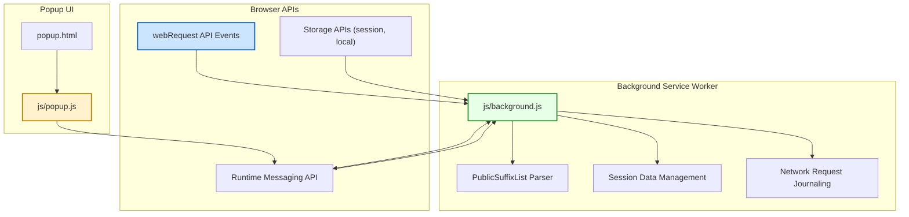

# Integration & Browser Compatibility

## Overview
uBO Scope integrates deeply with browser capabilities to reveal detailed network connection information for web pages you visit. By leveraging the `webRequest` API, it transparently tracks attempts to connect to remote servers, regardless of whether those connections are allowed, blocked, or stealth-blocked by other content blockers or filters. This page explains how uBO Scope integrates with browser APIs, supports multiple browsers including Chromium, Firefox, and Safari, and how its manifest files configure required permissions for consistent operation.

---

## How uBO Scope Integrates with Browser APIs

### Using the `webRequest` API
The core of uBO Scope's monitoring functionality relies on the browser's `webRequest` API. This powerful interface provides detailed information about network requests initiated by web pages, including when requests are sent, redirected, blocked, or successfully completed.

- **Network Event Listening:** uBO Scope uses listeners such as `onBeforeRedirect`, `onErrorOccurred`, and `onResponseStarted` to capture distinct network events in real-time.
- **Outcome Tracking:** Each network request is categorized as "allowed", "blocked", or "stealth-blocked" based on outcomes reported through these events.
- **Domain Mapping:** The extension extracts hostnames and derives their registered domains using an embedded Public Suffix List, enabling precise aggregation and counting of third-party connections.
- **Tab-Based State Management:** Network request outcomes are tracked per browser tab, allowing uBO Scope to provide detailed per-tab insights.

This integration is visible in the background script (`js/background.js`), where network events trigger recording logic and session state is updated accordingly.

### Local and Session Storage Utilization
uBO Scope uses browser storage APIs to persist session data and the processed Public Suffix List:

- **Session Storage:** Transient tab and request state is saved in session storage to survive browser reloads within the session.
- **Public Suffix List Caching:** The extension downloads and caches the public suffix list for accurate domain parsing.

### Inter-Component Communication
The background service worker interacts synchronously with the popup UI through message passing using the runtime messaging API:

- The popup requests per-tab connection data.
- Background script responds with serialized tab details for rendering.

---

## Cross-Browser Support

uBO Scope is engineered for compatibility with the major browser engines: Chromium, Firefox, and Safari. This multi-browser support ensures consistency in feature availability and user experience.

### Chromium (Chrome, Edge, etc.)
- Uses Manifest Version 3 with a background service worker (`/js/background.js`).
- Permissions include `webRequest`, `storage`, and `activeTab` for active user context.
- Host permissions extend to HTTP, HTTPS, WebSocket (`ws://`), and Secure WebSocket (`wss://`) URLs.

### Firefox
- Supports Manifest V3 with a module background script.
- Includes Gecko-specific metadata for minimum versions and extension ID.
- Supports the same permissions as Chromium, with explicit host permissions for HTTP, HTTPS, WS, and WSS schemes.

### Safari
- Conforms to Safari’s WebExtension requirements with a module background script.
- Strict minimum version enforced (18.5 and above).
- Similar permissions and host access as other browsers but adapted for Safari’s extension ecosystem.

### Permissions and Host Permissions Overview
Across browsers, the essential permissions include:

- **`webRequest`**: To listen to all network requests and capture their states.
- **`storage`**: To persist session and configuration data.
- **`activeTab`**: To operate in the context of the currently active tab for fine-grained tracking.
- **Host Permissions (`http://*/*`, `https://*/*`, `ws://*/*`, `wss://*/*`)**: To monitor all relevant web and websocket connections initiated by sites.

---

## Manifest Files in Different Browser Platforms

The manifest files configure how the extension integrates and operates in each supported browser environment. Key excerpts are shown below for clarity.

### Chromium Manifest Excerpt
```json
{
  "manifest_version": 3,
  "name": "uBlock Origin Scope",
  "version": "1.0.1",
  "permissions": [ "activeTab", "storage", "webRequest" ],
  "host_permissions": [ "https://*/*", "http://*/*", "wss://*/*", "ws://*/*" ],
  "background": { "service_worker": "/js/background.js", "type": "module" },
  "action": {
    "default_popup": "popup.html",
    "default_title": "uBO Scope"
  }
}
```

### Firefox Manifest Excerpt
```json
{
  "manifest_version": 3,
  "name": "uBlock Origin Scope",
  "version": "1.0.1",
  "permissions": [ "activeTab", "storage", "webRequest" ],
  "host_permissions": [ "https://*/*", "http://*/*", "wss://*/*", "ws://*/*" ],
  "background": { "scripts": [ "/js/background.js" ], "type": "module" },
  "action": {
    "default_popup": "popup.html",
    "default_title": "uBO Scope"
  },
  "browser_specific_settings": {
    "gecko": {
      "id": "uBO-Scope@raymondhill.net",
      "strict_min_version": "128.0"
    }
  }
}
```

### Safari Manifest Excerpt
```json
{
  "manifest_version": 3,
  "name": "uBlock Origin Scope",
  "version": "1.0.1",
  "permissions": [ "activeTab", "storage", "webRequest" ],
  "host_permissions": [ "https://*/*", "http://*/*" ],
  "background": { "scripts": [ "/js/background.js" ], "type": "module" },
  "action": {
    "default_popup": "popup.html",
    "default_title": "uBO Scope"
  },
  "browser_specific_settings": {
    "safari": {
      "strict_min_version": "18.5"
    }
  }
}
```

Note that Safari currently does not request websocket host permissions explicitly.

---

## Interactions with Other Content Blockers

- uBO Scope operates independently of other installed content blockers.
- It reports all network connection attempts and outcomes, reflecting the actual connections made (or blocked) by your browser environment.
- The extension captures network outcomes **regardless of which other blockers are installed or the DNS-based filtering in use**, as long as those requests pass through the browser's `webRequest` API.
- This makes uBO Scope invaluable for unbiased analysis and verification of content blockers’ behavior, by focusing on distinct connected servers rather than raw block counts.

---

## Practical Benefits of Cross-Browser Compatibility

- **Consistent User Experience:** The same insights are available whether you use Chrome, Firefox, or Safari, without unexpected behavior differences.
- **Reliable Updates:** Leveraging standard browser APIs ensures that uBO Scope remains robust across browser updates.
- **Wide Adoption:** Supports users across platforms, including desktop and recent mobile versions where supported.

---

## Summary Mermaid Diagram: Integration Flow


This diagram illustrates the key integration points of uBO Scope with browser internals and its own components.

---

## Troubleshooting & Best Practices

- **Permission issues:** Ensure that all required host permissions and APIs are granted at installation for your browser.
- **Browser Updates:** Keep browsers updated to maintain API stability, especially important for Manifest V3 transitions.
- **Storage Limits:** If session data seems incomplete, verify storage quota and browser policies.
- **Inspect Manifest:** If deploying enterprise or custom versions, verify manifest correctness per browser.

---

## Additional Resources

- See the [Overview: What is uBO Scope?](/overview/intro-core-value/what-is-uboscope) for foundational understanding.
- Explore the [System Architecture](/overview/core-architecture-concepts/architecture-overview) to understand how the components work internally.
- Use the [Understanding the Toolbar Badge](/guides/essential-workflows/understanding-the-badge) guide to interpret connection counts.
- For general installation and setup, consult [Installing uBO Scope](/getting-started/setup-installation/installing-extension).
- Visit the [official GitHub repository](https://github.com/gorhill/uBO-Scope) for source code and issue tracking.

---

By understanding uBO Scope’s integration with browser APIs, its cross-browser design, and manifest configuration, users and maintainers gain clarity on how it delivers reliable insights into network connections while maintaining broad compatibility and seamless operation in modern browsers.
