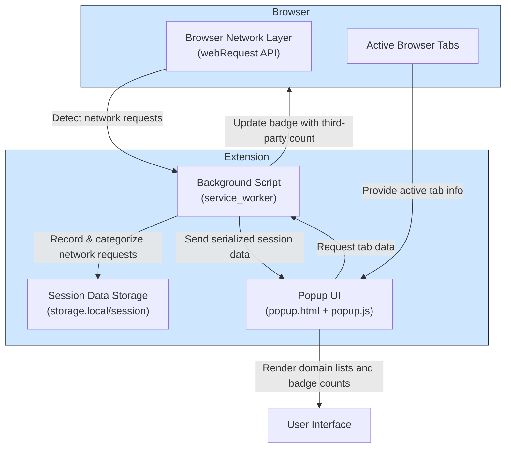

# System Architecture Overview

## Visualizing uBO Scope's Core Components and Data Flow

At the heart of uBO Scope is a streamlined architecture designed to provide real-time insight into all remote server connections your browser makes. This page walks you through the major components involved, illustrating how data flows seamlessly from the browser's network layer through the extension's internal processes to your interface.

---

### Why This Matters

Understanding the architecture helps you appreciate how uBO Scope captures accurate, on-the-fly data about network activity, regardless of other content blockers in use. The design ensures minimal impact on browsing performance while delivering precise exposure metrics.

---

## Overview of Core Components

### 1. Browser's Network Layer

uBO Scope leverages the browser's native `webRequest` API, which intercepts all network requests initiated by pages you visit. This API is crucial because it exposes the raw details of connection attempts, including URLs, request outcomes, and redirects.

- **Scope**: Includes HTTP, HTTPS, WebSocket, and Secure WebSocket requests.
- **Insight**: Access to request status such as success, error, or redirects.

### 2. Background Script (Service Worker)

The service worker script (`/js/background.js`) acts as the extension's central intelligence hub. It listens to the browser's network events, processes them, and maintains session-level aggregates.

Core responsibilities include:

- Collecting request data and categorizing outcomes (allowed, stealth-blocked, blocked).
- Associating requests with their originating browser tab.
- Updating badge counts that reflect third-party domain exposure.
- Persisting session state to storage for durability across user interactions.

### 3. Session Management and Data Structures

uBO Scope maintains structured details per tab to track domains and hostnames contacted:

- Domains are grouped by outcome category: allowed, stealth, or blocked.
- Counts of individual domains and hostnames provide granular visibility.
- Public suffix list integration ensures accurate domain extraction.

This structured data storage enables quick access and update operations necessary for real-time reporting.

### 4. Popup UI Interface

The popup (`popup.html`) is the user-facing component that displays all collected data in a clear, organized manner. When opened, it requests the latest tab data from the background script and renders:

- The current active tab's hostname and domain details.
- Separate sections listing allowed, stealth-blocked, and blocked third-party domains, each showing domain name and request count.
- A summary count of connected domains.

The UI seamlessly updates whenever you open the popup, providing a real-time snapshot of your browsing exposure.

### 5. Extension Manifest & Permissions

uBO Scope's manifest (`manifest.json`) declares necessary permissions:

- `webRequest` to monitor network events.
- Host permissions for all web and secure WebSocket URLs.
- Storage access to persist session data.

This ensures the extension can operate across supported browsers while respecting security constraints.

---

## Data Flow Diagram

The following Mermaid diagram visualizes the interactions among these components, charting the path from network event detection to user interface update.

---

## Practical Example: Monitoring Your Current Tab

When you actively browse a webpage, uBO Scope's background script listens to all network requests triggered by that tab. As network responses arrive or fail, it updates internal counts:

- If a request to a third-party server succeeds, it increments the 'allowed' category.
- If a request is detected as blocked by stealth techniques, it increments the 'stealth' category.
- If an error or explicit block occurs, it increments the 'blocked' category.

When you open the extension's popup, it displays all these categories distinctly, giving you full visibility into remote servers your browser engaged with while visiting the current tab.

---

## Tips & Best Practices

- **Keep your browser updated:** uBO Scope requires the browser to support Manifest Version 3, and specific minimum Chrome (122+), Firefox (128+), or Safari (18.5+) versions for optimal operation.
- **Understand badge counts:** The badge indicates the number of unique third-party domains contacted, not the block count.
- **Use alongside content blockers:** uBO Scope complements but does not replace content blockers — it visualizes their effectiveness through network activity.

---

## Troubleshooting

- If you do not see any data in the popup, make sure the extension has the necessary permissions and is actively monitoring network requests.
- Badge counts might not update instantly—open the popup to refresh session data.
- Some network requests may not be reported if the browser restricts access to certain APIs or due to network isolation policies.

---

By understanding these components and the flow of network request information within uBO Scope, you gain confidence in the extension's accurate reporting of your browser's remote interactions.

---

For in-depth understanding, explore related documentation pages on [What is uBO Scope?](/overview/product-introduction/what-is-ubo-scope), [Value Proposition and Why It Matters](/overview/product-introduction/value-proposition-and-why-it-matters), and [Monitoring Third-party Connections](/guides/practical-use-cases/monitoring-3rd-party-connections).

---

**Author:** Raymond Hill

**Repository:** [https://github.com/gorhill/uBO-Scope](https://github.com/gorhill/uBO-Scope)

---

_Last updated: main branch_

---