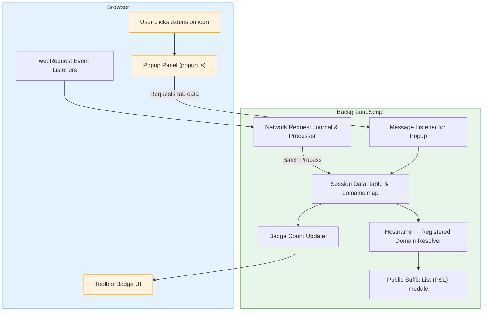

# Extension Architecture Overview

Understand how uBO Scope fits together through its high-level architecture, following the journey of browser network events from page load to popup display. This overview reveals key data flows, how domains are categorized via the Public Suffix List, and how uBO Scope achieves reliable cross-browser support.

---

## How uBO Scope Works: End-to-End Flow

1. **Browser Network Events Capture**

   uBO Scope hooks into the browser’s `webRequest` API to monitor all network requests:

   - Requests initiated by loading web pages
   - Redirected requests
   - Requests that succeed or fail (blocked or errored)

   These events flow into the **background script**, which acts as the core data processor.

2. **Background Script: Hub of Tracking and Categorization**

   The background script (`background.js`) is the heart of uBO Scope’s functionality, responsible for:

   - Maintaining a session-based map correlating browser tabs to their network activity details.
   - Parsing network request details, such as URL and request type.
   - Extracting **hostnames** and resolving **registered domains** using a **Public Suffix List (PSL)** for accurate domain categorization.
   - Classifying connections into three groups:
     - **Allowed**: Requests succeeding without blocking
     - **Blocked**: Requests that failed or were blocked
     - **Stealth**: Redirects or invisible blocks
   - Periodically batching and aggregating network events before synchronizing updates.
   - Updating the toolbar badge to display the count of distinct allowed third-party domains per tab.

3. **Public Suffix List Integration**

   uBO Scope relies on [Mozilla’s Public Suffix List](https://publicsuffix.org/) to correctly identify registered domains. This avoids misclassifying subdomains or confusing domains with multiple suffix components (e.g., `.co.uk`).

   - The list is loaded into a compact, efficient JavaScript representation using the `publicsuffixlist.js` library.
   - The background script resolves hostnames to their registered domains for categorization and display.

4. **Popup Panel: User Interface Accessing Background Data**

   When a user clicks on the uBO Scope icon, the popup (`popup.js`) fetches the latest per-tab domain data from the background script via messaging:

   - `popup.js` requests domain data for the active tab using `getTabData` message.
   - Data includes allowed, stealth, and blocked domains with counts.
   - Domains are displayed in categorized lists, showing counts and allowing quick visibility on network connections.

5. **Cross-Browser Support**

   The extension architecture is designed to be compatible across Chromium, Firefox, and Safari browsers by:

   - Using the WebExtensions API uniformly via the `ext.js` abstraction layer.
   - Detecting platform flavor to handle subtle API or environment differences.
   - Configuring appropriate manifest files (`manifest.json`) per browser platform, specifying permissions, host access, and background script handling.

---

## Visualizing the Architecture

---

## Core Data Flow Explained

- **Network event listeners** capture every HTTP and WebSocket request matching user permissions.
- These events are **queued temporarily** in a journal to improve performance by reducing processing frequency.
- The background script **processes batched network events**, extracting hostnames and classifying outcomes based on request success, errors, or redirections.
- Hostnames are resolved to their **registered domain** using the loaded Public Suffix List for consistent domain grouping.
- The session map is updated per tab to track categories of connections: **allowed**, **blocked**, or **stealth**.
- The **toolbar badge** updates dynamically to show the count of distinct allowed third-party domains, giving immediate, visual privacy insight.
- When the popup is opened, it **sends a message** to the background script requesting the domain data for the current tab, which is serialized and sent back.
- The popup renders this domain data, displaying counts and categorized lists for effortless user interpretation.

---

## Important Components

| Component | Role |
| --------- | ---- |
| **background.js** | The main service worker/script handles event listening, data processing, and inter-component communication. |
| **popup.js** | Renders UI for users, requests domain connection data, and presents categorized network outcomes. |
| **publicsuffixlist.js** | Provides efficient domain suffix resolution to distinguish registered domains from subdomains or public suffixes. |
| **ext.js** | Abstracts browser APIs ensuring consistent use across Chromium, Firefox, and Safari. |

---

## Practical Tips & Best Practices

- The extension batches network request processing to avoid UI thread blocking—expect a small delay (~1 second) before the badge updates after network events.
- Browser tabs closing removes their session data to keep memory use efficient.
- The use of the Public Suffix List ensures that connections to CDNs or legitimate third parties are properly counted and not inflated by subdomain noise.
- Cross-browser compatibility ensures that your experience and data integrity are consistent regardless of the browser used.

---

## Troubleshooting Common Issues

<AccordionGroup title="Troubleshooting Background Processing and Data Flow">
<Accordion title="Why is the badge count not updating immediately?">
The extension queues network events for batch processing every second to optimize performance. Wait a moment for the badge to refresh, or reload the tab if the issue persists.
</Accordion>
<Accordion title="What if the popup shows 'NO DATA'?">
This indicates that no domain data is available yet for the active tab. Check that the page is fully loaded and that network requests occur.
</Accordion>
<Accordion title="How is the registered domain calculated?">
The extension uses the Public Suffix List to determine the registered domain from a hostname, preventing false grouping of subdomains. If this fails, domain names might look inconsistent in the UI.
</Accordion>
</AccordionGroup>

---

For more detailed information on installation, popup usage, and core concepts, see these pages:

- [What is uBO Scope?](https://docs.example.com/overview/product-introduction/what-is-ubo-scope)
- [Why Use uBO Scope?](https://docs.example.com/overview/product-introduction/value-proposition)
- [Target Audience & Use Cases](https://docs.example.com/overview/product-introduction/target-audience-use-cases)
- [Fundamental Concepts](https://docs.example.com/overview/core-concepts-and-architecture/fundamental-concepts)

---

**Empower your privacy awareness by understanding exactly what network connections your browser is making through uBO Scope’s transparent architecture.**

---
