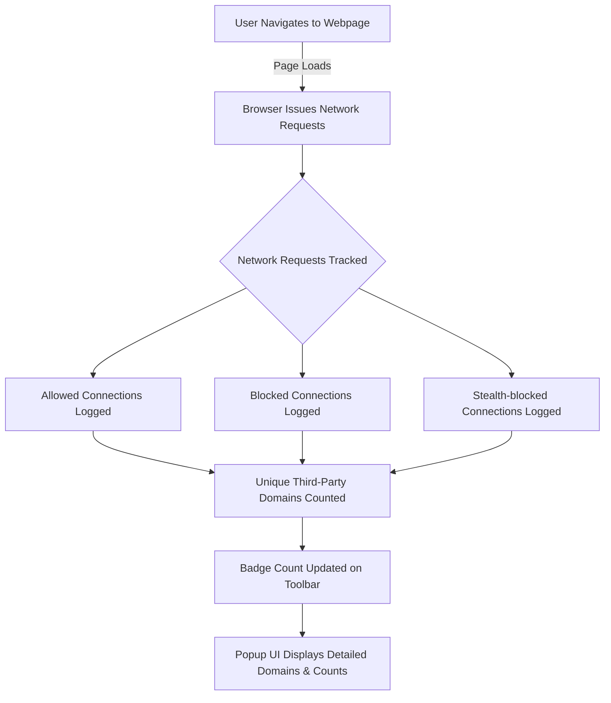

# Feature Highlights of uBO Scope

Discover the core capabilities that set uBO Scope apart as your go-to tool for transparent, real-time visibility into all third-party network connections initiated by websites. This page provides a clear, concise walkthrough of uBO Scope’s primary features, highlighting how each empowers you to assess and understand the full scope of your web privacy exposure.

---

## Real-Time Reporting of Third-Party Connections

uBO Scope actively monitors every network request your browser makes while loading web pages. It reveals all connections to remote servers, including those that content blockers might allow, block, or stealthily handle behind the scenes. This immediate insight helps you see exactly which third-party domains are involved with the page you’re visiting, empowering you to gain a realistic picture of your browsing footprint.

### What You Can Achieve
- Detect all third-party hostnames contacted during browsing sessions.
- Understand connections blocked outright, allowed, or stealth-blocked, providing transparency beyond traditional blockers.
- Identify communications hidden from standard content blocker UIs or metrics.

Real-world use: When browsing, you can verify which domains your browser connects to, including those your content blocker stealthily hides, helping you tune your filters or uncover unexpected third-party tracking.

---

## Distinct Badge Counts Reflect Unique Third-Party Domains

The badge count on the uBO Scope toolbar icon represents the number of unique third-party remote domains with successful connections for the current tab. This metric is precise and focused — rather than just counting blocked requests or total connections, it tells you how many distinct external entities have loaded resources.

### Why This Matters
- Provides a meaningful, actionable metric: fewer distinct third-party domains generally mean less exposure.
- Avoids common misconceptions about blocker effectiveness based solely on block counts.
- Encourages informed decisions by reflecting actual network compromisation.

Example: If a page loads content from three distinct ad networks, the badge shows "3" even if blockers silently filtered many requests, exposing real exposure rather than superficial block metrics.

---

## Cross-Browser Compatibility

uBO Scope is designed to seamlessly integrate with all major browsers supporting the `webRequest` API, including Chromium-based browsers, Firefox, and Safari. This ensures consistent, reliable network connection reporting regardless of your preferred browsing environment.

### Benefit Summary
- Uniform experience across multiple browsers keeps your workflow consistent.
- Supports major platforms with minimal differences in functionality.
- Allows privacy-conscious users to track connections without switching tools when changing browsers.

---

## Independence from Specific Content Blockers

Unlike some extensions tightly coupled with a specific content blocker, uBO Scope operates independently. It monitors all network requests passed through the browser’s `webRequest` API, no matter which blockers or DNS filters are active.

### Practical Impact
- Works alongside any content blocker you use, providing an unbiased view of network connections.
- Detects connections even if they are stealth-blocked or invisibly modified by other extensions.
- Helps you verify and tune any privacy tools by comparing what uBO Scope reports against your blocker’s behavior.

Use case: Combine uBO Scope with your favorite blocker to get a truthful report of which third-party connections sneak past, enabling more precise filter list customizations.

---

## How These Features Work Together

Here’s a simplified flow of how uBO Scope’s key features collaborate to deliver insights:

This live process ensures you always have real-time visibility into the network behavior of the sites you visit.

---

## Practical Tips and Best Practices

- **Check the badge frequently:** It provides an at-a-glance indication of third-party exposure per tab.
- **Use the popup UI for details:** Click the toolbar icon to open a detailed breakdown of allowed, stealth, and blocked domains with connection counts.
- **Leverage across blockers:** Since uBO Scope is blocker-agnostic, it complements any privacy extension, helping you verify its effectiveness.
- **Understand domain grouping:** Counts are shown per distinct domain as classified by the Public Suffix List, avoiding confusing subdomain duplication.

---

## Troubleshooting Common Scenarios

<AccordionGroup title="Common Troubleshooting Topics">
<Accordion title="Why is the badge count zero even on sites with many resources?">
uBO Scope counts the number of unique third-party domains with successful connections. If the badge shows zero, it means no third-party domains had allowed connections. This can happen if your content blocker or network filters blocked all third-party connections or no third-party was contacted.
</Accordion>
<Accordion title="Why do stealth-blocked domains still show in the popup?">
Stealth blocking means the domain’s requests were blocked in a way that does not appear in regular blocker UIs. uBO Scope reveals these hidden blocks to give you a fuller picture. Seeing stealth-blocked domains helps you confirm stealth blocking is active.
</Accordion>
<Accordion title="Does uBO Scope interfere with my content blocker?">
uBO Scope only observes network requests without blocking or modifying them. It operates independently and does not interfere with content blocking behavior.
</Accordion>
</AccordionGroup>

---

## Next Steps

Now that you understand the key features of uBO Scope, explore related documentation to maximize your understanding and use:

- [Understanding the Popup: Domains and Connection Types](../../guides/core-workflows/understanding-the-popup): Learn how to interpret the detailed domain lists shown.
- [Badge Counts and What They Mean](../../guides/core-workflows/badge-counts-and-what-they-mean): Deep dive into reading and using badge counts effectively.
- [Value Proposition](../introduction-and-value/value-proposition): Understand why uBO Scope presents unique insights compared to blockers alone.

Start monitoring your network connections with real-time precision and make more informed privacy decisions today using uBO Scope.

---

*For more technical background or to contribute, view the source code on GitHub: [uBO Scope GitHub Repository](https://github.com/gorhill/uBO-Scope)*

---

*End of Feature Highlights*