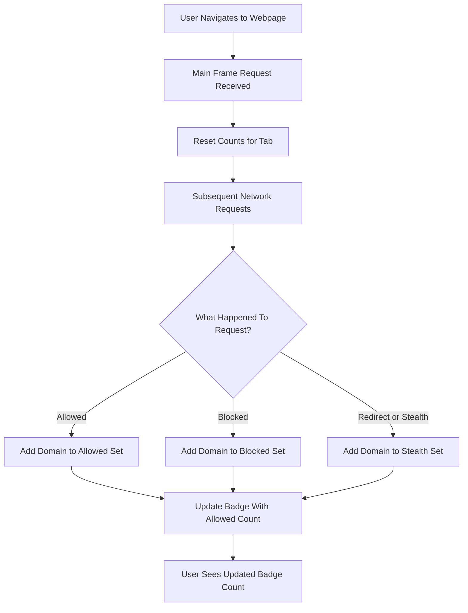

# Core Concepts & Terminology

Understanding the core terminology and concepts in uBO Scope is essential to using the extension effectively. This page explains what key terms like 'third-party server,' 'allowed,' 'blocked,' and 'stealth' mean within the context of uBO Scope. It also clarifies how the extension counts network requests, why badge counts matter, and the limits imposed by browser APIs.

---

## Understanding Third-Party Servers in uBO Scope

In uBO Scope, a **third-party server** is any remote server domain contacted by your browser that is different from the domain of the webpage you are visiting. For example, if you visit `example.com` and your browser loads resources from `cdn.example.net` or `ads.tracker.org`, these domains count as third-party servers.

This distinction is crucial because uBO Scope's primary metric is the number of *distinct* third-party domains your browser connects to during a page session. Minimizing this number generally improves privacy and reduces exposure to tracking.

<Check>
The badge count on the toolbar icon reflects this number of **distinct third-party remote servers** your browser successfully connected to, with a lower count indicating fewer external contacts.
</Check>

## What Does 'Allowed', 'Blocked', and 'Stealth' Mean?

uBO Scope classifies network requests based on their outcomes, which correspond to how your content blocker or browser handled those requests:

- **Allowed:** Requests that were successfully completed and not blocked by any mechanism. These represent active connections to servers.

- **Blocked:** Requests that were explicitly blocked by a content blocker or by an error preventing successful connection (such as DNS failure or network errors).

- **Stealth:** Requests that were blocked or redirected in a way that the webpage or network cannot detect directly. This category captures when content blockers or browser features prevent detection via traditional means but still obscure the request.

These categories help you discern not only which requests reached remote servers but also those that were stopped, and which were hidden stealthily by the blocking mechanism.

## How Request Counting Works

uBO Scope uses browser network APIs (`webRequest` listeners) to monitor network activities that happen during browsing. Here’s how it processes request data:

1. **Initial Request:** When you navigate to a new page (main frame request), uBO Scope resets its counters for that tab.
2. **Tracking Requests:** Incoming network requests are classified in real-time as allowed, blocked, or stealth based on their final status.
3. **Domain Mapping:** Hostnames from network requests are converted to their registered domains using the public suffix list algorithm, ensuring consistency in counting subdomains under a main domain.
4. **Counting Distinct Domains:** The extension aggregates unique domains per outcome category to maintain a clear count.
5. **Badge Update:** After processing, the count of allowed distinct domains updates the extension badge, giving you a live sense of your exposure.

---

## Why Badge Counts Matter

The badge count reflects the **number of unique third-party servers your browser connected to** without being blocked. This metric is the most reliable indication of the actual network exposure from browsing.

- A **lower badge count** means fewer third-party connections, which generally means enhanced privacy and better blocking.
- A **high block count** (not shown as the badge) can be misleading; blocking many requests does not guarantee fewer third-party connections, as some allowed connections may still remain.

<u>Understanding this helps avoid common misconceptions such as equating block numbers to effectiveness.</u>

---

## Limits and Coverage: What uBO Scope Can and Cannot Report

uBO Scope relies entirely on the browser's `webRequest` API to observe and classify network requests.

**Capable scenarios:**
- Requests made through HTTP/HTTPS and WebSocket protocols captured by browser APIs.
- Requests where the browser reports status codes, IP addresses, or errors via `webRequest` events.

**Limitations:**
- Network requests made outside the scope of the `webRequest` API (such as some browser-internal DNS lookups or low-level system requests) will not be detected.
- Some stealth blocking techniques at the DNS or network layer might obscure requests, resulting in less visibility.
- Browser API limitations impose an upper bound on request counting fidelity.

This means while uBO Scope provides excellent visibility into network connections within the browser environment, it does not cover all possible network activity at the system level or outside browser instrumentation.

---

## Overview of Core Terms

| Term                | Meaning                                                                                 |
|---------------------|-----------------------------------------------------------------------------------------|
| **Third-party server** | Any remote domain different from the top-level site domain involved in a webpage load.  |
| **Allowed**           | Requests that successfully connected and loaded resources without being blocked.        |
| **Blocked**           | Requests that were prevented from completing due to content blocking or network errors.  |
| **Stealth**           | Requests blocked or redirected invisibly to the page or network, hiding their existence. |
| **Domain Counting**   | Grouping hostnames into registered domains according to public suffix rules for accuracy. |

---

## How Domains Are Resolved in uBO Scope

To provide meaningful counting, uBO Scope uses the Mozilla Public Suffix List (PSL) algorithm.

- This algorithm identifies the **public suffix** (like `.com` or `.co.uk`) and extracts the **registered domain**.
- For example, `cdn.example.co.uk` and `www.example.co.uk` both map to the registered domain `example.co.uk`.

This approach helps avoid inflated counts due to subdomains and consolidates network connections into meaningful domain buckets.

## Practical Tips & Common Pitfalls

- **Watch the badge count:** Focus on the distinct allowed domains count shown as a badge to gauge your network exposure.
- **Don't rely solely on block counts:** High block numbers don’t guarantee fewer third-party connections; always consider allowed domains.
- **Recognize stealth blocking:** Some content blockers use stealth techniques; uBO Scope's stealth category helps expose this.
- **Browser compatibility affects visibility:** Browser APIs vary, so some network behavior might be hidden in certain browsers.

### Troubleshooting Common Issues

- If the badge count remains zero on sites that clearly load third-party resources, verify the extension is active and has necessary permissions.
- If unexpected high counts appear, check if legitimate third-party services (like CDNs and analytics) are in use.
- Consider the limits of the browser API when certain network requests are not reported.

---

## Illustrative User Flow

---

## Next Steps

To apply this foundational understanding:

- Visit the [Why Use uBO Scope?](../product-introduction/value-proposition) page to explore more about the value of measured data.
- Explore [Target Audience & Use Cases](../product-introduction/target-audience-use-cases) to see how this knowledge translates to real-world usage.
- Set up and start using uBO Scope by following installation and configuration guides.

By mastering these core concepts and terminology, you empower yourself to better interpret what uBO Scope reports, make informed privacy decisions, and correctly assess your browser's network behavior.

---

For additional details on domain resolution, see the Public Suffix List implementation referenced in the extension's background processes.

If you encounter issues or want to understand underlying behaviors, review the browser's API limitations section or consult the troubleshooting guide in the Getting Started documentation.

---

###### Source code and further technical info available at the official repository: [uBO Scope GitHub](https://github.com/gorhill/uBO-Scope)
