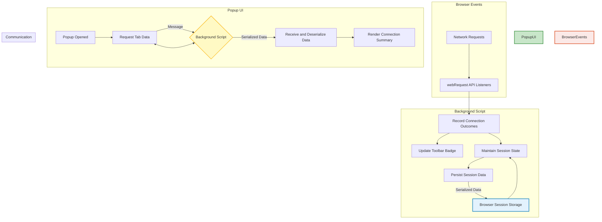

# How uBO Scope Works: Architecture & Data Flow

Understanding how uBO Scope functions behind the scenes is key to appreciating the accuracy and timeliness with which it reports network connections. This page walks you through the core architectural components and the flow of data—from the moment your browser makes network requests to how those requests are summarized and displayed in the popup UI.

---

## Overview

At its core, uBO Scope operates as a browser extension that monitors network activity in real-time, summarizes the outcomes of these requests by domain, and presents this information through a user-friendly popup interface. Its architecture revolves around three critical components:

- **Background script:** Listens to network events, records connection outcomes, maintains session state, and updates the toolbar badge.
- **Popup UI:** Retrieves and renders aggregated data about connections from the current browser tab.
- **Communication channel:** Facilitates messaging between the popup and background script to share the latest connection data.

This separation ensures efficiency and responsiveness, while detailed session persistence enables continuity across browsing sessions.

---

## Core Components and Their Responsibilities

### Background Script

The backbone of uBO Scope’s tracking capabilities lives in the background script:

- **Network monitoring:** Hooks into the browser's `webRequest` API to capture events for redirects, errors, and successful responses related to all network requests.
- **Outcome classification:** For each request, it records whether the connection was _allowed_, _blocked_, or _stealth-blocked_, categorizing these by hostname and domain.
- **Session management:** Maintains an in-memory map linking active tabs to their recorded connection details; persists this session data using browser session storage to survive browser restarts or extension reloads.
- **Badge updates:** Reflects the number of distinct third-party domains connected in the extension's toolbar icon, giving immediate visual feedback.

### Popup UI

The popup acts as the real-time dashboard of your current tab’s network connections:

- **Data retrieval:** On opening, it sends a message to the background script to retrieve serialized session data for the active tab.
- **Rendering:** Decodes the data and displays counts of allowed, blocked, and stealth-blocked domains, grouped clearly for easy understanding.
- **UI responsiveness:** Dynamically adjusts based on available data, including fallback messages when no data exists for the current tab.

### Communication Between Components

The background and popup components communicate via the browser runtime messaging API:

- The popup initiates a `getTabData` request, specifying the active tab ID.
- The background script responds with serialized session details for that tab, ensuring the UI reflects the most up-to-date network activity.

---

## Data Flow Explained

1. **Network Request Initiation:** When a webpage initiates a network request (e.g., loading an image or script), the browser triggers events detectable by uBO Scope's background listeners.

2. **Event Capture and Outcome Determination:** The background script captures `onBeforeRedirect`, `onErrorOccurred`, and `onResponseStarted` events to determine if the request was allowed to complete, blocked by a filter, or stealth-blocked.

3. **Outcome Recording:** Each outcome is recorded in session memory with granular detail—classified into domains and hostnames, and organized into three categories: allowed, stealth-blocked, and blocked.

4. **Badge Update Trigger:** After batching these events, usually in one-second intervals, the badge count on the extension's toolbar icon updates to display the number of unique allowed third-party domains for the current tab.

5. **Session Persistence:** The session data is serialized and saved to browser session storage, ensuring state is preserved even if the extension or browser restarts.

6. **Popup UI Data Request:** When the user opens the popup, it requests the latest tab-specific data from the background script.

7. **Data Rendering:** Upon receiving data, the popup deserializes the information and updates the connection counts and lists accordingly.

---

## Architectural Data Flow Diagram

---

## Practical Insights

- **Real-time monitoring:** By listening directly to the browser’s webRequest API, uBO Scope ensures you see every network interaction relevant to content blocking outcomes — no guesswork or delays.

- **Aggregated domain-level reporting:** Tracking by domain and hostname translates complex technical details into user-friendly insights, showing exactly which third parties resources are coming from.

- **Session persistence:** Maintaining session data means your connection reports survive tab reloads and browser restarts, offering a continuous auditing experience.

- **Lightweight, event-driven batching:** Network events are batched (every second) before processing, optimizing performance while ensuring timely updates.

- **Modular design:** Clear separation between background logic and UI makes uBO Scope maintainable and adaptable for insertion of future features.

---

## Troubleshooting Common Scenarios

<Tip>
If you notice the popup doesn't show updated data:
- Ensure you have network activity on the current tab.
- Try closing and reopening the popup to trigger fresh data retrieval.
- Verify the extension has necessary permissions, especially `webRequest` and `storage`.
</Tip>

<Tip>
If the badge count seems off:
- Remember it reflects the count of distinct third-party domains allowed, not raw block counts.
- Background script processing happens in batches; wait a moment after network activity for the badge to update.
</Tip>

---

## Next Steps

To deepen your understanding of uBO Scope:

- Explore the [Key Concepts & Terminology](../core-concepts-and-architecture/key-concepts-terminology) for foundational definitions.
- Review [Features at a Glance](../feature-summary/features-at-a-glance) to see this architecture's capabilities in action.
- Start with the [Quickstart Guide](../feature-summary/quickstart-experience) to experience real usage.

For technical details on installation and setup, see the [Getting Started](../../getting-started/installation-basics) documentation.

---

This architectural overview equips you with a clear mental model of how uBO Scope diligently observes and reports network connections, empowering you to leverage its insights for privacy, security, and content-blocker evaluation.

---