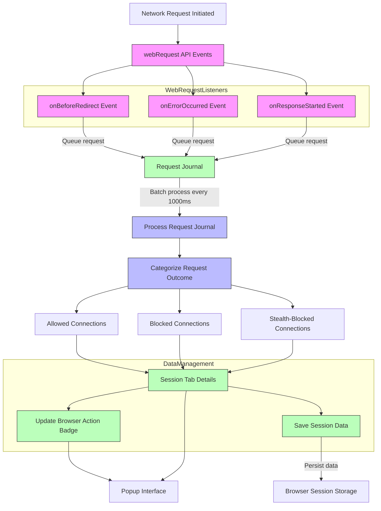

# How uBO Scope Works (Architecture Overview)

Discover the inner workings of uBO Scope as it actively monitors all browser network connections using the `webRequest` API. This page provides a detailed visualization of how requests are captured, categorized, and ultimately displayed in the extension's popup interface, giving you clear insights into every allowed, blocked, and stealth-blocked network interaction.

---

## Understanding the Flow: From Network Request to User Interface

At its core, uBO Scope uses the browser's `webRequest` API to listen to all network requests initiated by browser tabs. This monitoring pipeline is designed to capture the full lifecycle of network requests — from initiation through to their final outcome — to provide you with an accurate, real-time view of your browser's third-party connections.

### Key Steps in the Monitoring Process

1. **Intercepting Network Events:** 
   uBO Scope attaches listeners to three crucial `webRequest` events:
   - `onBeforeRedirect`: when a request is about to redirect
   - `onErrorOccurred`: when a request fails
   - `onResponseStarted`: when a response begins arriving

2. **Queueing and Batching Requests:**
   These intercepted requests are immediately queued in a temporary journal rather than processed instantly. This strategy ensures efficient batching and reduces performance impact.

3. **Processing the Request Journal:**
   Every second, the journaled requests are processed, and their outcome is recorded against the tab that initiated them.

4. **Categorizing Requests by Outcome:**
   Requests are classified into three categories:
   - **Allowed:** Successfully loaded connections
   - **Blocked:** Connections that failed due to errors
   - **Stealth-blocked:** Redirected requests that are silently blocked

5. **Domain and Hostname Attribution:**
   Each request is linked to its hostname and registered domain using a robust domain parsing system powered by the Public Suffix List. This enables aggregation of connection data by meaningful domain groups.

6. **Updating the UI and Badge Count:**
   For each active tab, aggregated data is saved and sent to the popup interface where users can inspect the domains contacted. The browser action badge updates to show how many distinct third-party domains have successfully connected.

---

## How uBO Scope Records Network Requests

Every request received via the `webRequest` API is handled carefully:

- If it is a main document load (`main_frame`), the tab’s existing data resets to start fresh records.
- For redirect events, connections are logged silently (stealth-blocked).
- Requests culminating in errors increment the blocked count.
- Successful responses increase the allowed count.

The extension differentiates these outcomes to offer accurate visibility into your browser’s real network communication.

---

## Visual Representation of uBO Scope's Architecture



This diagram traces the lifecycle of network requests through uBO Scope's monitoring system, showing how data flows from native browser network events to the user-facing extension panel.

---

## Practical Insights: How This Architecture Benefits You

- **Real-Time Monitoring:** With continuous event listeners and batching, you receive up-to-date information without lag or performance degradation.
- **Accurate Outcomes:** Categorizing requests as allowed, blocked, or stealth-blocked uncovers not just visible blocks but subtle stealth tracking attempts.
- **Domain-Level Clarity:** Grouping by domains and hostnames distilled through the Public Suffix List provides you a clear understanding of which third parties your browser interacts with.
- **Persistence and Continuity:** Session data is saved and restored, letting you analyze network activity across browsing sessions.
- **Badge Indicators:** Quick-glance toolbar badge updates the count of third-party connections per tab, letting you instantly assess potential tracking exposure.

---

## Tips for Users Exploring uBO Scope Under the Hood

- The badge count reflects **distinct third-party domains allowed** — lower is better for privacy.
- Stealth-blocked connections may not appear in other content blockers but are silently accounted for here.
- If you manipulate your browser or extensions’ network blocking settings, uBO Scope remains impartial, reflecting true network activity.
- Visit the popup interface during active browsing to see live tallies and domain lists.

---

## Troubleshooting Common Issues

If you notice inaccurate or missing network data:

- **Verify Browser Permissions:** The extension requires host permissions and the `webRequest` permission to capture all requests.
- **Check for Browser Limitations:** Some browsers or versions may limit or interfere with `webRequest` event coverage.
- **Session Data Integrity:** If data doesn't persist, ensure your browser session storage is functioning correctly.

---

## Next Steps

After understanding how uBO Scope captures and processes network events, you can:

- Explore the [Core Concepts & Terminology](./core-terminology) page to grasp key terms.
- Learn to interpret the [Popup Interface Reports](../effective-usage/understanding-popup-reports) for user-friendly insights.
- Start your investigative journey with the [Getting Started Quick Tour](../quick-tour/getting-started-overview).

---

Empower your privacy management by mastering the architecture that brings network transparency to life inside uBO Scope.

---

## References and Additional Resources

- [uBO Scope GitHub Repository](https://github.com/gorhill/uBO-Scope)
- [Public Suffix List](https://publicsuffix.org/)
- [Browser `webRequest` API Documentation](https://developer.mozilla.org/en-US/docs/Mozilla/Add-ons/WebExtensions/API/webRequest)

---

# Appendix: Key Code Snippet Illustrating Request Queuing

```javascript
// Queue incoming network requests with metadata
function queueNetworkRequest(details, event) {
    details.event = event;
    networkRequestJournal.push(details);
    if (networkRequestJournalTimer !== undefined) { return; }
    networkRequestJournalTimer = setTimeout(() => {
        networkRequestJournalTimer = undefined;
        processNetworkRequestJournal();
    }, 1000);
}

// Attach listeners to network events
browser.webRequest.onBeforeRedirect.addListener(details => {
    queueNetworkRequest(details, 'redirect');
}, { urls: manifest.host_permissions });

browser.webRequest.onErrorOccurred.addListener(details => {
    queueNetworkRequest(details, 'error');
}, { urls: manifest.host_permissions });

browser.webRequest.onResponseStarted.addListener(details => {
    queueNetworkRequest(details, 'success');
}, { urls: manifest.host_permissions });
```

This snippet shows how network requests are intercepted, tagged with their respective events, and queued for batched processing to maintain efficiency and responsiveness.
