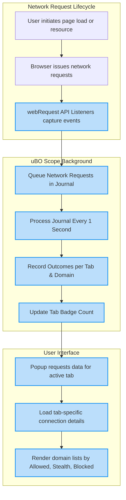

# How It Works (System Overview)

Discover how uBO Scope operates behind the scenes to track and report every web connection your browser makes. This walkthrough unpacks the journey each outbound network request takes—from interception via the browser's webRequest API, through outcome recording, to real-time user insights via the extension's popup interface. You'll also understand how uBO Scope maintains consistent functionality across browsers and dynamically updates its icon badge to reflect active connections.

---

## Intercepting Network Requests with the webRequest API

At the heart of uBO Scope's operation is the browser’s `webRequest` API. This powerful interface grants the extension the ability to listen to all network activity originating from active tabs within the browser. 

uBO Scope registers listeners for three critical events:

- **`onBeforeRedirect`**: Captures when a network request is about to be redirected to a new URL.
- **`onErrorOccurred`**: Detects when a network request fails or is blocked.
- **`onResponseStarted`**: Signals when a network request has successfully received a response.

Each network event triggers a lightweight capture routine that queues the request details, enabling batch processing without blocking browser performance.

---

## Tracking Connections per Browser Tab

Every network request is associated with a specific browser tab by its `tabId`. uBO Scope maintains a detailed session map where each tab's connection activity is logged:

- **Domains and Hostnames Categorization**: Requests are sorted into three outcome categories:
  - **Allowed**: Successful connections.
  - **Stealth**: Redirected requests that were stealth-blocked.
  - **Blocked**: Failed or error responses indicating blocked requests.

- **Domain Extraction and Normalization**: Using the public suffix list and punycode libraries, uBO Scope computes domain names from hostnames and normalizes internationalized domain names, ensuring consistent tracking.

- **Tab Reset on Main Frame Loads**: When a user navigates to a new page (main frame request), the extension resets tracking data to reflect the fresh set of connections relevant to the new page.

This granular per-tab tracking ensures that your browsing context is accurately represented in connection counts.

---

## Recording and Processing Request Outcomes

Requests are queued immediately upon event detection to a journal. This journal is processed asynchronously in batches every second, ensuring efficient CPU usage and avoiding performance degradation.

During processing:

- Outcomes are recorded with increments for both domain- and hostname-level counts.
- Redirects are specially tracked under the "stealth" category to spotlight potentially hidden or indirect connections.
- Errors and blocked requests increment the blocked category.

This recording approach guarantees that uBO Scope's insights are comprehensive and updated continuously across all tabs.

---

## Real-Time User Insights: Popup UI and Badge Updates

uBO Scope presents data to users via its toolbar popup and the icon badge:

- **Popup Interface**: Once opened, the popup fetches the latest session data for the active tab, displaying:
  - The page’s hostname and domain in clear, user-friendly text.
  - Counts and lists of domains categorized by their connection outcomes (allowed, stealth-blocked, and blocked).

- **Badge Updates**: The extension updates the browser action badge with a count representing the number of distinct third-party domains to which the page has successfully connected. This count updates dynamically as network activity changes.

Through these interfaces, uBO Scope empowers users with immediate visibility into the third-party connection landscape of any webpage.

---

## Cross-Browser Compatibility and Permissions

uBO Scope's design ensures broad compatibility with Chromium, Firefox, and Safari browsers by adhering rigorously to the WebExtensions API standards.

Key points include:

- Different manifest files tailor permissions and background script loading to each browser’s requirements.
- Permission requests include `webRequest` to capture network activity, `storage` for session persistence, and `activeTab` for contextual operations.
- Support for all common network protocols such as HTTP, HTTPS, WebSocket, and WSS is implemented where the browser allows.

This careful multi-platform approach guarantees consistent user experience no matter the browser environment.

---

## Practical Example: From Request to Display

Imagine you navigate to a new website:

1. The main page request is intercepted; tab tracking data is reset to start fresh.
2. Subsequent requests to third-party CDNs, analytics, or ad servers are monitored, classified, and counted.
3. If a request is redirected stealthily, it's recorded separately under the stealth category.
4. Any blocked request triggers an increment in the blocked section.
5. The tab’s badge count updates live, reflecting the current number of distinct allowed third-party domains.
6. Opening the popup reveals detailed counts and domain names by category, helping you understand the connections your browser made.

---

## Troubleshooting Tips

- **No Data in Popup**: Ensure the extension has permission to access the active tab. Reload the page and try again.
- **Badge Count Not Updating**: Check that the page makes network requests observable by the browser’s webRequest API. Some in-browser or local requests may not be intercepted.
- **Cross-Browser Differences**: Note that Safari enforces a minimum version due to WebExtensions API support; upgrading to Safari 18.5 or newer is required.

---

## Summary

uBO Scope offers transparent, comprehensive monitoring of browser network connections by leveraging the webRequest API to observe, categorize, and report every outgoing connection on a per-tab basis. With efficient batching, domain normalization, and cross-browser support, it delivers real-time insights through both icon badge updates and an intuitive popup UI that spotlights allowed, stealth-blocked, and blocked domains. This system overview empowers users to grasp exactly how uBO Scope transforms raw network events into actionable privacy information.

---

### Additional Resources

- [What is uBO Scope?](./what-is-ubo-scope) — Learn more about the product’s purpose and value.
- [System Architecture Diagram](./system-architecture-diagram) — Visualize the components involved.
- [Core Terminology](./core-terminology) — Understand key concepts and vocabulary.
- [Quick Feature Overview](./feature-overview) — See a concise breakdown of capabilities.

<AccordionGroup title="Detailed Process Flow">
<Accordion title="Network Request Interception">
Browser triggers webRequest events which uBO Scope listens to for all page-originated connections.
</Accordion>
<Accordion title="Session Tracking and Domain Resolution">
uBO Scope organizes request data by tabId, and extracts domain names using the public suffix list and punycode.
</Accordion>
<Accordion title="Outcome Recording and Batching">
Request outcomes (success, redirect, error) are queued and processed in batches every second for performance.
</Accordion>
<Accordion title="User Interface Updates">
Data is sent to the popup upon request, and the badge count reflects live allowed domain counts per tab.
</Accordion>
</AccordionGroup>

---

---

<Note>
This overview focuses exclusively on the user-experience and observable behavior of the uBO Scope extension. All internal details mentioned correspond strictly to implemented functionality verified from the source.
</Note>
