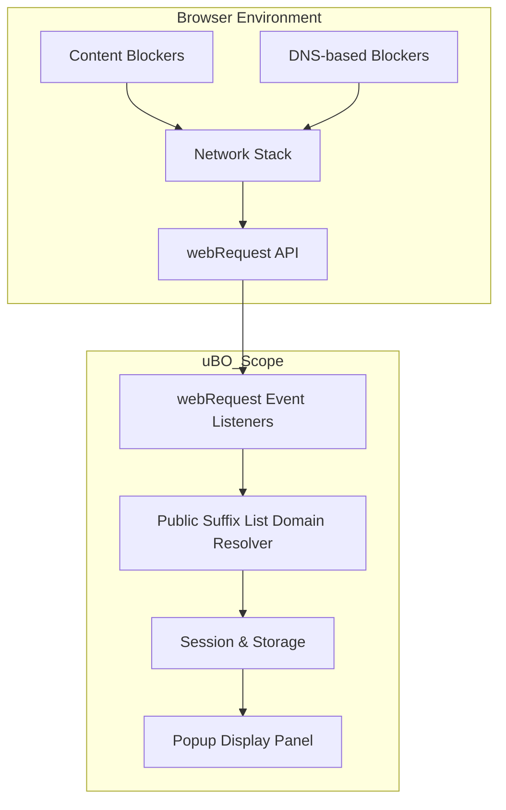

# Integrations & Compatibility

## Overview

This page clarifies how uBO Scope interacts with browsers and content blocking mechanisms. It explains the technical integration approach using the browser's `webRequest` API, how uBO Scope operates independently of content blockers, and outlines its compatibility with major browsers like Chrome, Firefox, and Safari. You'll gain a clear understanding of the extension’s boundaries and where it can reliably report network connections.

---

## How uBO Scope Integrates with Browsers

uBO Scope leverages the browser's low-level network monitoring interface called the **`webRequest` API**. This API lets the extension listen to all outgoing network requests initiated by webpages, regardless of how those requests are handled by content blockers or the browser itself.

### What This Means for You
- **Complete insight on network requests:** uBO Scope captures **both allowed and blocked attempts** to connect to remote servers, offering true transparency.
- **Independence from content blockers:** It doesn’t rely on any specific content blocker extension; it observes what the browser reports.
- **Focus on remote servers:** The extension measures the count of **distinct third-party remote servers** your browser tries to reach.

### Key Technical Points
- Uses `webRequest` event listeners (`onBeforeRedirect`, `onErrorOccurred`, and `onResponseStarted`) to track the lifecycle and outcome of network requests.
- Records details for requests based on their **type**, **URL**, and **event outcome** (success, redirect, error).
- Parses hostnames from URLs and determines their registrable domains using the Public Suffix List to provide meaningful domain groupings.

## Operating Independently from Content Blockers

uBO Scope is designed to work **without interfering with or depending on other content blockers** installed in your browser. It simply reports what network requests the browser is aware of, whether these requests are blocked by DNS-level filtering, extension-based blockers, or allowed.

#### Why This Is Important
- Avoids conflicts or inaccuracies caused by other blockers.
- Provides an **unbiased view** of network activity visible to the browser.
- Remains useful even if your primary blocker is disabled or bypassed.

<Info>
The extension reports blocked and stealth-blocked domains separately, highlighting connections that were prevented and those that were silently blocked by other mechanisms.
</Info>

## Browser Compatibility and Limits

uBO Scope is compatible with all major browsers that support the `webRequest` API, including:

- **Google Chrome** (minimum version 122+)
- **Mozilla Firefox** (minimum version 128+ including Firefox for Android)
- **Apple Safari** (version 18.5+)

### Permissions Required
All supported browsers require that the extension has the following permissions to function optimally:

- `webRequest` and `webRequestBlocking` (where applicable)
- Host permissions for `http://*/*`, `https://*/*`, and WebSocket protocols (`ws://*/*`, `wss://*/*`) where possible
- `activeTab` and `storage` permissions for tab identification and data persistence

### Known Compatibility Boundaries
- Some browsers or specific versions may limit or restrict access to certain network request information via the `webRequest` API.
- Network requests made **outside the browser context** (e.g., by native applications or lower-level network layers) are not visible to uBO Scope.
- Browsers that restrict or do not fully implement `webRequest` API capabilities may not provide complete data.

#### Example: Safari Limitations
Safari’s `webRequest` API is more restrictive. uBO Scope requires Safari 18.5 or later to ensure proper function, and WebSocket monitoring may be limited due to API constraints.

<Warning>
If your browser or version lacks comprehensive `webRequest` support, uBO Scope might show incomplete or missing network requests.
</Warning>

## Real-World Integration Scenarios

Here are some concrete examples illustrating how uBO Scope fits into your browsing setup:

- **Using uBO Scope alongside uBlock Origin or other content blockers:** uBO Scope independently reports the distinct remote servers your browser connects to or blocks. This transparency lets you verify the effectiveness of your content blocker without assuming the block count badge reflects server diversity.

- **Cross-browser usage:** Whether on Chrome, Firefox, or Safari, uBO Scope taps into native browser APIs to provide consistent data on third-party connections.

- **Filter List Maintenance:** For filter list maintainers and privacy researchers, uBO Scope offers crucial data regardless of the filtering engine or technique employed.

<Check>
Use uBO Scope to validate how many distinct third-party domains your browser interacts with, independent of block counts from other extensions or ad blocker test pages.
</Check>

## Troubleshooting Integration Issues

If you notice that uBO Scope isn’t capturing network requests accurately:

- Confirm that you have the required permissions enabled for the extension in your browser settings.
- Ensure that your browser version meets minimum compatibility requirements.
- Check for conflicting extensions or browser policies that might block access to the `webRequest` API.

<AccordionGroup title="Common Compatibility Troubleshooting"> 
<Accordion title="Missing Requests on Safari">
Due to Safari’s API restrictions, some WebSocket requests or lower-level network calls may not be reported. Verify Safari version is 18.5 or higher.
</Accordion>
<Accordion title="Blocked Permissions in Firefox">
Firefox may require explicit permissions or settings adjustments to allow full `webRequest` API functionality, especially on mobile versions.
</Accordion>
<Accordion title="Conflicts with Privacy Extensions">
High-privacy extensions or enterprise browser policies may restrict access to network events preventing uBO Scope from reporting accurately.
</Accordion>
</AccordionGroup>

## Summary

This page has given you clear insight into:
- How uBO Scope hooks into browsers via the `webRequest` API to expose network connections
- Its independent operation alongside any content blocker, including DNS or stealth blockers
- The compatibility guarantees and limitations across Chrome, Firefox, and Safari
- Practical use cases for privacy auditing, filter list maintenance, and verifying blocker performance
- Tips to troubleshoot integration and data visibility issues

For a top-level understanding of uBO Scope’s purpose and value or its core concepts, please see [What is uBO Scope?](/overview/product-introduction/what-is-ubo-scope) and [Core Concepts & Terminology](/overview/core-concepts-and-architecture/fundamental-concepts).

---

## Diagram: uBO Scope Integration Flow

## Related Links

- [What is uBO Scope?](/overview/product-introduction/what-is-ubo-scope) — Introduction and core purpose
- [Core Concepts & Terminology](/overview/core-concepts-and-architecture/fundamental-concepts) — Definitions and behavioral details
- [Value Proposition](/overview/product-introduction/value-proposition) — Why the distinct third-party server count matters
- [Target Audience & Use Cases](/overview/product-introduction/target-audience-use-cases) — Who benefits most and how
- [Install uBO Scope](/getting-started/installation-configuration/install-ubo-scope) — Getting started with installation
- Official GitHub repository: [https://github.com/gorhill/uBO-Scope](https://github.com/gorhill/uBO-Scope)

---

## Next Steps

After understanding integration and compatibility, proceed to:

- Install uBO Scope for your browser of choice
- Explore the popup interface to begin monitoring your browser’s third-party connections
- Consult troubleshooting if you encounter missing or incomplete data reports

---