# How uBO Scope Works: Architecture & Data Flow

Understanding how uBO Scope operates under the hood empowers users to better trust the data it provides and appreciate the seamless experience it delivers. This page breaks down the extension’s architecture, detailing how network requests are observed, categorized, and displayed through the popup user interface.

---

## Introduction

At its core, uBO Scope is a browser extension that actively monitors all network connections initiated by webpages you visit. Regardless of whether these connections are allowed, blocked, or stealthily redirected, uBO Scope comprehensively tracks and aggregates this information in real-time.

This page presents a high-level overview of the extension’s internal data flow, illustrating how background scripts capture web requests, process connection outcomes, and communicate statistics to the popup UI you interact with.

---

## High-Level Architecture

uBO Scope primarily consists of two main components:

- **Background Script:** Runs persistently within the browser’s extension environment. It listens to the browser’s network events, analyzes each request, categorizes connection outcomes, and maintains a session-wide data store.
- **Popup UI:** Activated when a user clicks the extension icon. It fetches processed connection data from the background script and renders a clear, organized dashboard.

These components collaborate through a message-passing mechanism that ensures the latest network data is efficiently reflected in the UI.

### Component Interaction Flow

```mermaid
flowchart TD
    subgraph Browser Environment
      A["User Browsing Webpage"] --> B["Network Requests Triggered"]
      B --> C["Background Script Listens to Web Requests"]
      C --> D["Record & Categorize Outcomes"]
      D -->|Save Data| E["Session Data Store"]
      E --> F["Update Extension Badge"]
      F --> A
    end

    subgraph User Action
      G["User Clicks Extension Icon"] --> H["Popup UI Requests Tab Data"]
      H --> I["Background Script Returns Serialized Data"]
      I --> J["Popup Render Panel with Details"]
      J --> G
    end

    classDef component fill:#f9f9f9,stroke:#333,stroke-width:1px;
    class A,B,C,D,E,F,G,H,I,J component;
```

---

## Background Script Responsibilities

### Monitoring Network Events

Using the browser's WebRequest API, the background script hooks into three key events:

- `onBeforeRedirect` — for intercepting redirects.
- `onErrorOccurred` — for detecting failed requests.
- `onResponseStarted` — to detect successful responses.

Each event queues a detailed request record for batched processing, optimizing performance.

### Recording and Categorizing Outcomes

When processing the queued requests, the background script:

1. Extracts the hostname and converts it to a domain using the Public Suffix List to normalize domains accurately.
2. Classifies connection outcomes into:
   - **Allowed:** Requests successfully made to distinct domains.
   - **Blocked:** Requests that failed or were blocked.
   - **Stealth:** Redirect events that obscure the true destination.
3. Maintains individual Maps (key-value-store) for domains and hostnames under these three categories, per browser tab.
4. Updates the badge count on the extension icon to reflect the number of unique allowed third-party domains.

### Session Management

The data is stored in session memory and persisted across browser sessions using the browser’s `storage.session` APIs. This persistence enables the extension to maintain connection statistics live for each tab until the tab is closed.

When tabs are closed, their associated data is expunged to free resources.

---

## Popup UI Data Flow

When you open the uBO Scope popup, it initiates a message to the background script:

- Requests the connection data relevant to the currently active tab.
- Receives serialized domain and hostname details categorized by their outcome (allowed, blocked, stealth).
- Displays this data clearly, showing:
  - The tab’s main hostname and its registered domain in user-friendly Unicode format.
  - Counts and lists of domains by outcome type, enabling quick insight.
  - A summary count of all connected domains.

The UI uses a simple, accessible design with distinct sections for each outcome category, allowing you to audit your browsing’s network exposure at a glance.

---

## Data Structures

### Tab Details Entity

This object stores all connection records pertaining to a single browser tab:

- **domain**: The registered domain of the top-level document.
- **hostname**: The full hostname of the top-level document.
- **allowed, blocked, stealth**: Objects each containing:
  - **domains**: Map of domain → count of requests.
  - **hostnames**: Map of hostname → count of requests.

This structure ensures rich detail with easy aggregation for display and badge updates.

---

## Practical Example: Tracking a Tab's Network Requests

Imagine you visit https://example.com in a new tab. The background script:

1. Detects the main frame request and resets any prior data for this tab.
2. Sets the hostname and domain to "example.com".
3. Marks the main frame domain as allowed.
4. As subresources load, their requests are tracked:
   - Allowed third-party domains increase the allowed domains map.
   - Any errors or blocks increase the blocked domains map.
   - Redirects marking stealth modifications update the stealth domains map.
5. The extension icon updates the badge count dynamically to show how many unique allowed third-party domains are connected.
6. When you click the extension icon, the popup renders a detailed list of these domains classified by their connection status.

---

## Tips and Best Practices

- **Keep an eye on badge counts** for a quick indication of third-party exposure on a site.
- Use the **popup UI** to drill down into specific domains to understand the nature of connections.
- Remember that stealth-blocked domains are those where the connection was redirected or obfuscated, which may warrant closer inspection.
- The usage of the **Public Suffix List** ensures domains are normalized consistently, helping prevent duplication or missed classifications.

---

## Troubleshooting

- If the popup shows "NO DATA" or no domain information, ensure that the tab is active and has made network requests.
- Badge counts not updating could be due to session data loss; refreshing the tab or restarting the browser usually resolves this.
- Network requests made outside the browser's WebRequest scope won’t be captured; this is a limitation of browser APIs.

---

## Further Reading

For more on how uBO Scope fits into your browsing privacy toolkit and how to interpret its data:

- [Product Overview](./product-overview)
- [Value Proposition](./value-proposition)
- [Core Concepts & Terminology](./core-concepts-terminology)
- [Understanding the Popup: Domains and Connection Types](../../guides/core-workflows/understanding-the-popup)

---

**Source Code Reference:** View the core background and popup scripts responsible for network tracking and UI rendering:

<Source url="https://github.com/gorhill/uBO-Scope" paths={[{"path": "js/background.js", "range": "1-150"},{"path": "js/popup.js", "range": "1-80"}]} />

---