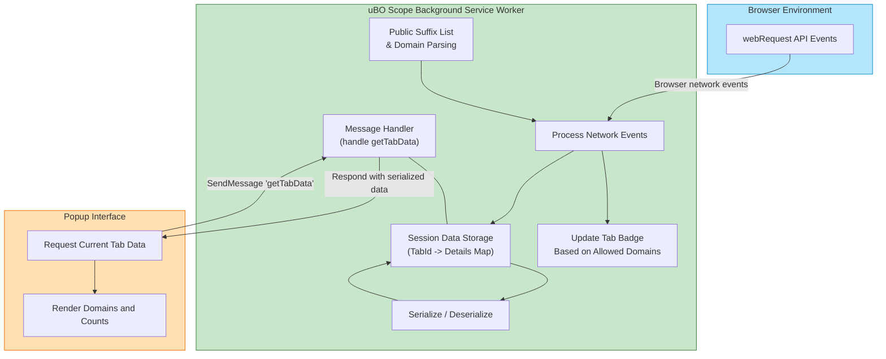

# Architecture & Data Flow

## Visualizing uBO Scope's Internal Workings

Understanding the architecture and data flow within uBO Scope reveals how it delivers precise, real-time insight into your network connections. This page guides you through the journey of browser network events from their capture to presentation, demonstrating how different components within the extension communicate efficiently to power the popup UI.

---

## Overview: How uBO Scope Captures and Processes Network Activity

When you browse the web, numerous network requests are triggered to various remote servers. uBO Scope seamlessly listens to these events, categorizes their outcomes, and stores the data to give you a clear picture of which third-party connections succeeded, were blocked, or stealthily redirected.

Here’s how the interaction unfolds:

- **Background Service Worker**: The core engine of uBO Scope, running as a background service worker, continuously listens to browser network events using the `webRequest` API.
- **Data Tracking and Classification**: Incoming HTTP and WebSocket requests are classified based on their outcomes into "allowed," "blocked," or "stealth-blocked" groups.
- **Session Management**: Data is organized per browser tab, maintaining details about the domains and hostnames involved.
- **Popup UI Communication**: Upon interaction, the popup interface queries the background for the current tab's summarized network data, then visualizes it.

## Core Components and Data Flow

### 1. Browser Event Capture

- The extension listens to multiple critical web request events:
  - **onBeforeRedirect**: Tracks requests that have been redirected.
  - **onErrorOccurred**: Detects failed requests.
  - **onResponseStarted**: Marks successful network responses.

These listeners operate under the permissions declared in the extension manifest, ensuring they capture all network requests matching host patterns (e.g., HTTPS and WSS URLs).

### 2. Background Script and Session Storage

- The background script (`background.js`) acts as the hub:
  - It updates a session-scoped map holding per-tab details.
  - For each network event, it normalizes URLs, extracts hostnames and domains, and classifies requests based on their outcome.
  - The session’s state persists using the browser's storage APIs, enabling continuity across browser sessions.

### 3. Tab-Specific Data Tracking

- For every active browser tab, network request details are mapped and reset as needed to reflect the current page's context.
- Details include counts of distinct domains and hostnames for each outcome category (allowed, stealth, blocked).

### 4. Popup UI Interface

- When you open the uBO Scope popup:
  - A message is sent to the background script requesting current tab data.
  - The background responds with serialized tab request data.
  - The popup renders this data, listing domains according to their network outcomes.

This clear separation ensures a lightweight and responsive UI without requiring direct access to sensitive browser APIs.

---

## Benefit-Driven Walkthrough: Why This Architecture Matters to You

### Real-Time Accuracy

By listening to browser events directly, uBO Scope reports precise network outcomes. This guarantees the badge and popup reflect live, reliable data about your browsing connections.

### Organized Per Tab

Tracking data per tab allows you to instantly see the network footprint of the active webpage without noise from background tabs or other browsing activities.

### Persistent Session Data

Storing session data means your connection insights survive a page reload or temporary interruptions, making troubleshooting and analysis smoother.

### Efficient Communication & UI Separation

Decoupling data collection (background service worker) from visualization (popup) minimizes performance impact and ensures the user interface always shows current, trusted information.

---

## Detailed Data Flow Diagram

---

## Practical Tips & Best Practices

- **Understanding Outcomes**:
  - *Allowed*: Requests that successfully completed.
  - *Blocked*: Requests which failed (e.g., due to content blockers or network errors).
  - *Stealth-Blocked*: Redirected requests that were hidden or rerouted.

- **Browser Support Variations**:
  - Manifest permissions and background script setup differ slightly across Chromium, Firefox, and Safari but the core data flow stays consistent.

- **Session Persistence**:
  - Because tab data is saved in session storage and updated continuously, refreshing a tab won’t lose connection history.

- **Badge Count**:
  - Reflects the number of distinct allowed third-party domains, giving an immediate privacy insight.

- **Avoid Overloading the UI**:
  - Domains and hostnames are summarized and sorted to keep the display concise and actionable.

---

## Troubleshooting Common Scenarios

<AccordionGroup title="Common Issues in Architecture & Data Flow">
<Accordion title="No Data Appears in Popup">
Verify that the background service worker is running correctly. The popup depends on querying the background script for data; failures typically occur if the service worker has been evicted or fails to respond.
</Accordion>
<Accordion title="Badge Count Not Updating">
The badge depends on tracked data from network events. If you observe stale counts, make sure the extension has proper host permissions and the browser supports the `webRequest` API fully.
</Accordion>
<Accordion title="Network Requests Not Recognized">
Some requests might originate outside the typical webRequest API's reach (e.g., WebRTC connections or extension-injected scripts). These won’t be tracked, which is expected behavior.
</Accordion>
</AccordionGroup>

---

## Next Steps

To build on this understanding, explore:

- [Key Features at a Glance](/overview/core-concepts-arch/feature-overview) — to see how these architecture details translate into user-facing capabilities.
- [Interpreting Network Request Data](/guides/deep-dive-analysis/interpreting-network-data) — to make sense of the collected data.
- [Understanding the Popup and Badge](/guides/getting-started/understanding-ui-badge) — for practical usage insights.

---

Unlock powerful transparency into your web connections by mastering uBO Scope’s architectural flow — an essential foundation for any privacy-conscious user or filter list maintainer.
