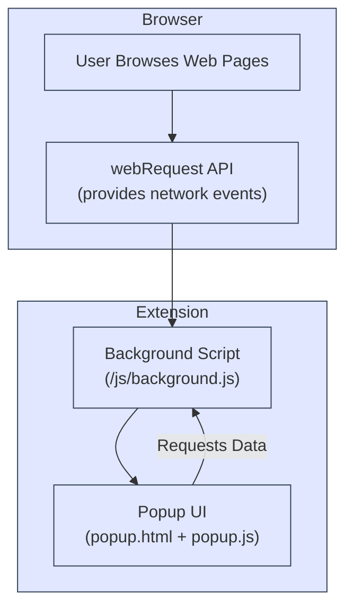

# System Architecture Overview

Understanding how uBO Scope works at a high level empowers you to use it confidently and interpret its data accurately. This page unveils the key components of the uBO Scope extension, how they interact, and precisely where network data flows within the system. An intuitive Mermaid.js diagram visually captures these relationships, making the architecture accessible and clear.

---

## What This Page Covers

- The primary components involved in uBO Scope operation
- Core data flows capturing network requests
- Integration points such as the browser's `webRequest` API
- How the background script and popup UI collaborate

This focused overview complements more detailed pages that explain how uBO Scope captures network data and presents it to the user.

---

## High-Level Components

### Browser

uBO Scope relies on modern browser APIs to access network request information. The browser is the platform where websites and their network activities run, and it provides the essential `webRequest` API that uBO Scope hooks into. Supported browsers (like Chrome, Firefox, and Safari) expose this API in a way that allows the extension to monitor outgoing connections seamlessly.

### Background Script

At the heart of uBO Scope is the background script (`background.js`). This module acts as the persistent, privileged process that listens for network events via the `webRequest` API. It independently intercepts all relevant network requests, analyzes them, and maintains the state per browser tab without interference from content blockers.

Key responsibilities include:

- Capturing attempted and successful remote server connections
- Determining the 'third-party' nature of connections using domain resolution
- Recording connection statuses (allowed, blocked, stealth-blocked)
- Persisting data across browsing sessions for consistent reporting

### Popup UI

The popup (`popup.html` + `popup.js`) is the user-facing interface that presents collected network data in a readable form. When you click the uBO Scope toolbar icon, this UI opens and shows a domain-level breakdown of third-party connections, categorized by their status.

It communicates with the background script to request the latest data for the active tab and updates reactively to reflect current network activity.

---

## Core Data Flows & Integration Points

The following diagram outlines the interaction between these components and the flow of network information that uBO Scope reports.

### Detailed Explanation of Data Flow Steps

1. **User navigates and interacts with web pages** within the browser, triggering network requests as resources are loaded.

2. The **browser's `webRequest` API** independently emits detailed events for each network request, including initial attempt, blocking decisions, and completion notices.

3. The **background script listens** to these `webRequest` events, independently from any content blocker, enabling comprehensive and trustworthy monitoring.

4. The background script **analyzes requests** to identify third-party domains, determine if connections were allowed, blocked, or stealth-blocked, and associates this information with the tab that initiated the request.

5. When you open uBO Scope’s toolbar icon, the **popup UI launches and queries** the background script for the latest collected data pertaining to the active tab.

6. The **popup UI displays** a categorized list of third-party domains contacted, enhancing your awareness of all third-party activity on the current page.

---

## Why Understanding This Architecture Matters

By knowing these components and visible data flows, you will:

- Recognize that uBO Scope operates independently to provide accurate network visibility.
- Understand that the data you see in the popup reflects real-time network events captured at the browser level.
- Appreciate how uBO Scope maintains per-tab context for clarity.
- Gain insight into troubleshooting — for example, if no data appears, verifying browser support for the `webRequest` API or extension permissions helps.

---

## Practical Tips & Best Practices

- Ensure your browser version supports the required APIs (`webRequest`) and the manifest version used by uBO Scope.
- Understand that not all network requests (e.g., those outside browser API visibility) can be tracked.
- Use the popup UI to gain instant clarity on which third-party servers your browser connects to during your browsing session.

---

## Related Documentation

For users looking to deepen their understanding, consider visiting these pages:

- [How uBO Scope Works](/overview/core-concepts-arch/how-it-works): Detailed data flow and request processing
- [Core Terminology and Concepts](/overview/core-concepts-arch/core-terminology): Definitions that clarify statuses and domain processing
- [Interpreting the Badge and Popup Panel](/guides/getting-started-usage/interpreting-badge-popup): Guide to reading the UI data

You can also explore the [GitHub repository](https://github.com/gorhill/uBO-Scope) for source code insights.

---

Unlock the full value of uBO Scope by pairing this architectural clarity with practical usage insights.

Happy monitoring!
