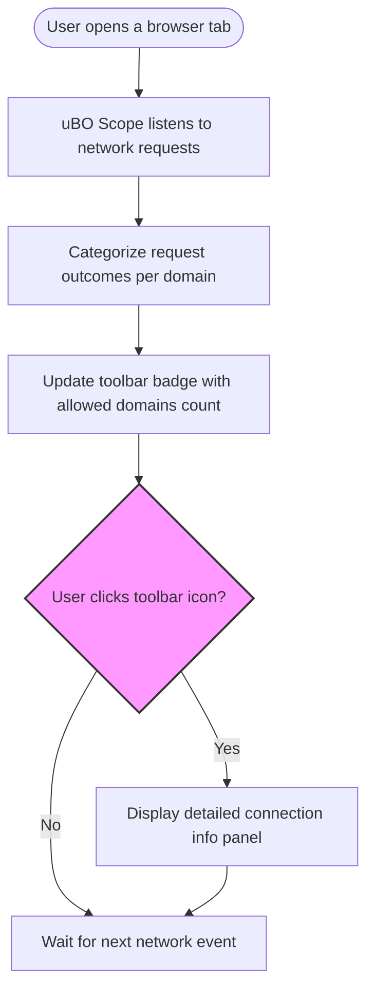

# Quick Feature Overview

Discover how uBO Scope empowers you with unparalleled visibility into your browsing connections. This overview encapsulates the core features that make uBO Scope an essential tool for privacy-conscious users and filter list maintainers alike.

---

## Per-Tab Connection Tracking

uBO Scope meticulously monitors network connections on a per-tab basis, associating every connection outcome with the active browser tab. This feature lets you see exactly which third-party domains each tab interacts with, categorized by status:

- **Allowed:** Connections successfully established.
- **Blocked:** Connections that failed or were prevented.
- **Stealth-blocked:** Connections that were redirected or hidden deliberately by content blockers or network effects.

### Why It Matters
Understanding per-tab connection details helps you audit web behavior, identify unwanted trackers, and validate content blocker effectiveness with precision.

---

## Real-Time Toolbar Badge Counts

The toolbar icon dynamically displays a badge representing the number of distinct third-party domains successfully connected in the current tab. This count updates in real-time, providing an immediate, concise snapshot of your browsing exposure.

### Key Benefits
- **Instant Insight:** See your exposure to third-party connections at a glance.
- **Actionable Feedback:** Lower badge counts indicate fewer third-party connections, generally correlating with better privacy.

---

## Popup Panel for Detailed Connection Insights

Clicking the toolbar icon opens the popup panel, revealing detailed domain-level information about the current tab's connections. The panel is logically divided into three sections:

- **Not Blocked:** Domains from which resources were successfully loaded.
- **Stealth-blocked:** Domains where connection attempts were redirected or hidden, often by stealthy content blockers.
- **Blocked:** Domains where connections failed due to blocking or errors.

Each section lists domains along with the number of connection attempts, enabling you to drill down into the specifics.

### Real Scenario
Imagine browsing a website and wondering how many third-party servers it contacts. The popup instantly tells you which connections happen freely, which ones are hidden, and which were actively blocked—without guesswork.

---

## Independence from Content Blockers

uBO Scope operates outside the influence of content blocking rules, relying solely on the browser's `webRequest` API to log all network request outcomes. This independence means:

- It reports **all** connection attempts, whether blocked by your content blocker, DNS filter, or allowed through.
- The data is candid and unfiltered, giving a trustworthy view of network behavior.

### Impact
This feature allows users to audit their content blockers’ real-world effectiveness and catch stealth behaviors invisible to conventional tools.

---

## How These Features Work Together

By combining per-tab tracking, real-time badge counts, a detailed popup, and independent network monitoring, uBO Scope creates an actionable, transparent user experience:

1. **You open a webpage.**
2. uBO Scope listens to all network requests issued by this tab.
3. It categorizes each request's outcome into allowed, stealth, or blocked.
4. The toolbar badge updates with the count of allowed third-party domains.
5. You click the badge to open the popup panel and explore detailed domain data.

This workflow empowers you to: monitor your privacy exposure continuously, make informed decisions about blockers or filter lists, and understand how sites interact with third parties.

---

## Practical Tips & Best Practices

- Use uBO Scope alongside your current content blocker to verify connection outcomes independently.
- Regularly check the badge count during browsing sessions as an immediate privacy metric.
- Explore the popup panel to identify unexpected or suspicious domains.
- Remember that not all third-party servers are harmful; common CDNs are often necessary and legitimate.

## Troubleshooting Common Issues

- If the badge count remains empty, ensure that uBO Scope has the necessary permissions (`webRequest`, `activeTab`, `storage`).
- The extension depends on browser APIs that may not track all connection types (e.g., non-HTTP protocols).
- If detailed domain data doesn’t show, try refreshing the tab or disabling conflicting extensions.

## Summary Diagram — User Experience Flow

## Getting Started Preview

To immediately benefit from uBO Scope's insights, install the extension from your browser’s official store. Once installed, simply browse as usual:

- The badge will display the distinct allowed third-party domains count for the active tab.
- Click the badge to open the popup panel and examine connection details.

For comprehensive usage guidance, visit the related documentation pages outlined below.

---

## Further Exploration

For deeper understanding of terminology, architecture, and best practices, consult these related documentation pages:

- [What is uBO Scope?](../intro-value-prop/what-is-ubo-scope)
- [How uBO Scope Works](../core-concepts-arch/how-it-works)
- [Interpreting the Badge and Popup Panel](../getting-started-usage/interpreting-badge-popup)

These resources provide the foundation needed to master uBO Scope and maximize its privacy monitoring capabilities.

---

Unlock full visibility into your web connections with uBO Scope’s core features—track, quantify, and understand every third-party connection across your browsing sessions with confidence and clarity.

---

## References

- uBO Scope GitHub Repository: [https://github.com/gorhill/uBO-Scope](https://github.com/gorhill/uBO-Scope)
- Browser Extension Permissions: `webRequest`, `storage`, `activeTab`

