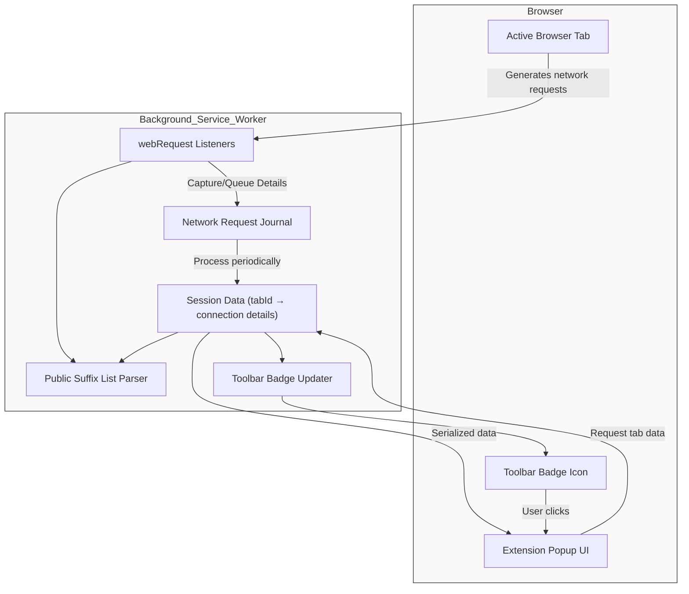

# Overall System Architecture

## Gain Clear Insight Into How uBO Scope Operates

Understanding how uBO Scope tracks and reports network connections unlocks its full potential. This page guides you through its internal workings from the moment a webpage triggers requests to how data is collected, processed, and displayed in the popup interface. You'll see the seamless interplay between background scripts and the user interface, empowered by advanced browser APIs.

---

### Why This Matters to You

With transparency into the architecture, you gain confidence in the accuracy and reliability of the network connection data you view. You will grasp why uBO Scope can detect connections regardless of other content blockers in place, and appreciate the care taken to keep its reports real-time, succinct, and privacy-conscious. Equipped with these insights, troubleshooting and interpreting results become much easier.

---

## How uBO Scope Works: End to End

At its core, uBO Scope uses your browser's `webRequest` API to intercept and monitor network requests made by active tabs. These requests include all attempts to connect to remote servers — whether they succeed, fail, or get redirected. Through background scripts running as a service worker, uBO Scope captures this network event stream and organizes it in a detailed session data model mapped by browser tab.

When you open the extension popup (clicking the toolbar icon), it queries this curated data for the current active tab and renders a categorized report summarizing third-party domains connected by that page.

### Step-by-Step User Flow

1. **Network Activity Captured:** As you browse, uBO Scope's background service worker listens to web requests, intercepting critical lifecycle events like redirects, errors, and successful responses.

2. **Request Outcome Recorded:** Each request is analyzed to determine its fate — allowed, stealth-blocked (redirected to stealthy handlers), or blocked — and the respective hostname and domain are logged accordingly.

3. **Session Data Maintained:** All network connection details are organized in session storage keyed by tab ID, allowing quick retrieval and updating without slowing down browsing.

4. **Badge Update:** The browser toolbar icon updates in near real-time showing the count of distinct third-party domains successfully connected for the active tab, providing an immediate privacy snapshot.

5. **Popup UI Rendering:** When activated, the popup requests the background script for session data for the active tab, then displays a neatly organized list of domains grouped by outcome (allowed, stealth, blocked) along with connection counts.

### Benefits at a Glance

- **Transparent & Real-Time Reporting** — Never miss a network connection, regardless of other blockers.
- **Tab-Specific Granularity** — Understand exactly which tab is connecting to which domains.
- **Accurate Outcome Categorization** — Differentiate stealth-blocked and fully blocked connections.
- **Persistent Session Data** — Retain insights through your browsing session for continuity.

---

## Key Components and Their Roles

| Component               | Role                                                         |
|-------------------------|--------------------------------------------------------------|
| **Background Service Worker** | Listens to browser webRequest events, processes outcomes, maintains session data, and updates badge counts. |
| **Session Data Model**         | Stores organized connection outcomes keyed by tab, domain, and hostname for quick access and persistence. |
| **Popup UI Script**             | Requests tab-specific data, decodes, and renders the user-facing report inside the popup. |
| **Public Suffix List Module**  | Extracts base domains from hostnames to categorize requests correctly. |
| **Browser APIs (webRequest, storage, tabs, action)** | Enable network observation, data storage, tab querying, and UI badge updates. |

---

## Technical Workflow Diagram

---

## Practical Example: Tracking a Single Page Load

Imagine you navigate to a news website. As the page loads:

- The browser issues network requests for HTML, images, scripts, ads, and trackers.
- uBO Scope’s background script listens for these requests.
- When a request succeeds, it logs the hostname and domain as "allowed".
- If a request is redirected stealthily (e.g., by a blocker), it marks it under "stealth".
- If a request fails or is blocked, it records it as "blocked".
- The tab’s entry is updated, counting how many distinct third-party domains have connected.
- The toolbar badge updates to quickly inform you.
- You click the extension icon, and the popup shows a categorized list like:
  - Not blocked: cdn.example.com (15)
  - Stealth-blocked: trackerbad.com (4)
  - Blocked: ads.example.net (7)

This concise report helps you instantly assess the page connections, improve privacy awareness, or debug filtering rules.

---

## Tips for Effective Use

- **Refresh Awareness:** The architecture updates data in near real-time but shows a snapshot — refresh the popup to see latest state.
- **Focus on Domains:** A lower count of allowed third-party domains generally indicates better privacy.
- **Understand Outcomes:** Some stealth-blocked connections may be less harmful but still worth noting.
- **Session Persistence:** Data persists per browser session but resets on tab close for privacy and accuracy.

---

## Troubleshooting Common Issues

<AccordionGroup title="Common Issues in Architecture and Data Flow">
<Accordion title="No connections appear for a tab">
This can happen if the tab was just opened or if no network requests were captured yet. Confirm that the tab is fully loaded and that your browser supports the webRequest API.
</Accordion>
<Accordion title="Badge count not updating">
Background script updates badge counts using event listeners and timers. Sometimes, delays or browser restrictions can cause lag. Try refreshing the tab or restarting the browser.
</Accordion>
<Accordion title="Data mismatch between popup and badge">
The popup queries snapshot data at click time while badge updates asynchronously. Slight timing differences can cause momentary discrepancies. They will synchronize upon further activity.
</Accordion>
</AccordionGroup>

---

## Looking Ahead

This foundational architecture empowers uBO Scope to deliver dependable, transparent network connection reporting. Future enhancements will extend detail granularity while maintaining lightweight, responsive operation.

---

_For related conceptual information, including terminology and how uBO Scope fits into your broader privacy toolkit, see [Key Terms & Concepts](/overview/core-concepts-arch/core-terminology)._  
_For practical user guidance and getting started, visit the [What is uBO Scope?](/overview/intro-value-audience/what-is-ubo-scope) and [Who Should Use uBO Scope?](/overview/intro-value-audience/target-audience-use-cases) pages._

---

## Source Code Reference

For complete details on background processing and popup UI interaction, view:

- [Background Service Worker (`js/background.js`)](https://github.com/gorhill/uBO-Scope/blob/main/js/background.js)
- [Popup UI Script (`js/popup.js`)](https://github.com/gorhill/uBO-Scope/blob/main/js/popup.js)

---

_Last updated for version 1.0.1 on branch `main`._