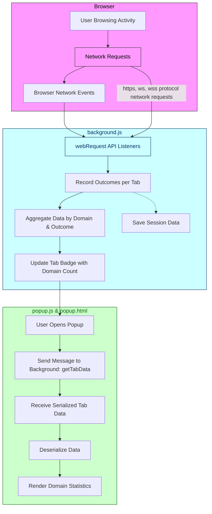

# How Does uBO Scope Work? (Architecture & Data Flow)

Understanding the inner workings of uBO Scope will empower you to make the most of its unique capabilities. This page provides a clear, high-level architectural overview and illustrates the flow of data from your browser's network events to the live statistics shown in the popup UI.

---

## Unlocking Transparency: The Architecture Behind uBO Scope

uBO Scope is designed with a straightforward yet powerful architecture that captures every network connection attempt made by your browser. Its core strength lies in how it monitors and aggregates network activity, all while presenting relevant insights directly through its user interface.

### Key Components and Their Roles

- **Browser Events:** These are the native triggers your browser emits whenever it initiates or receives network requests.
- **Background Monitoring (background.js):** Acts as the extension’s vigilant observer, using the browser's `webRequest` API to listen for network activity events.
- **Data Aggregation per Tab:** uBO Scope organizes network data individually by browser tab, ensuring precise tracking of third-party domains contacted for each active webpage.
- **Popup UI:** The interactive window you see when clicking uBO Scope’s icon, querying live data from the background script to display current statistics.

---

## How It All Comes Together: Data Flow Explained

1. **Network Requests Begin:** When you navigate or interact with web pages, your browser issues network requests to various servers.
2. **Events Triggered:** Each network request leads to browser events signaling success, redirection, or error.
3. **Background Listener Reacts:** The extension's background script (`background.js`) listens to these events via `webRequest` API listeners (`onBeforeRedirect`, `onErrorOccurred`, `onResponseStarted`).
4. **Outcome Categorization & Aggregation:** Requests are categorized as allowed (successful), stealth (redirects that bypass detection), or blocked (failed/error). This outcome is tracked per tab with domain-level aggregation.
5. **Badge Update:** The browser action badge count for each tab updates dynamically to reflect the number of distinct third-party domains successfully contacted.
6. **Popup Queries Data:** When you open the uBO Scope popup, it sends a message requesting the latest aggregated data for the current active tab.
7. **Data Deserialization and Rendering:** The popup script receives serialized tab data, deserializes it, then renders a comprehensive, real-time breakdown of connected domains sorted by their outcome (allowed, stealth-blocked, blocked).

---

## Visual Overview: Architecture and Data Flow Diagram

---

## Practical Insights: What This Means for You

- **Real-Time Monitoring:** As you browse, uBO Scope effortlessly captures network activity without delay, giving you immediate feedback on third-party connections.
- **Per-Tab Contextualization:** Statistics are precisely tied to each browser tab, allowing you to focus on data relevant to the active page.
- **Outcome Transparency:** By distinguishing allowed, stealth-blocked, and blocked connections, you gain a nuanced understanding of network request behavior.
- **Intuitive UI Feedback:** The toolbar badge and popup UI provide clear, searchable insights to help you evaluate your web exposure at a glance.

---

## Tips to Get the Most Out of uBO Scope

- **Keep an Eye on the Badge:** The badge count reflects unique third-party domains contacted. A lower count generally signifies fewer external connections.
- **Open the Popup Often:** Dive into the detailed domain lists to identify which servers your browser is communicating with.
- **Understand Outcomes:** 'Stealth' connections are redirects detected by uBO Scope; exploring these can reveal subtle behaviors in network traffic.
- **Use in Privacy Assessment:** Comparing allowed vs. blocked domains can help assess content blocker performance and the effectiveness of stealth blocking.

---

## Troubleshooting Common Issues

<AccordionGroup title="Common Issues and Solutions">
  <Accordion title='Popup Shows No Data or "NO DATA"'>
    Ensure that the active tab is a web page with network activity. Some pages, like browser settings or new tabs, don't generate meaningful network requests.
  </Accordion>
  <Accordion title="Badge Count Not Updating">
    If the badge doesn't refresh, verify that background monitoring is active. The extension relies on browser `webRequest` API, which might behave differently or be restricted in some contexts.
  </Accordion>
  <Accordion title="Unexpected Domain Counts">
    Remember that uBO Scope counts distinct third-party domains contacted. Third-party definitions depend on the domain extraction logic using the Public Suffix List. Domains under the same organization but different suffixes count separately.
  </Accordion>
</AccordionGroup>

---

## Next Steps

To deepen your understanding and start using uBO Scope immediately, explore the following:

- [What is uBO Scope?](/overview/introduction-value/product-purpose-value) — Understand the purpose and value.
- [Interpreting Domain Statistics](/getting-started/first-use-and-verification/interpreting-domain-stats) — Learn to read and analyze the detailed data.
- [Installation Instructions](/getting-started/installation-and-requirements/installation-instructions) — Set up uBO Scope quickly and correctly.

---

By grasping the architecture and data flow of uBO Scope, you equip yourself to harness its full power in monitoring and understanding your web traffic privacy exposure.