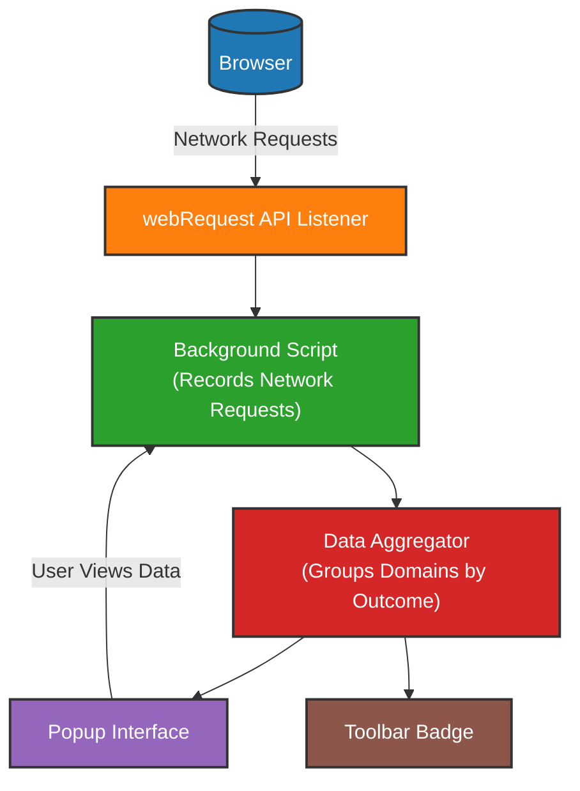

# How uBO Scope Works (Architecture Overview)

Understanding how uBO Scope processes and reports network connections provides valuable insight into its strengths and limitations. This page walks you through the major data flows of the extension—including how it monitors network requests, aggregates the results, and presents them through the popup interface and toolbar badge. A simplified architecture diagram is included to visualize this flow clearly.

---

## Overview: From Network Requests to User Interface

uBO Scope’s primary goal is to expose all network connections initiated by webpages, transparently reporting which third-party remote servers your browser connects to.

This transparency begins with the extension listening to network requests through the browser's `webRequest` API. Every request made by a webpage triggers this listener, allowing uBO Scope to capture data about whether the request was allowed, blocked, or stealth-blocked (blocked in a manner transparent to the page).

Collected data is then categorized, aggregated per domain, and displayed in two ways:

- **Popup Interface:** When you click the uBO Scope icon, the popup shows detailed, categorized lists of domains with connection outcomes.
- **Badge:** The toolbar icon badge reflects the count of distinct third-party domains with *allowed* connections, enabling quick insight into exposure.

This architecture ensures you see beyond mere block counts — you gain clarity on how many distinct third-party servers are actually connected.

## Key Data Flow Steps

1. **Monitoring Network Requests**
    - The extension’s background script uses the `webRequest` API to listen for all network requests made by pages.
    - It captures details such as request URL, resource type, and outcome (allowed, blocked, stealth-blocked).
    - This mechanism works regardless of the content blocker in place, even supporting DNS-based blocking, provided browser reports through `webRequest`.

2. **Aggregating Domain Information**
    - Each observed network request’s host is extracted and normalized (accounting for IDNs via punycode).
    - Domains are grouped by their status outcome (allowed, blocked, stealth-blocked).
    - Counts are maintained for how many requests per domain fall into each category.

3. **Popup Interface Rendering**
    - Upon popup open, the extension queries aggregated data for the active tab.
    - It displays domains under headings: **not blocked**, **stealth-blocked**, and **blocked**, along with request counts.
    - The popup updates dynamically as you navigate tabs or reload.

4. **Badge Count Update**
    - The extension updates its toolbar badge with the count of distinct allowed third-party domains per page.
    - A lower count here indicates fewer active connections to third-party servers, aligned with privacy goals.

## Visualization: Simple Architecture Diagram

## Understanding Key Concepts in the Flow

- **webRequest API:** The core browser interface that allows uBO Scope to intercept details about all network requests.
- **Background Script:** Runs persistently (or as a service worker in Chromium) to process captured request events.
- **Data Aggregator:** Maintains running totals and categorization of domains reflecting request outcomes.
- **Popup Interface:** A user-facing HTML page that provides a detailed snapshot for the current tab.
- **Toolbar Badge:** A concise visual indicator summarizing the privacy exposure of each page.

## Practical Example Scenario

Imagine visiting a news website that includes several third-party ads and trackers:

- The `webRequest` listener captures every domain the site tries to access.
- Some tracker domains are blocked outright, others are stealth-blocked (hidden from the page).
- Allowed domains, like content delivery networks (CDNs), appear as connected.

The popup then lists these domains clearly under their respective categories. The badge shows the number of allowed third-party domains, highlighting your actual exposure.

## Tips & Best Practices

- **Refresh the popup interface on tab reloads** to get up-to-date connection info.
- Understand that **not all third-party connections are bad**; some legitimate services use CDNs or APIs.
- Use the **badge count as a quick gauge**, but dive into the popup for details before adjusting filters.
- Remember uBO Scope’s **accuracy depends on browser support for `webRequest`**; some network activity outside it cannot be seen.

## Troubleshooting & Limitations

- If you notice no connections reported, verify that your browser allows `webRequest` access and that uBO Scope has been granted required permissions.
- The extension cannot see or report network requests made outside the browser environment or non-HTTP(s)/WebSocket protocols.
- The badge count reflects distinct allowed domains, not the raw number of requests, which focuses on exposure rather than traffic volume.

---

### Next Steps

For more detailed breakdown on terminology, explore the [Key Concepts & Terminology](../network-terminology) page.
To see how uBO Scope integrates with browsers and existing content blockers, visit [Integration with Browsers & Content Blockers](../integration-other-systems).
If you haven’t already, review the [Feature Snapshot](../../getting-started/feature-glance) for a concise overview of capabilities.

---

_By understanding uBO Scope’s architecture and data flows, you can better leverage its insights to evaluate your web privacy and content blocking efficacy._

---

## Source Code Reference

For an in-depth look into the core data gathering and popup rendering, see the background script and popup JavaScript source files:
- Background script managing `webRequest`: [`/js/background.js`](https://github.com/gorhill/uBO-Scope/blob/main/js/background.js)
- Popup UI rendering data: [`/js/popup.js`](https://github.com/gorhill/uBO-Scope/blob/main/js/popup.js)