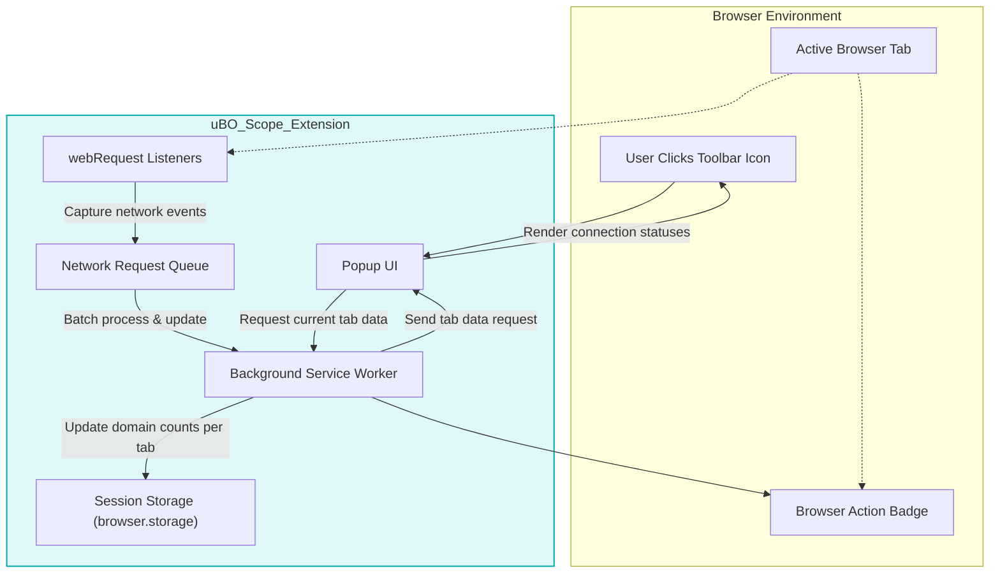

# Architecture Overview

## Understanding uBO Scope's Internal Architecture

uBO Scope is designed to provide **transparent, real-time insight into all network connections** made by your browser's web pages. This page unfolds the internal architecture of uBO Scope, explaining how it captures and processes network requests, and how it orchestrates communication between its core components: the background service worker, popup interface, and user interface (UI).

Through this architecture, uBO Scope uniquely surfaces every connection attempt—including allowed, blocked, and stealth-blocked requests—irrespective of other content blockers or DNS filters in use.

---

## Core Purpose and Workflow

At its heart, uBO Scope leverages browser `webRequest` API listeners within a background service worker to monitor network traffic in real-time. It captures detailed information about each request, records outcomes such as successful connections, redirects, or failures, and maintains state per browser tab.

This recorded data is then made accessible to the popup UI on demand, enabling users to explore connection outcomes categorized by status. Communication between components is seamless, providing instant reflection of network activity with minimal latency.

## Key Components

- **Background Service Worker**: Runs persistently to monitor network requests using `webRequest` listeners for events like request success, error, or redirect. It maintains the state of network activity per tab, updates badge counts, stores session data, and responds to popup queries.

- **Popup UI**: A lightweight interface activated when the user clicks the browser toolbar icon. It requests up-to-date tab-specific connection data from the background service worker and presents it in a clear, categorized breakdown of domains connected, blocked, or stealth-blocked.

- **Storage and Session Management**: Utilizes browser storage to persist session states and the public suffix list, ensuring accurate domain extraction and continuity across browsing sessions.

---

## How Network Requests Are Captured and Processed

1. **Listening to Network Events**
   - The background service worker attaches listeners to `webRequest` events: `onBeforeRedirect`, `onErrorOccurred`, and `onResponseStarted`. These listeners catch detailed events on all network requests matching the extension's host permissions.

2. **Queueing and Batching**
   - Incoming network request events are queued briefly to batch-process updates, minimizing performance overhead and ensuring efficient data handling.

3. **Outcome Categorization**
   - Each request is classified as one of three states:
     - **Allowed (Success)**: Connections that completed successfully.
     - **Blocked (Error)**: Connections that failed or were blocked.
     - **Stealth (Redirect)**: Connections that ended in redirects, often indicative of stealth-blocking techniques.

4. **Updating Tab Details**
   - The extension tracks connections per browser tab, aggregating counts of distinct domains and hostnames per connection outcome.

5. **Domain Extraction Logic**
   - To present network data meaningfully, uBO Scope extracts hostnames and derives effective second-level domains using the embedded Public Suffix List. This ensures accurate grouping even for domains using multi-level public suffixes (e.g., `.co.uk`).

6. **UI Badge Update**
   - The browser action badge reflects the current count of distinct third-party domains allowed per tab, providing an immediate privacy exposure indicator.

---

## Communication Flow

The background service worker and popup UI communicate through asynchronous messages:

- When the popup opens, it sends a message requesting the tab's recorded network connection data.

- The background service worker responds with serialized session details relevant to the current tab.

- The popup renders this data, presenting a categorized list of domains and connection counts.

---

## Visual Diagram of uBO Scope Architecture

---

## Practical Example: What Happens When You Load a Webpage

Imagine you navigate to example.com in a new tab. Here’s how uBO Scope handles it:

1. The background service worker's `webRequest` listeners start capturing all HTTP and WebSocket requests made by this tab.
2. The first main frame request sets the baseline hostname and domain for tracking.
3. Each subsequent resource request is evaluated:
   - If it succeeds, it’s recorded as allowed.
   - If blocked or if it fails, it’s recorded as blocked.
   - Redirected requests are marked as stealth, showing hidden network activity.
4. These outcomes are stored and aggregated per domain and hostname.
5. The browser action badge updates, showing you how many unique third-party domains successfully connected.
6. When you open uBO Scope’s popup, it displays the categorized list of connected domains, empowering you with transparent visibility.

---

## Tips for Users

- **Understand badge counts** as the number of distinct third-party domains allowed, not total requests.
- Use the **popup UI** actively to audit and interpret results per tab.
- Recognize that **stealth-blocked entries highlight nuanced network behaviors** like redirects which may evade standard blockers.

---

## Troubleshooting Common Issues

- If data seems missing, ensure your browser supports the `webRequest` API and that uBO Scope has necessary permissions.
- Background service worker may be restarted by the browser; uBO Scope persists session data to mitigate loss.
- Some network requests made outside browser control (e.g., outside `webRequest` scope) will not be observed.

---

For a deeper dive into core concepts and how to interpret uBO Scope data, explore the [Core Concepts and Terminology](/overview/core-concepts-architecture/core-concepts-terminology) and [Feature Summary](/overview/core-concepts-architecture/feature-summary).

---

_This architecture enables uBO Scope to deliver **unmatched transparency and reliability** for understanding your browser's network activity with precision and minimal overhead._
