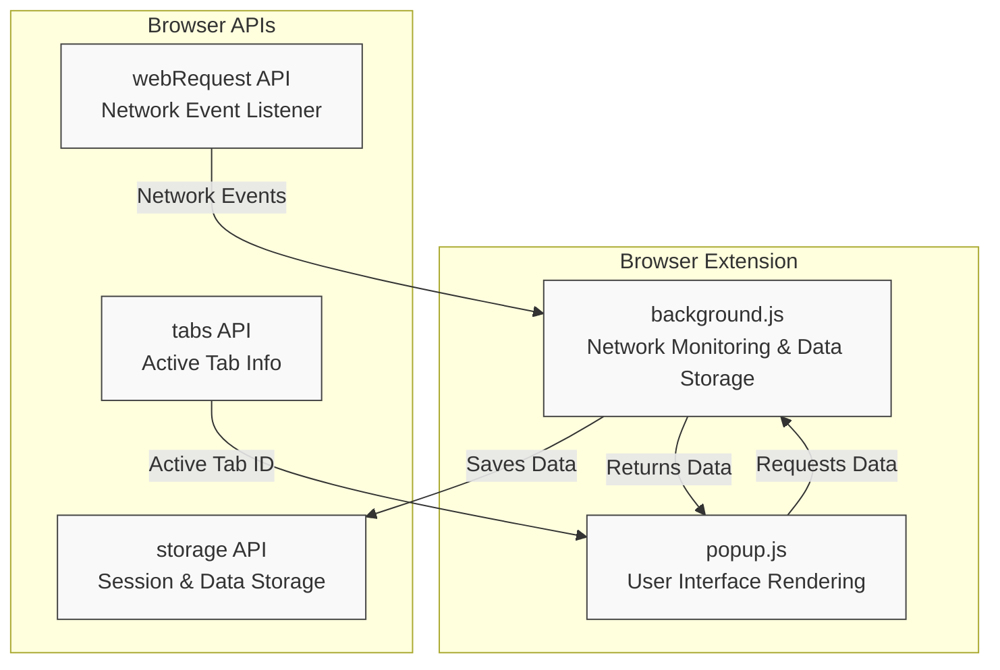

# How uBO Scope Works

Discover the inner workings of uBO Scope through a clear, high-level visual and narrative walkthrough. Understand how this extension leverages browser APIs to monitor network requests in real time, organize session data, and interact dynamically with the user interface to present actionable insights about your web connections.

---

## Introduction: What Happens Behind the Scenes?

Imagine browsing a website and instantly knowing every connection your browser tries to establish—whether it's allowed, stealth-blocked, or outright blocked. uBO Scope achieves this by monitoring network traffic through the browser’s native capabilities and feeding this data directly into the extension’s UI to deliver transparency and actionable information.

At its core, uBO Scope acts as a vigilant observer nestled inside your browser, constantly recording network events and summarizing them in a meaningful way.

---

## Core Architecture Overview

uBO Scope’s architecture consists primarily of two pivotal scripts working in tandem:

- **background.js** — Acts as the persistent, behind-the-scenes service worker or background script that listens to network events, manages data storage, processes network connection outcomes, and maintains session information.

- **popup.js** — Drives the user interface you interact with via the extension popup, rendering up-to-date connection summaries based on data retrieved from background.js.

These components synchronize through messaging and shared session storage to present a live and accurate picture of network connections for each browser tab.

### Visual Diagram: Simplified Data Flow

This diagram showcases how network events captured by `background.js` through browser `webRequest` listeners resume a constant cycle: they get processed and saved in session storage, which the UI (`popup.js`) subsequently requests and renders.

---

## Detailed User Flow and Component Interactions

### 1. Monitoring Network Activity

Using the browser's `webRequest` API, background.js registers listeners for key network events related to every web request:

- `onBeforeRedirect`: capturing redirects
- `onErrorOccurred`: detecting failed network requests
- `onResponseStarted`: tracking successful responses

Each network event is queued momentarily and processed in batch to efficiently record outcomes, avoiding UI lag or performance hits.

### 2. Session Data Management

Background.js aggregates network connection data per-tab, organizing information by:

- **Allowed**: Connections completed successfully to distinct third-party domains
- **Stealth-blocked**: Connections redirected in ways that remain hidden or stealthy
- **Blocked**: Connections that failed or were explicitly blocked

This state is stored in browser session storage, preserving data per active tab across browsing sessions.

### 3. Connection Outcome Classification

Each connection's hostname is extracted and normalized to its registrable domain using the public suffix list library (psl). Detailed mappings of connection outcomes—per domain and hostname—are maintained, enabling granular and aggregated views.

### 4. UI Data Retrieval and Presentation

When the user clicks the uBO Scope icon, popup.js queries background.js for the data corresponding to the active tab. The extension then:

- Converts punycode domains to user-friendly Unicode representations
- Sorts domains by connection counts
- Renders categorized lists under _not blocked_, _stealth-blocked_, and _blocked_ sections
- Updates badge counters dynamically to reflect distinct connected domains

### 5. Real-Time Updates and Badge Counts

Background.js updates the toolbar badge count for each tab in real time. This count represents the number of distinct third-party domains from which successful network connections have been made, helping users see at a glance how many unique external servers the current page is connecting to.

---

## Practical Example: Exploring the Flow

1. You navigate to a website in tab 17.
2. The browser dispatches network requests for images, scripts, or data.
3. Background.js listens to these requests via `webRequest` events.
4. Each request’s domain is extracted and categorized as allowed, stealth-blocked, or blocked.
5. This categorized data is stored within the session mapped specifically to tab 17.
6. uBO Scope’s badge on tab 17 shows the count of allowed unique domains.
7. When you open the popup UI, popup.js requests the session data for tab 17.
8. It then displays a detailed and readable summary of connected domains and counts.

This seamless flow provides immediate feedback on third-party network activity and lets you verify your content blocking status visually.

---

## Best Practices and Tips

- **Keep the Public Suffix List updated:** Background.js loads and caches the latest public suffix list on startup to accurately parse domains. This ensures correct classification of hostnames.

- **Patience with initial load:** Data is asynchronously loaded and cached; some details may take a moment to appear after the first page load.

- **Understand badge counts:** The badge reflects distinct *third-party* domains connected, not simply the number of blocked or allowed requests.

- **Remember limitations:** Network requests not observable via the browser’s `webRequest` API (e.g., made by native code or some WebSocket variants outside the API) won’t be reflected.

- **Use for insights, not absolute blocking decisions:** uBO Scope reveals connection attempts and outcomes but does not block by itself.

---

## Troubleshooting Common Scenarios

<AccordionGroup title="Common Issues and Solutions">
<Accordion title="Popup Shows 'NO DATA' or Blank">
This typically means the active tab has no recorded network activity or background.js hasn’t loaded data for that tab yet. Try refreshing the tab or ensuring the site has actively loaded resources.
</Accordion>
<Accordion title="Badge Count Doesn't Update Immediately">
Background.js batches events and updates badge text periodically (approximately every second). This delay is intentional for performance reasons.
</Accordion>
<Accordion title="Extension Does Not Detect Some Network Connections">
Certain network connections outside browser scope (e.g., native applications, some WebSocket connections) are not captured by the extension due to API limitations.
</Accordion>
<Accordion title="Data Disappears After Tab Close or Reload">
Session data is tied to active tabs. Closing a tab removes its data. Reloading restarts tracking with a fresh session for that tab.
</Accordion>
</AccordionGroup>

---

## Summary

uBO Scope integrates closely with browser APIs and internal scripts to deliver real-time transparency on third-party network connections. Its background.js script listens to and processes network events, managing session data that the popup.js UI renders on demand. This architecture fosters a clear and actionable understanding of your browser's connections, empowering you to monitor, verify, and analyze third-party interactions effortlessly.

---