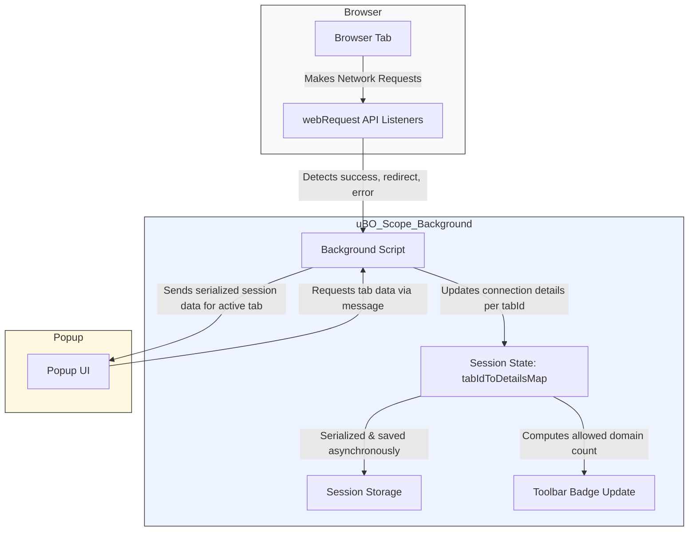

# How uBO Scope Works (Architecture Diagram)

Discover how uBO Scope intelligently tracks and reports your browser’s network activity, offering clear insights into all remote server connections made by your open tabs. This page visually breaks down the architectural flow, emphasizing how the extension captures, manages, and presents detailed connection data in a way that’s accessible and actionable.

---

## Overview of uBO Scope’s Architecture

uBO Scope operates as a browser extension designed with transparency and precision in mind. It monitors every network request initiated by browser tabs to reveal all third-party connections, including allowed, blocked, and stealth-blocked domains. This information empowers users to understand real-time exposure and control over their browsing data.

The architecture primarily revolves around three core components:

1. **Background Script**: Listens to network events through browser webRequest APIs.
2. **Session State Management**: Maintains detailed connection data per tab.
3. **Popup UI**: Fetches and displays summarized connection data to the user.

This division ensures efficient, continuous monitoring while providing quick, on-demand user feedback.

## Key Components and Data Flow

### Background Script: Network Listener and Recorder

At the core, uBO Scope’s background script hooks into the browser’s `webRequest` API to listen for network events:

- **Request Outcomes Tracked:**
  - `success`: Successfully allowed connections.
  - `redirect`: Connections silently redirected (stealth-blocked).
  - `error`: Blocked or failed requests.

Upon detection, the background script queues these network requests, annotates their outcomes, and asynchronously updates the session data.

### Session State Management

Each tab is managed independently with a dedicated session data structure, capturing:

- Hostnames and domains for allowed, stealth-blocked, and blocked connections.
- Counts of requests per domain/hostname.

The session data is serialized and stored persistently, ensuring state consistency even if the background process is temporarily suspended. Closed tabs automatically clear their data, preventing stale information.

### Popup UI: Visualizing Connection Data

When you click the uBO Scope toolbar icon, the popup UI requests the latest session data for the active tab from the background script. 

The UI then presents:

- **Hostname and domain** of the current tab.
- Counts and lists of connected domains grouped by their outcome (allowed, stealth-blocked, blocked).

This real-time snapshot facilitates quick interpretation and decision-making.

---

## User Journey Through uBO Scope’s Architecture

Imagine browsing a news website:

1. As your browser requests content, uBO Scope monitors each request via the background script.
2. Successful connections add domains to the allowed category.
3. Redirects (used by stealth-blocking content blockers) are noted separately.
4. Blocked requests contribute to the blocked list.
5. All counts update the badge on the extension icon, indicating how many unique third-party connections are active.
6. Clicking the icon shows detailed connection lists in the popup for you to analyze.

This flow ensures you remain informed throughout your browsing session.

## Practical Tips

- **Badge Count**: Reflects the number of unique allowed third-party domains per tab.
- **Stealth-Blocked Connections**: Are connections silently redirected or hidden by other blockers.
- **Blocked Connections**: Failed or prevented connections.
- **Session Persistence**: Allows continuous monitoring even if your browser extension undergoes reloads.

## Architecture Diagram

---

## Troubleshooting Common Issues

### No Data Showing in Popup
- Ensure the background script is running and has permission to listen to webRequest.
- Verify the active tab is not a browser internal page or URL that restricts extension access.

### Badge Count Not Updating
- Background script may have been temporarily evicted by the browser; refreshing the tab or restarting the browser resets communication.
- Some network requests may occur outside `webRequest` API scope and hence are untracked.

### Discrepancies Between Content Blockers
- uBO Scope reports independent of content blockers; strictly shows actual allowed, blocked, and stealth-blocked connection attempts.

---

## Next Steps

With this foundational knowledge of how uBO Scope works, proceed to [Installing uBO Scope](/getting-started/installation-and-setup/installation) to begin monitoring your browsing network activity. For understanding the data you see, consult [Understanding the Popup and Badge](/guides/getting-started-essentials/understanding-the-popup).

These guides will help you translate the architecture insights into practical usage and enhance your web privacy mastery.

---