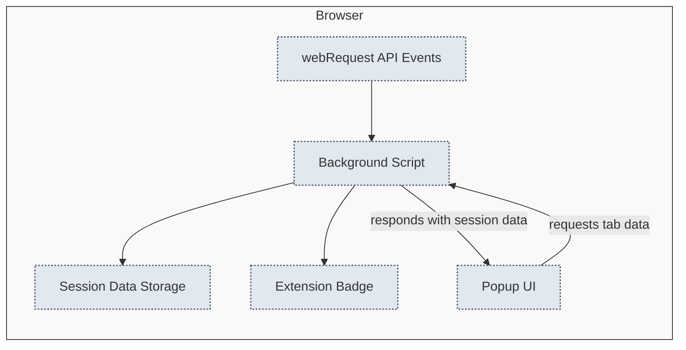

# How uBO Scope Works: Architecture Overview

Welcome to the architecture overview of uBO Scope, where we unravel the inner workings of this browser extension and how it continuously monitors and reports network connections within your browser. This page provides a clear, visual understanding of the core system components, their interactions, and the flow of data that powers uBO Scope's insightful connection reporting.

---

## Understanding uBO Scope’s Core Architecture

At its heart, uBO Scope operates as a lightweight but powerful browser extension designed to capture and communicate detailed information about network requests initiated by all web pages you visit. By leveraging your browser's `webRequest` API, it tracks each network event — be it allowed, blocked, or stealthily blocked — and organizes this data by browsing session and tab.

Through this architecture, uBO Scope enables users to see the real-time landscape of connections on each tab, enhancing your awareness and control over your web privacy.

---

## Key System Components and Data Flow

This section breaks down the primary components of uBO Scope and illustrates the journey of network request data from detection to display.

### Main Components

- **Background Scripts**
  - Continuously listens to all web requests via the browser's `webRequest` API.
  - Records events describing connection outcomes: successful loads, redirects, or errors (such as blocked requests).
  - Maintains session data in browser storage to keep track of the ongoing network activity per tab.
- **Session Data Storage**
  - Holds detailed information for each open browser tab: domains and hostnames categorized by connection outcomes.
  - Shared persistently between browsing sessions to preserve continuity.
- **Popup UI**
  - User-facing interface triggered by clicking the extension badge.
  - Queries the background script for the current tab's network connection data.
  - Presents an intuitive breakdown of allowed, blocked, and stealth-blocked domains.

### Data Flow Explained

1. **Network Events Capture:** The background module hooks into three key webRequest API events — redirects, errors, and successful response starts — capturing detailed info about each network request.
2. **Outcome Classification:** Each request is classified into one of three categories:
   - **Allowed:** Successfully established connections.
   - **Blocked:** Requests that failed due to blocking.
   - **Stealth-Blocked:** Redirects internally handled by blockers to hide tracking.
3. **Session Update:** The background script updates session data, associating domains and hostnames with their respective categories and browser tabs.
4. **Badge Update:** Based on the count of allowed domains, the extension badge updates dynamically per tab, enabling at-a-glance understanding.
5. **User Interface Rendering:** When users open the popup, it requests the latest data for the active tab from the background script, deserializes it, and renders a clear summary in the popup panel.

---

## Architecture Workflow Diagram

To better visualize these components and their interactions, consider the Mermaid diagram below highlighting the key entities and data flows:

---

## Practical Scenario: From Network Request to User View

Imagine browsing a news website that loads content from multiple external servers. uBO Scope's background script listens silently, capturing every connection attempt:

- A first-party content server connection is allowed and recorded.
- A third-party ad network request might be stealth-blocked by your content blocker and noted accordingly.
- Another tracker connection attempt is fully blocked, registering as blocked.

This live flow populates per-tab session data that the popup UI presents when you open it:

- You see a summary of domains that loaded correctly.
- Domains that were stealthily blocked don't clutter the main view but are still reported.
- Blocked connections are clearly shown, giving insight into your content blocker's effectiveness.

The badge on the toolbar icon reflects the number of allowed domains, giving you immediate feedback without opening the popup.

---

## Best Practices & Tips

- **Avoid Closing Tabs Rapidly:** Since session data is saved per tab, closing tabs prematurely may discard useful connection history.
- **Refresh Popup Consistently:** Open the popup after the page completes loading for an accurate connection report.
- **Understand Badge Counts:** A lower badge count indicates fewer third-party connections, typically signifying better privacy.
- **Leverage for Auditing:** Use the architecture to analyze and cross-verify content blockers' behavior beyond standard block lists.

---

## Troubleshooting Common Issues

- **No Data Displayed in Popup:** Confirm your browser supports the `webRequest` API and uBO Scope has sufficient permissions.
- **Badge Not Updating:** Sometimes background scripts may delay; waiting a few seconds or refreshing the page ensures updated badge counts.
- **Mismatched Domains:** Domain lineage relies on the Public Suffix List loaded into the extension. If outdated, reload uBO Scope or clear session storage.

---

## Next Steps

To deepen your understanding of uBO Scope, consider exploring:

- [Core Concepts and Terminology](../core-concepts-architecture/core-terminology) to familiarize yourself with uBO Scope’s crucial terms.
- [Key Features at a Glance](../../getting-started/feature-quicklook) to see how these architectural elements translate into tangible UI features.
- [Viewing & Interpreting Connection Data](../../getting-started/first-steps-validation/viewing-and-interpreting-connection-data) for practical user guidance.

For detailed technical insights or to explore source code, consult the repository at [GitHub uBO Scope](https://github.com/gorhill/uBO-Scope).

---

Unlock the full potential of uBO Scope by seeing not just what connections your browser makes, but how the extension's architecture brings this data to your fingertips, imparting transparency and control over your browsing privacy.
