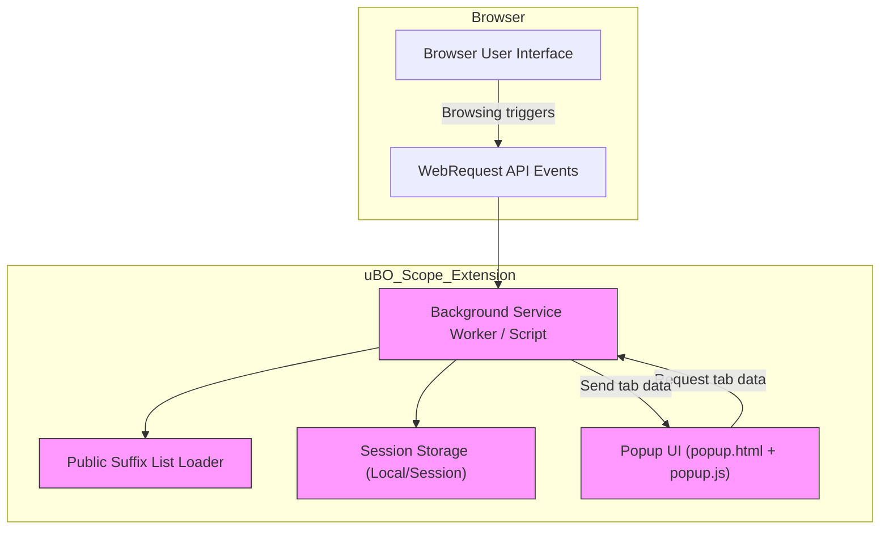

# Architecture Overview

## Understanding uBO Scope's Architecture

uBO Scope operates as a lightweight browser extension designed to provide clear, real-time visibility into every remote server connection your browser attempts or establishes. Its architecture is purpose-built to capture network events seamlessly in the background, categorize them, and present concise connection summaries specific to each browser tab via the popup interface.

### What Happens Under the Hood?

At its core, uBO Scope listens to network requests as your browser loads web pages. It continuously monitors these requests in the extension’s background layer, tracking whether connections are allowed, blocked, or stealthily blocked by content blockers or browser policies. This detailed classification helps you distinguish which remote domains are connected successfully, which are deliberately blocked to protect your privacy, and which are hidden from usual detection mechanisms.

Once the data is captured and organized, the extension’s popup UI renders this information by tab, making it easy to understand the network landscape of the current page.

### High-Level System Components

- **Background Service Worker / Script**
  - Listens for browser network events such as redirects, errors, and successful responses.
  - Processes these events to classify each domain connection outcome.
  - Maintains an in-memory map of connection details separately for each browser tab.
  - Stores session data persistently using browser storage APIs.

- **Public Suffix List Loader**
  - Loads and maintains an up-to-date list of domain suffixes to accurately parse base domains from hostnames.
  - Ensures domain grouping aligns with global internet standards.

- **Popup UI (popup.html & popup.js)**
  - Retrieves the current tab’s network summary data by messaging the background.
  - Presents a clean, categorized view segmented into "allowed", "stealth-blocked", and "blocked" domains.
  - Shows the count of distinct connected domains as an at-a-glance overview.

### Data Flow and User Interaction

1. **Browser Network Requests**
   - As you browse, network requests trigger browser webRequest events.
   - uBO Scope’s background script captures these events.

2. **Event Processing**
   - Each network event is classified by its outcome: success (allowed), error (blocked), or redirect (stealth-blocked).
   - Mapping is maintained per tab with domain granularity.

3. **Session Persistence**
   - Data is serialized and saved persistently via browser storage to maintain state across browser sessions.

4. **Popup Presentation**
   - When the popup opens, it requests the summarized data for the active tab.
   - The data is deserialized and rendered into categorized sections.

<Tip>
The badge count on the toolbar icon dynamically reflects the number of distinct allowed third-party domains connected by the active tab, providing you with immediate privacy insight.
</Tip>

---

## Concrete Example: Tracking Domains in a Tab

Imagine visiting a news website:

- As the page loads, several domains from content delivery networks (CDNs) and analytics providers are connected.
- uBO Scope’s background process records these connections, classifying which ones succeeded, which were blocked by content blockers, and which were stealthily redirected.
- When you click the extension icon, the popup displays:
  - **Allowed Domains:** The CDNs actually contacted.
  - **Stealth-Blocked Domains:** Domains connections attempted but invisibly redirected.
  - **Blocked Domains:** Domains explicitly blocked.

This allows you to see, for example, whether content blockers hidden from normal detection are actively preventing tracking.

---

## Visual Architecture Diagram

This diagram succinctly captures how uBO Scope fits into the browser ecosystem, showing the flow from browsing activity to network event capture and finally user presentation.

---

## Practical Tips for Users

- Opening the popup gives immediate understanding of third-party connections broken down by their outcome.
- The badge count complements the popup by offering a quick privacy indicator at all times.
- Knowing which domains are stealth-blocked can reveal advanced content blocker effects not obvious from regular browser tools.

## Common Pitfalls

- **No Data Displayed:** The popup depends on network activity. If a tab has just opened or has no network requests, no data will be shown.
- **Misleading Badge Counts:** The badge shows connected domains, not blocked ones. A high count means more third-party connections, which might signal lower privacy.

---

## Next Steps

To deepen your understanding after reviewing the architecture:

- Explore the [What is uBO Scope?](/overview/product-intro-value/what-is-ubo-scope) page for core product introductions.
- Review the [Value Proposition & Primary Use Cases](/overview/product-intro-value/value-proposition-usecases) to see why this architecture matters.
- Learn how to interpret the [Popup UI Overview](/guides/getting-started-ubo-scope/popup-ui-overview) for practical usage.

For developers or advanced users interested in deeper integration insights, the [Integration with Browser APIs & Ecosystem](/overview/core-concepts-architecture/integration-browser-apis) sheds light on browser interaction.

---

## Reference

For source code and ongoing updates, visit the uBO-Scope GitHub repository: [https://github.com/gorhill/uBO-Scope](https://github.com/gorhill/uBO-Scope)

---

*This overview empowers you to visualize how uBO Scope captures and presents network connection data, enabling more informed privacy decisions.*