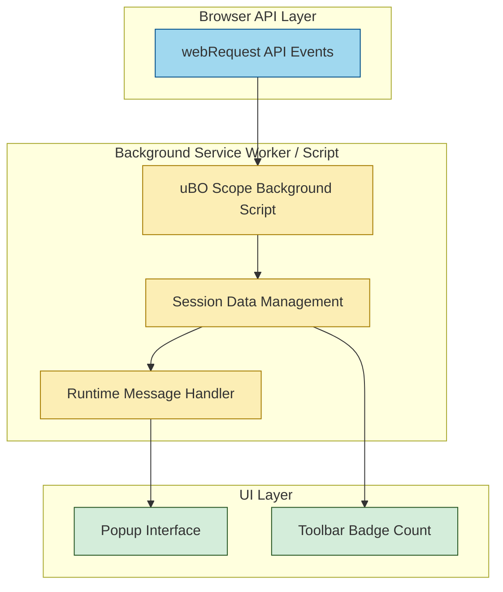

# Browser Integration & Compatibility

## Unlocking Network Insights Across Browsers with Native APIs

uBO Scope leverages the power of **browser-native APIs** to transparently capture and report on all network requests your browser tabs initiate, empowering privacy-conscious users with detailed visibility into remote server connections. This page explains how uBO Scope integrates deeply with Chromium, Firefox, and Safari browsers, highlighting key integration points, platform-specific nuances, compatibility considerations, and inherent limitations tied to browser architecture.

---

## Why Browser Integration Matters

Every web browser offers a unique environment and constraints on how extensions monitor network activity. uBO Scope is designed to seamlessly integrate with browser-native APIs—primarily the `webRequest` API—to track, categorize, and present network request data accurately.

This approach is essential because:

- It ensures **real-time, reliable capture** of network events including allowed, blocked, and stealth-blocked connections.
- It allows uBO Scope to deliver **consistent user experience** across the most popular browsers.
- It respects each browser’s **security and privacy model**, operating within explicit permissions and visibility scopes.

Understanding these components helps users recognize the foundation for uBO Scope's capabilities and any limitations.

---

## Core Integration Points Across Browsers

### 1. Use of `webRequest` API

The heart of uBO Scope’s network monitoring lies in the browser-native `webRequest` API. This API emits events for network requests, such as:
- `onBeforeRedirect`
- `onErrorOccurred`
- `onResponseStarted`

uBO Scope listens to these events to determine each request’s outcome—whether it was allowed, stealth-blocked (redirected silently), or blocked — and records the originating hostname and domain.

### 2. Background Processing

Depending on the browser, background scripts have different lifecycles and environments:

- **Chromium** uses a _service worker_ as the background process.
- **Firefox** and **Safari** use background _scripts_ running as modules.

Despite these differences, uBO Scope utilizes a consistent module-based background script (`background.js`) to centralize event listening, session management, and data aggregation.

### 3. Platform-Specific Manifest Declarations

uBO Scope maintains tailored `manifest.json` files per browser platform to declare required permissions, host access, and other settings:

- **Chromium Manifest Highlights:**
  - Uses `service_worker` background type.
  - Requires `webRequest`, `activeTab`, and `storage` permissions.
  - Host permissions include HTTP(S) and WebSocket schemes.
  - Declares minimum Chrome version `122.0`.

- **Firefox Manifest Highlights:**
  - Uses background script module.
  - Declares `webRequest`, `activeTab`, and `storage` permissions.
  - Includes host permissions for HTTP(S) and WebSocket URLs.
  - Specifies Gecko-specific strict minimum version `128.0` for desktop and Android.

- **Safari Manifest Highlights:**
  - Uses background script module.
  - Permissions limited to those supported, e.g., `webRequest`, `activeTab`, `storage`.
  - Enforces Safari minimum version `18.5`.
  - The extension’s popup and icon configuration adapted for Safari’s UI.

This manifest strategy ensures uBO Scope fits the platform conventions while maintaining consistent core functionality.

---

## Browser Visibility & API Limitations

### Visibility Within Browser Tabs

Network capture scope is **tied to the tab visibility context**:

- uBO Scope primarily collects network requests occurring in **active and background tabs** where the browser’s `webRequest` API is active.
- Requests originating from other contexts—such as native applications or sandboxed iframes isolated from the `webRequest` API—may go unreported.

### Limitations of `webRequest` API

While powerful, the `webRequest` API has notable constraints across browsers:

- Some network requests (e.g., DNS-level blocking or requests bypassing the API) won't be visible.
- APIs may have **privacy-preserving restrictions**, limiting the details available about certain requests.
- **Service workers and other browser internals** might generate network requests undetectable by the API.
- The **WebSocket** support varies slightly, but uBO Scope’s manifests include explicit permissions (`wss://`, `ws://`) to capture these when possible.

Understanding these boundaries helps set realistic expectations on what uBO Scope can reveal.

---

## How Platform Manifests Enable Cross-Browser Support

The careful tailoring of `manifest.json` per platform plays a pivotal role:

- Permissions requested in manifests align with **each browser’s support and privacy model** to maintain compatibility.
- The setup includes **default_popup** and **browser action icons** configured identically, ensuring consistent UI across browsers.
- Host permissions cover HTTP, HTTPS, WebSocket, and secure WebSocket schemes suitably per platform, enabling comprehensive capture.
- Background script declarations adapt to each platform's lifecycle mechanisms (service workers in Chromium, scripts in Firefox and Safari).

This design allows a **single codebase** with conditional runtime detection (see `js/ext.js`) to dynamically adapt behavior as needed.

### Runtime Flavor Detection

At runtime, uBO Scope identifies the executing browser environment (Chromium, Firefox, or Safari) to adjust behavior accordingly, ensuring optimal integration:

```js
// Pseudocode extracted from ext.js
const webextFlavor = (() => {
  const extURL = runtime.getURL('');
  if (extURL.startsWith('safari-web-extension:')) return 'safari';
  return extURL.startsWith('moz-extension:') ? 'firefox' : 'chromium';
})();
```

This guarantees that uBO Scope can handle minor platform API discrepancies without user intervention.

---

## User-Centric Benefits of Browser Integration

By leveraging native APIs responsibly and carefully adapting per platform, uBO Scope delivers:

- **Consistent and trustworthy connection reporting** regardless of browser choice.
- **Accurate badge counts and popup data** that reflect real network exposure, empowering privacy decisions.
- **Cross-platform usability** allowing users to maintain workflows across browsers without losing insight.
- **Alignment with browser content blockers and security features**, ensuring that network capture respects users’ privacy while maximizing visibility.

---

## Practical Tips for Users

- **Verify host permissions**:
  - Ensure your browser grants uBO Scope permissions to access all relevant URLs (`http://`, `https://`, `ws://`, `wss://`) to maximize capture.

- **Browser Version Requirements**:
  - Keep your browser updated beyond the extension’s minimal version (e.g., Chrome 122+, Firefox 128+, Safari 18.5+) for maximum compatibility.

- **Expect some unreported connections**:
  - Recognize that connections outside the `webRequest` API’s reach will not appear; this is a platform limitation, not a malfunction.

---

## Summary Diagram: Browser Integration Flow



This diagram illustrates how uBO Scope listens to browser-native network events, processes session data in the background script, and populates the UI with accurate status and connection information.

---

## Next Steps

To experience the benefits of uBO Scope’s cross-browser integration:

- Install the extension for your preferred browser (links in the [README](https://github.com/gorhill/uBO-Scope)).
- Consult the [Understanding the Popup and Badge](../guides/getting-started-essentials/understanding-the-popup) to interpret network insights.
- Learn about [Analyzing Third-Party Connections](../guides/practical-analysis-workflows/analyze-page-connections) to maximize privacy control.

Ensure your browser meets the minimum supported versions and permissions are granted for the best experience.

---

## Troubleshooting Common Integration Issues

<AccordionGroup title="Troubleshooting Browser Integration">
<Accordion title="Why am I not seeing all network requests?">
Not all network requests are exposed through the browsers' `webRequest` API. Connections made outside this scope, including those by certain service workers or non-HTTP protocols, will not be captured.
</Accordion>
<Accordion title="What are platform manifest differences and why do they matter?">
Platform manifests specify permissions and background script configurations. Incorrect or outdated manifests can cause failures or limited data capture. Always use the manifest version specific to your browser.
</Accordion>
<Accordion title="Why does the badge count change unexpectedly?">
The badge count reflects the number of distinct third-party domains connected. Changes in network requests, tab visibility, or tab closure trigger updates. It may also be influenced by content blockers active in your browser.
</Accordion>
</AccordionGroup>

---

For more comprehensive understanding of uBO Scope’s architecture and practical application, visit the [Architecture Overview](./architecture-overview) and [Core Concepts & Terminology](./core-concepts-terminology) documentation.


---

© Raymond Hill | Source Code: [uBO-Scope GitHub Repository](https://github.com/gorhill/uBO-Scope)


---