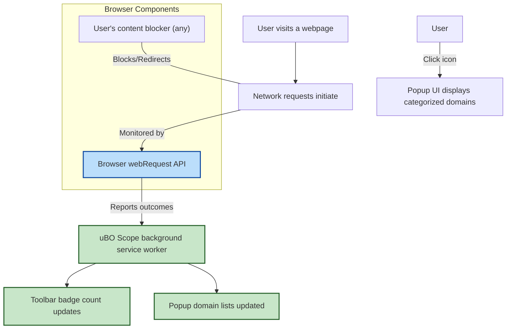

# Feature Overview

## Discover What uBO Scope Brings to Your Browser

uBO Scope enhances your browsing experience by delivering transparent, actionable insights into every connection your browser makes to third-party servers. With a visible badge count and a detailed popup interface, it arms you with the knowledge about which domains are allowed, blocked, or stealthily managed — all while seamlessly working alongside any content blocker you already use.

### Why This Matters to You

- **Instant Insights on Toolbar:** See at a glance how many distinct third-party remote servers your current tab connects to, helping you monitor privacy exposure without digging into raw logs.
- **Rich Popup Visualization:** Dive deeper with a clear, categorized display of connected domains—sorted into allowed, blocked, and stealth categories—to understand exactly what’s happening behind the scenes.
- **Compatibility with Any Blocker:** Because it listens to network requests reported by the browser, uBO Scope works alongside your preferred content blockers or DNS filtering systems.
- **Consistent, Reliable Data Reporting:** Utilizing standard browser APIs like `webRequest` ensures that you get trustworthy, up-to-date information on your browser’s network activity.

### Who Benefits Most?

This feature set is designed for privacy-conscious users, developers, filter list maintainers, and anyone who wants real transparency on where browser connections go during their browsing sessions.

---

## What’s in the Feature Overview?

This page walks you through the core user-facing capabilities of uBO Scope. It focuses on what you will see and interact with during everyday use, highlighting how each feature empowers you to better understand and audit your browser’s network footprint.

## Core Features & Capabilities

### 1. Toolbar Badge with Dynamic Count

A numerical badge overlays the extension icon on your browser’s toolbar. This number represents the count of _distinct third-party remote domains_ your current browser tab has successfully connected to.

- **What it tells you:** A lower number means fewer third-party connections (often better for privacy). A higher count indicates more external connections.
- **Example:** When visiting a news website with many advertising and tracking domains, you might see a badge count of 15, informing you that 15 distinct third-party remote servers were contacted.

### 2. Popup Interface with Categorized Domain Lists

Clicking the toolbar icon opens a detailed popup, instantly summarizing your current tab networking activity.

- **Sections for clarity:**
  - **Not Blocked (Allowed):** Domains for which connections succeeded.
  - **Stealth-Blocked:** Domains for which connections were redirected or stealthily blocked, often by advanced content blocking techniques.
  - **Blocked:** Domains where connections were explicitly blocked or failed.

- **Visualization:** Each domain entry is accompanied by a count badge indicating how many requests targeted it.
- **Example scenario:** You open the popup after visiting a shopping site and see a few allowed domains representing content delivery networks, some stealth-blocked tracking domains, and a handful of outright blocked ad servers.

### 3. Works Seamlessly Alongside Any Content Blocker

Because uBO Scope taps directly into the browser's `webRequest` API, it receives information about network requests irrespective of which blocker or filtering mechanism is in place.

- **Benefit:** You don't have to compromise your current setup to gain detailed insight from uBO Scope.
- **Compatibility Examples:** Whether you're using uBlock Origin, DNS-based filtering, or another ad blocker, uBO Scope reports the outcome based on what your browser sees.

### 4. Data Integrity via Browser API Consistency

The extension utilizes standard browser APIs designed for extensions, ensuring:

- **Reliability:** Data is gathered from the browser’s own network request lifecycle events.
- **Up-to-date reporting:** Changes are reflected dynamically as you navigate or refresh pages.

## Real-World User Flow: From Surfing to Analysis

1. **Browse a website:** You navigate to your favorite blog.
2. **Instant badge update:** The toolbar icon shows a badge with the number '8', indicating eight distinct third-party remote domains were connected.
3. **Open the popup:** Clicking the icon reveals which domains were allowed, blocked, or stealth-blocked.
4. **Interpret connections:** You notice several allowed CDN domains and a couple of stealth-blocked trackers.
5. **Adjustments or audits:** With this knowledge, you can decide to maintain or update your filter lists and blocking preferences.

## Tips for Success

- Keep an eye on the badge number as a quick privacy health check while browsing.
- Use the popup summary to validate if legitimate services (like content distribution networks) are allowed through while trackers and ads are blocked.
- Remember that stealth-blocked domains might not appear directly in some content blocker logs; uBO Scope exposes this hidden layer.

## Common Pitfalls to Avoid

- **Misinterpreting badge counts:** A higher number does not necessarily mean worse privacy — some domains are essential for proper site functioning (e.g., CDN services).
- **Assuming all blocked domains are malicious:** Some connections could be blocked due to network errors unrelated to blocking policies.

---

## Next Steps: Explore Related Documentation

To get the most out of these features, consider visiting the following pages:

- [What Is uBO Scope?](../product-intro-and-value/product-purpose-value) — Understand the product’s purpose and core value.
- [Key Concepts & Terminology](../core-concepts-architecture/core-concepts-terminology) — Learn about terms like stealth domains and badge count.
- [Installing uBO Scope on Your Browser](../../guides/getting-started/installing-extension) — Step-by-step installation help.
- [Mapping Allowed and Blocked Third-Party Domains](../../guides/core-use-cases/tracking-blocked-allowed) — Practical uses of domain categorization.

---

## Visual Guide: High-Level Interaction Flow

This diagram illustrates how uBO Scope interacts with the browser's networking and UI layers to provide you with meaningful insights.

---

By understanding this Feature Overview, you’re equipped with a clear vision of how uBO Scope integrates seamlessly into your browsing experience, empowering you with visibility and control over your privacy.

---

_For detailed installation instructions and deeper dives into concepts, visit the related guides and introductions referenced above._
