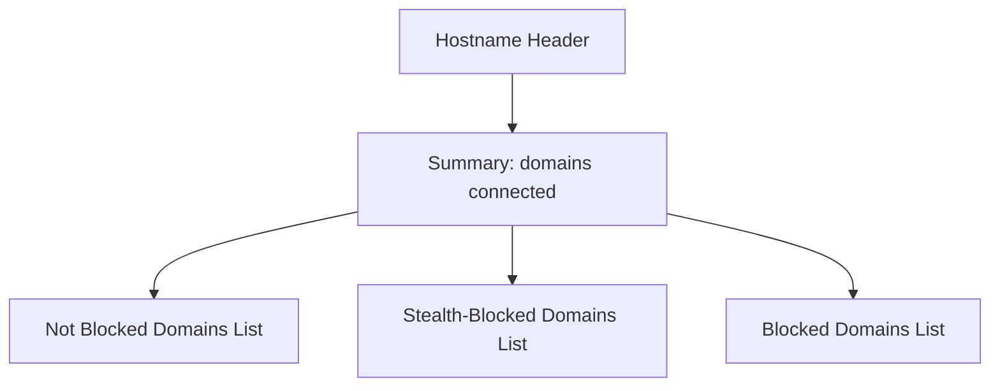

# Quick Feature Overview

Discover at a glance the core features and interface elements of **uBO Scope**, your transparent guide to remote server connections within your browser tabs. This page breaks down the essential functionalities you can expect, highlighting how badge reporting, domain categorization, multi-browser support, and resilient network reporting provide you with actionable insights in a simple, intuitive UI.

---

## Key Features at a Glance

- **Badge Reporting**: A concise numeric badge on the browser toolbar icon immediately indicates the number of distinct third-party domains connected by the active tab — a critical metric signaling your privacy exposure.

- **Per-Tab Domain Categorization**: Each browser tab maintains its own detailed classification of connections categorized into:
  - **Not Blocked (Allowed)**: Domains where connections successfully completed.
  - **Stealth-Blocked**: Domains with network requests redirected stealthily by content blockers.
  - **Blocked**: Domains where network requests were explicitly blocked.

- **Accurate Reporting Across Browsers**: Supported on Chromium, Firefox, and Safari browsers, uBO Scope leverages browser-specific `webRequest` APIs to measure real network connections irrespective of any content blocking solution you use.

- **Unmatched Transparency Despite Blocking Solutions**: uBO Scope reports network request outcomes reliably regardless of blocking mechanism—whether it’s browser extensions, DNS-based blockers, or stealthy content blockers—so you get a true picture of third-party connections.

- **Main UI Elements**:
  - **Toolbar Badge**: Displays the count of unique connected third-party domains for the active tab.
  - **Popup Summary**: Shows the total distinct domains connected.
  - **Tabbed Sections for Outcomes**: Lists of domains categorized as Not Blocked, Stealth-Blocked, and Blocked along with the count of requests per domain.

---

## Understanding the Badge Reporting

The badge on the browser action icon is far more than a simple count.

- It reflects the number of **distinct third-party domains** contacted by the webpage in the active tab.
- A **lower badge count** signals fewer external connections, indicating better privacy and fewer potential trackers.
- The badge updates dynamically as network requests progress and are categorized.

> **Tip:** Treat the badge count as your primary privacy exposure indicator when browsing. Use it to quickly assess the effectiveness of your content blocking setup.

---

## Per-Tab Domain Categorization Explained

Each browser tab is independently tracked and categorized with insightful grouping:

| Category        | Description                                                                                         | User Insight                              |
|-----------------|-------------------------------------------------------------------------------------------------|-------------------------------------------|
| **Not Blocked** | Domains where connections to remote servers succeeded without obstruction.                        | Indicates allowed third-party resources. |
| **Stealth-Blocked** | Requests that were redirected or silently blocked by stealth content blockers.                 | Reveals subtle blocking activity.         |
| **Blocked**     | Requests explicitly blocked and prevented from connecting.                                      | Shows domains your blocker actively blocks. |

Within the popup window, users see these three categories as distinct sections, each listing involved domains with a count of requests made. This real-time breakdown lets you understand not just how many, but which servers your browser communicates with.

---

## Cross-Browser Support

uBO Scope is designed to operate seamlessly on the major browsers:

- **Chromium-based browsers** (Chrome, Edge, Brave, Opera, etc.)
- **Mozilla Firefox** including Firefox for Android
- **Apple Safari** (version 18.5 and later)

This broad compatibility is enabled by using each browser's native API capabilities under the manifest version 3 framework, ensuring consistent user experience and data accuracy.

---

## UI Elements and Their Purpose

The main user interface, accessible via the browser toolbar icon popup, is streamlined for clarity and insight:

- **Hostname Header**: Displays the domain and subdomain of the active tab's main document.
- **Summary Section**: Shows the total count of distinct connected domains.
- **Outcome Sections**: Three clearly labeled sections for _Not Blocked_, _Stealth-Blocked_, and _Blocked_ domains.
  - Each domain entry shows the domain name and the number of network requests associated.
  - Subtle color-coded badges complement the categorization for instant recognition.

### Visual Structure of Popup UI

This UI architecture supports fast comprehension of your real-time browsing network environment.

---

## Real-World Example: Seeing uBO Scope in Action

Imagine you open a news website with many embedded third-party resources.

- The badge updates to "5", indicating connections with five distinct third-party domains.
- Clicking the icon, the popup identifies 3 allowed domains delivering content, 1 stealth-blocked domain showing subtle blocking activity, and 1 blocked domain, indicating active blocking by your content blocker.

This immediate insight empowers you to evaluate how many external sources your browser interacts with and how effective your blockers are, without guesswork.

---

## Best Practices & Tips

- **Use Badge Count as a Quick Privacy Metric:** Regularly glance at the badge count to gauge your exposure across visited sites.

- **Compare Domains Across Categories:** Look for repeated problematic domains in the Stealth-Blocked or Blocked lists to fine-tune your blocking rules.

- **Leverage Multi-Browser Support for Cross-Platform Consistency:** Install uBO Scope on all your browsers to maintain consistent visibility into your network connections.

- **Refresh the Popup Often:** Network requests and outcomes update continuously—refresh the popup or reopen it to get the latest data.

- **Recognize Legitimate Third Parties:** Not all third-party domains are bad—content delivery networks and trusted services often appear in the 'Not Blocked' list.

---

## Troubleshooting Common UI Questions

<AccordionGroup title="Common Questions about the Quick Feature Overview">
<Accordion title="Why does the badge number change unexpectedly?">
The badge updates dynamically reflecting the current network activity of the active tab. Browsing to new pages or dynamic content loading can alter connection counts.
</Accordion>
<Accordion title="What if I see 0 but notice network connections?">
uBO Scope counts distinct third-party domains with successful connections, so if all connections are first-party or stealth-blocked without distinct third parties, the badge could be empty.
</Accordion>
<Accordion title="How does uBO Scope detect stealth blocking?">
It listens for redirects and errors in network requests reported by the browser's webRequest API, classifying these as stealth or blocked outcomes.
</Accordion>
</AccordionGroup>

---

## Next Steps

Now that you understand what features uBO Scope offers and how to interpret its UI elements, proceed to explore [Understanding the Popup: Your First Analysis](/guides/getting-started/first-popup-overview) for an interactive walkthrough of the popup interface and how to analyze connection data effectively.

Also, consult the [Core Concepts & Terminology](/overview/core-concepts-architecture/core-concepts-terminology) page to deepen your understanding of the categorization and privacy metrics.

---

For complete installation instructions and initial configuration, see the [Installation Guide](/getting-started/introduction-setup/installation).

---

*Your journey to transparent network connection insights begins here with uBO Scope.*

---

<Info>
This documentation summarizes the key features and UI components visible in the uBO Scope popup interface and badge reporting. For a deeper dive into architecture and network data flow, please refer to the [How It Works: Architecture & Data Flow](/overview/core-concepts-architecture/how-it-works-architecture) documentation.
</Info>
