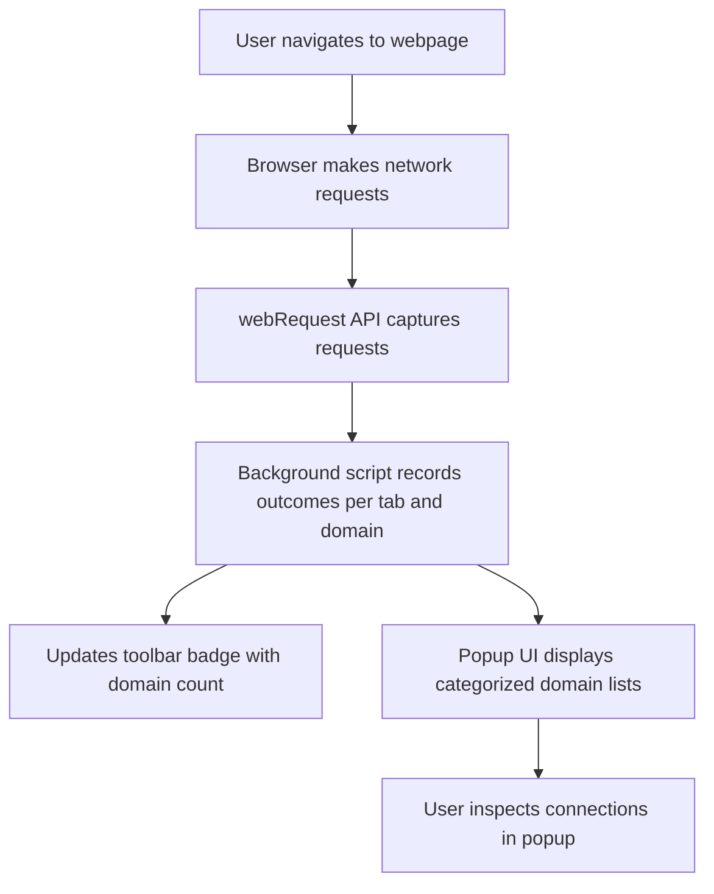

# Quick Feature Overview

uBO Scope delivers insightful, privacy-focused network monitoring capabilities in a streamlined and user-friendly extension interface. This page offers a concise summary of its standout features — from precise domain counting to real-time visualization — showing you exactly where and how these benefits appear within the extension.

---

## Distinct Domain Counting

At the core of uBO Scope is its unique ability to accurately count the number of distinct third-party domains your browser connects to for each active tab. Unlike traditional content blockers, uBO Scope doesn’t just measure blocked resources or raw network requests — it tracks *unique* remote servers based on their domain, providing a crystal-clear picture of your tab’s real network footprint.

- **Where it Appears:** The extension’s toolbar badge displays this exact count, helping you quickly assess how many third-party servers any webpage is contacting.
- **Why it Matters:** This metric helps you identify unnecessary or excessive third-party requests that may impact privacy or performance.

<Info>
The badge count updates live for the currently active tab, reflecting changes as pages load or network requests are made.
</Info>

## Real-Time Popup Visualization

uBO Scope features an intuitive popup UI that presents connection outcomes to remote servers, grouped by domain and categorized by status.

- **Categories Displayed:**
  - **Not blocked:** Domains with successful network requests.
  - **Blocked:** Domains where network requests were prevented.
  - **Stealth-blocked:** Domains with redirected or silently blocked requests.
- **Interface Highlight:** The popup lists each domain along with the number of connections, allowing immediate, actionable insight.

### Example Use Case
Imagine clicking the extension icon while viewing a news website. The popup instantly shows which content was loaded normally, which got blocked by your content blocker, and which servers uBO Scope stealthily prevented connections to — helping you understand exactly what's happening behind the scenes.

<Callout>
  <Tip>
  Hover over or scan through the popup sections to quickly differentiate domains by their network outcome, aiding troubleshooting or investigation.
  </Tip>
</Callout>

## Content Blocker Independence

Unlike many extensions, uBO Scope operates independently from your content blocker and even DNS-level blocking, leveraging the browser’s `webRequest` API to observe all network connection attempts.

- **Benefit:** See *all* remote server connections attempted or completed, no matter which blockers you use.
- **Usage Insight:** This makes uBO Scope a trustworthy tool for validating what your active blockers are truly doing.

<Note>
While uBO Scope tracks what the browser reports through the `webRequest` API, it cannot see connections made outside this scope. This limitation is inherent in browser APIs.
</Note>

## Privacy-Focused Design

The extension respects your privacy by focusing solely on network metadata — domains and connection outcomes — without collecting or transmitting any browsing data.

- **Offline Data Handling:** All session data is stored locally and scoped by tab, with no external communication.
- **Transparency:** Designed to empower users with knowledge of their browser's network behavior without compromising privacy.

---

## Where These Features Appear in the Extension

| Feature                     | Location in Extension              | Description                                         |
|-----------------------------|----------------------------------|-----------------------------------------------------|
| Distinct Domain Counting     | Toolbar Badge                    | Shows count of unique third-party domains connected.
| Real-Time Popup Visualization | Popup Interface (popup.html)     | Detailed categorized domain lists with connection counts.
| Content Blocker Independence | Background Script (`background.js`) | Leverages `webRequest` listeners to monitor network regardless of blockers.
| Privacy-Focused Design       | Session Storage & Local Processing | Data handled locally per tab with no external transmission.

---

## Practical Tips & Best Practices

- **Check the Badge Often:** Use the badge count as a quick snapshot of third-party network activity per tab.
- **Use the Popup for Deep Insight:** Whenever you suspect unexpected network connections, open the popup to see the detailed domain breakdown.
- **Combine with Content Blockers:** Use uBO Scope to verify that your content blockers or DNS filters are working as intended.
- **Understand Stealth Blocking:** The stealth-blocked category helps reveal hidden blocking actions that some blockers perform silently.

---

## Common Pitfalls to Avoid

- **Misinterpreting the Badge:** A higher badge count does not necessarily mean better or more aggressive blocking. It means more distinct third-party connections were observed.
- **Relying on External ‘Ad Blocker Test’ Pages:** Use uBO Scope’s insights instead of unreliable test sites, as uBO Scope reflects *real* network activity.

---

## How It Works: High-Level User Flow

This flow highlights uBO Scope’s transparent real-time monitoring that empowers users with accurate, actionable network data.

---

## Next Steps

Explore the following related documentation to deepen your understanding and maximize the value of uBO Scope:

- [What is uBO Scope?](/overview/about-ubo-scope/what-is-ubo-scope) — For a full introduction and core purpose.
- [How Does uBO Scope Work?](/overview/core-concepts-architecture/how-ubo-scope-works) — To learn deeper details on the inner workings.
- [Interpreting the uBO Scope Popup](/guides/getting-started/understanding-the-popup) — To master reading the popup’s data.

By mastering the quick feature overview presented here, you’ll become proficient at leveraging uBO Scope’s key capabilities effectively and responsibly.

---