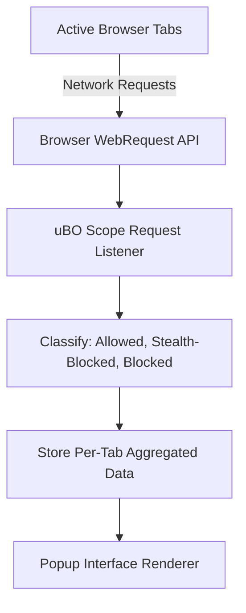

# Quick Feature Overview

Discover at a glance how uBO Scope arms you with precise, real-time insight into your browser's network connections. This page highlights the essential features designed to empower privacy-conscious users and filter maintainers through clear, per-tab visualizations and detailed domain connection reporting.

---

## Explore Network Connections by Tab

When you click the uBO Scope toolbar icon, the extension surfaces a **per-tab breakdown** of all third-party network connections your browser attempts or completes. This isn’t just a list — it’s a powerful snapshot offering clarity into how websites interact with remote servers across your active tabs.

- **Tab-Specific Context:** See the exact websites (hostnames and domains) your current tab connects to, helping you understand site behavior without opening complex developer tools.
- **Domain Grouping:** Connections are aggregated by domain, making it straightforward to identify which remote parties are communicating with the website.

Imagine browsing a news site and instantly knowing which advertising networks or tracking services are actually loading resources or blocked in your session — all without needing deep technical knowledge.

## Real-Time Status Reporting: Allowed, Stealth-Blocked, and Blocked

uBO Scope classifies network requests into three insightful categories, providing a transparent lens on your browser traffic's filtering outcomes:

- **Allowed:** Domains your browser successfully communicates with, indicating resources were loaded.
- **Stealth-Blocked:** Network requests intercepted and suppressed silently by content blockers to prevent detection or webpage breakage.
- **Blocked:** Requests explicitly denied or failed, showing domains filtered out by content blockers or DNS filtering.

Each section displays connected domains along with how many requests were made, giving you a clear, granular view of what passes, what hides, and what is stopped altogether.

## Intuitive Dashboard Summary & Domain Counts

At the top of the extension popup, a concise summary displays the **total number of distinct domains connected** by the active tab. This single count is the core metric that matters for privacy — a lower number often correlates with stronger third-party tracking mitigation.

Through efficient aggregation and sorting, uBO Scope surfaces this number instantly, without overwhelming you with raw request noise.

## Designed for Speed and Clarity

Every feature prioritizes:

- **Rapid Loading:** The popup UI presents data quickly by processing recent network activity asynchronously, balancing accuracy with responsiveness.
- **Clear Visual Sections:** Color-coded areas differentiate connection states (green for allowed, red for blocked/stealth), supporting immediate comprehension.
- **Unicode Support:** Domains encoded with punycode are translated for readability so you see familiar domain names, even for internationalized domains.

## How It Works Behind the Scenes (Simplified)

uBO Scope listens to all network requests initiated by your browser using standard browser APIs, tracking each request outcome regardless of which content blocker or DNS filter is applied. It groups these connections by tab and domain before displaying:

This seamless flow guarantees the popup always shows the latest connection insights, tailored to the active tab.

## Practical Examples

- **Checking a Tab's Privacy Exposure:** Open uBO Scope on a social media site tab to instantly review all third-party domains your browser connects to, including hidden or silently blocked trackers.
- **Filter List Maintainers:** Quickly identify domains frequently blocked or stealth-blocked across tabs to spot emerging trackers or validate filter effectiveness.

---

## Tips for Best Use

- Regularly check the popup as you browse different sites to understand their third-party presence.
- Use the domain counts as a privacy health check — a sudden jump could indicate unexpected connections.
- Combine insights from allowed and stealth-blocked lists to get a comprehensive picture of what content blockers do behind the scenes.

## Troubleshooting

- If the extension shows "NO DATA" or an empty popup, try refreshing the active tab or switching tabs, as uBO Scope updates per active tab.
- Ensure your browser supports the required APIs (`webRequest`) and that no conflicting extensions limit request visibility.

---

## Next Steps

To deepen your understanding and start analyzing your network requests effectively, visit the following documentation pages:

- [What is uBO Scope?](/overview/product-introduction/what-is-ubo-scope) — Learn about the extension’s core purpose
- [Reading Allowed, Blocked, and Stealth Domains](/guides/interpreting-data/reading-status) — Interpret domain statuses
- [Making Sense of Toolbar Badge Counts](/guides/interpreting-data/badge-counts-meaning) — Understand the key privacy metric

These resources build on the quick feature overview and guide you through practical usage and interpretation.

---

With uBO Scope’s Quick Feature Overview, you gain immediate understanding of your browser’s network activity, empowering you to make confident privacy choices with speed and clarity.

---

_Last updated on branch `main`._

---

## Source and Resources
- Extension source: [uBO Scope GitHub Repository](https://github.com/gorhill/uBO-Scope)
- Installation and browser compatibility: Refer to browser-specific documentation

---

