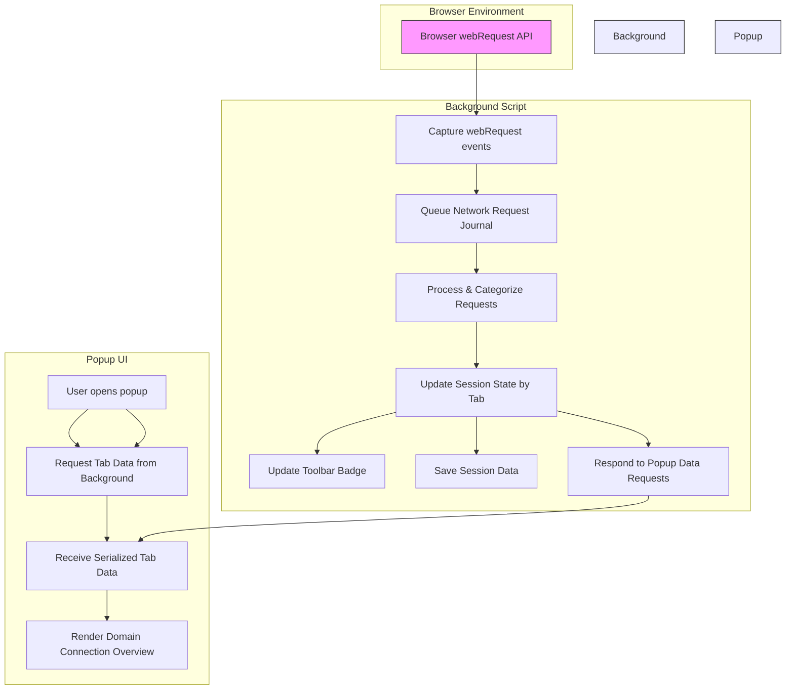

# How It Works: Architecture & Data Flow

Discover how uBO Scope operates behind the scenes to provide clear, reliable insight into all network connections initiated by your browser. This page walks you through uBO Scope’s architecture and data flow, showcasing how it captures and processes webRequest events independently from other blockers, organizes domain outcomes, and relays this information seamlessly to the popup user interface.

---

## Understanding uBO Scope’s Architecture

uBO Scope runs as a standalone browser extension that passively listens to your browser’s network activity. Its technical independence from content blockers like uBlock Origin means it offers an unfiltered, trustworthy view of web requests regardless of blocking or filtering rules in place.

The system is composed of three primary components:

- **Background Script:** Acts as the backbone, capturing all `webRequest` events.
- **Session State Manager:** Maintains an up-to-date catalog of network request outcomes segregated by browser tab.
- **Popup Interface:** Presents a real-time summary of network activities per tab, including allowed, blocked, and stealth-blocked domains.

This clear delineation of responsibilities ensures data integrity, quick updates, and an intuitive user experience.

## Core Data Flow

1. **Network Requests Captured:**
   Using the browser's `webRequest` API, the background script listens for three main event types — redirects, errors, and response starts — across all matching URLs.
2. **Request Categorization:**
   Each network request is processed and classified into one of three outcomes:
   - **Allowed:** Successfully fetched resources.
   - **Blocked:** Requests that failed due to blocking.
   - **Stealth-blocked:** Redirects or filtered requests not readily visible to typical blockers.
3. **Tab-Scoped Aggregation:**
   The outcomes are aggregated by tab ID. This aggregation tracks per-domain and per-hostname counts, helping distinguish first-party from third-party requests.
4. **Badge Update:**
   The tab’s toolbar icon badge updates dynamically, displaying a count of unique allowed third-party domains.
5. **Popup Refresh:**
   When you open the popup, it requests the latest tab-specific data from the background script to display detailed domain connection statuses.

---

## Visualizing the Architecture & Data Flow

This diagram presents the straightforward yet effective flow of data:

- The background script is the central data hub, continuously capturing and processing network requests.
- The session state acts as a live store linked to each browser tab, powered by efficient serialization.
- The popup queries this state on demand to deliver immediate, transparent insights.

---

## Practical Insights: What This Architecture Means for You

- **Accurate & Complete:** By independently monitoring the `webRequest` API, uBO Scope reports all network activity, including those obscured by filtering or stealth techniques.

- **Real-Time Feedback:** The toolbar badge updates dynamically to reflect live network activity, giving you immediate visibility into third-party connections.

- **Contextual Tab Details:** Each browser tab holds isolated, precise information, preventing confusion across browsing sessions.

- **Clear Categorization:** Domains are neatly sorted into 'allowed,' 'blocked,' and 'stealth-blocked,' helping you quickly understand connection outcomes.

- **Non-Intrusive:** uBO Scope does not block or alter any traffic—it only observes and reports, ensuring no impact on your browsing experience.

---

## Step-by-Step Journey of a Network Request

<Steps>
<Step title="1. Request Initiation">
When your browser loads a webpage or resource, it initiates network requests across HTTP, HTTPS, WebSocket protocols.
</Step>

<Step title="2. Event Capture">
uBO Scope’s background script listens to these requests via three key events: onBeforeRedirect, onErrorOccurred, and onResponseStarted.
</Step>

<Step title="3. Queuing for Processing">
Each event is queued in a buffered journal to optimize performance.
</Step>

<Step title="4. Outcome Classification">
The queued requests are processed in batches, categorizing each as 'allowed', 'blocked', or 'stealth-blocked' based on the event type and status codes.
</Step>

<Step title="5. Session Update & Counting">
The session map updates counts of domains and hostnames per tab, aggregating connection outcomes for display and badge count.
</Step>

<Step title="6. User Interface Update">
Upon popup open, the UI fetches the serialized session data for the active tab and renders detailed connection information.
</Step>
</Steps>

---

## Troubleshooting & Common Questions

<AccordionGroup title="Common Troubleshooting Questions">
<Accordion title="Why does the badge sometimes show zero connections?">
This occurs when there are no distinct third-party domains making allowed connections on the active tab. uBO Scope’s badge only counts unique allowed third-party domains. If your browsing session is limited or all connections are blocked, the count may be zero.
</Accordion>
<Accordion title="Does uBO Scope rely on other content blockers to work?">
No. uBO Scope operates independently from any content blockers, including uBlock Origin. It solely listens to the browser's `webRequest` API to observe network activity, unaffected by other extensions.
</Accordion>
<Accordion title="Can uBO Scope detect connections made outside the webRequest API?">
No. Network activity occurring outside of the browser’s `webRequest` API scope (such as browser internals or extensions with native capabilities) cannot be tracked by uBO Scope.
</Accordion>
<Accordion title="How often is session data saved and restored?">
Session data is saved periodically after processing each batch of network request events and restored when the extension loads, ensuring continuity across browsing sessions.
</Accordion>
</AccordionGroup>

---

## Next Steps

To get hands-on experience with uBO Scope’s data presentation, visit the [Quick Feature Overview](/overview/core-concepts-architecture/feature-overview) and the [Understanding the Popup](/guides/getting-started/first-popup-overview) pages.

If you are new, you might want to start with the [What is uBO Scope?](/overview/product-intro-core-value/what-is-ubo-scope) introduction for a broader context and follow it with installation and configuration guides.

---

## References

- View source and contribute on GitHub: [uBO Scope Repository](https://github.com/gorhill/uBO-Scope)
- Background script code: `js/background.js`
- Popup script code: `js/popup.js`

---