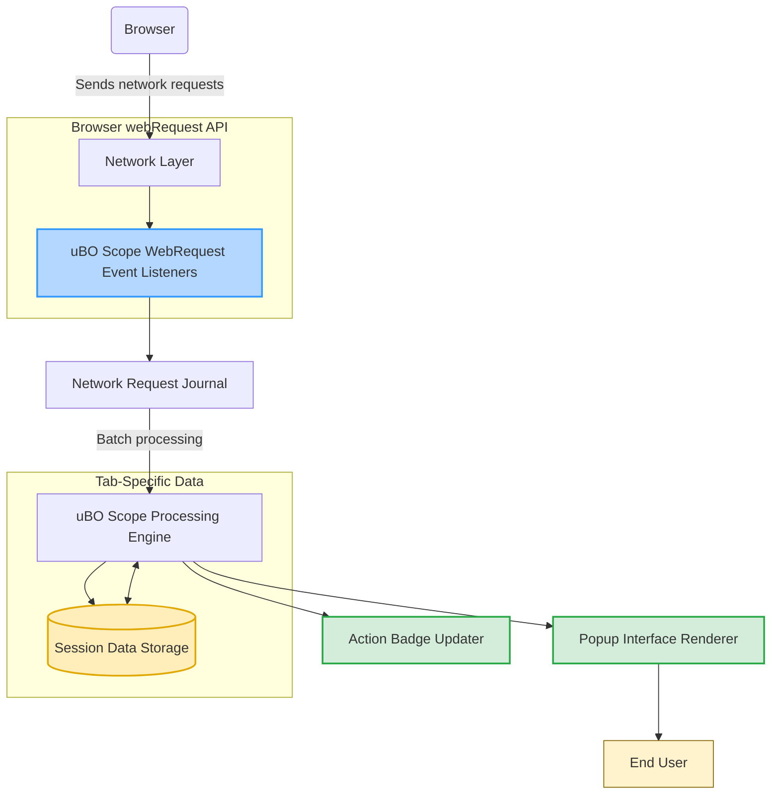

# How It Works: Architectural Overview

uBO Scope's core strength lies in its seamless integration with browser APIs to transparently monitor, analyze, and report all network connections made during your web browsing sessions. This architectural overview guides you through the flow from capturing network events to displaying actionable insights in the user interface.

---

## Understanding uBO Scope's Workflow

Imagine you're browsing a webpage. As the browser loads content, it makes a variety of network requests—some to the main website, others to third-party servers like CDNs, trackers, or analytics platforms. uBO Scope acts as your observer, quietly monitoring these requests to reveal who your browser is talking to behind the scenes.

### Step 1: Listening to Network Requests via Browser APIs

uBO Scope uses the browser's `webRequest` API, a powerful interface provided by Chromium, Firefox, and Safari browsers.

- It subscribes to key network events: 
  - **BeforeRedirect**: Detects when requests change destinations.
  - **OnErrorOccurred**: Captures failed requests.
  - **OnResponseStarted**: Notes the beginning of successful responses.

These event listeners collect detailed information about every HTTP and WebSocket request matching the host permissions (e.g., `https://*/*`, `wss://*/*`).

### Step 2: Recording Each Network Request’s Outcome

All observed network requests are enqueued into a processing journal for batch handling to optimize performance.

- The system waits briefly to accumulate requests and then processes them together.
- Each request is classified as one of three outcomes based on the event:
  - **Allowed**: Successfully connected.
  - **Redirected/Stealth**: Redirected behind the scenes.
  - **Blocked/Error**: Failed or blocked requests.

The extension tracks these outcomes by domain and hostname, building a detailed map of third-party connections.

### Step 3: Managing Tab-Specific Data

For each browser tab, uBO Scope maintains a dedicated data structure capturing three key categories: allowed, stealth-blocked (redirected), and blocked domains.

- When a navigation to a main frame occurs (`type` is `main_frame`), tab data resets and initializes for the new page.
- As requests come in, uBO Scope updates counts of distinct domains and hostnames per outcome.
- This tracking persists in session storage, ensuring continuity during browsing sessions.

### Step 4: Updating the User Interface

The browser’s action badge reflects the live count of distinct allowed third-party domains for the active tab, providing immediate, at-a-glance transparency:

- A lower badge count means fewer third-party connections.
- The popup interface categorized lists connections into **not blocked**, **stealth-blocked**, and **blocked** with domain-wise counts.

This direct visual feedback empowers users to quickly assess privacy and network activity.

## Data Flow Diagram

## Deeper Insights into Core Components

### WebRequest Event Listeners
These are the gateway through which uBO Scope gains visibility into all network operations across tabs. They listen asynchronously to network events, ensuring no connection attempt goes unnoticed.

### Network Request Journal & Processor
To maintain user experience smoothness, all incoming events enter a short-term queue (`networkRequestJournal`). Processing happens periodically in batches to categorize requests and update tab-specific connection data efficiently.

### Tab Details Management
Details for each tab include:
- **Domain and hostname context** of the page loaded.
- Three outcome buckets (`allowed`, `stealth`, and `blocked`) with counts of hostnames and domains.
- This info powers the badge count and popup display.

### Session Storage
Persistently stores the tab connection data, allowing recovery and continuity if tabs are reloaded or the extension reloads. It also caches the public suffix list (PSL) for accurate domain parsing.

### User Interface Elements
- **Action Badge**: Displays a summary count of distinct allowed third-party domains.
- **Popup Display**: Shows categorized and detailed lists of domains and connection counts, helping users scrutinize network transparency.

## Practical Example Workflow

1. You open a webpage.
2. The browser starts making multiple network requests.
3. uBO Scope listens to each request event using the `webRequest` API.
4. Requests are classified into allowed, stealth-blocked (redirects), or blocked.
5. The counts of distinct third-party domains in each category update.
6. The action badge reflects the number of allowed third-party domains.
7. Opening the popup reveals detailed connection outcomes, letting you assess the page's external communication.

## Best Practices & Tips

- **Understand Badge Counts**: A lower badge count means fewer third-party connections, signaling potentially better privacy.
- **Reload After Extension Updates**: The session and domain data rely on the public suffix list, automatically refreshed but can require a reload after updates.
- **Review Stealth-Blocked Domains**: Redirected requests might indicate hidden data flows worth investigating.
- **Complement with Content Blockers**: uBO Scope reveals connections irrespective of blocking; pairing it with blockers helps contextualize network activity.

## Troubleshooting Common Scenarios

<AccordionGroup title="Troubleshooting Network Data Visibility">
<Accordion title="Why do some network requests not appear in uBO Scope?">
Requests not observable through the `webRequest` API, such as non-webpage-initiated connections or internal browser data, won't be captured. If you see unexpectedly low counts, verify browser compatibility and permissions.
</Accordion>
<Accordion title="The badge count remains zero after loading a site">
This could indicate a failure in capturing requests or a page with no third-party connections. Try refreshing the tab, check that uBO Scope has required permissions, and ensure no browser privacy settings block the extension.
</Accordion>
<Accordion title="Popup shows 'NO DATA'">
The popup initializes after querying background data asynchronously. If it stays blank, the background script might not be ready or the tab lacks associated data yet. Reload the tab or extension as a first step.
</Accordion>
</AccordionGroup>

## Next Steps

To continue your mastery of uBO Scope:

- Explore the [What is uBO Scope?](/overview/introduction-values/what-is-ubo-scope) page to contextualize this architecture in user benefits.
- Review [Understanding Badge Counts and Connection Outcomes](/guides/core-workflows/understanding-badge-and-outcomes) to make sense of the live data.
- Visit [Using uBO Scope for Privacy Diagnostics](/guides/core-workflows/using-for-diagnostics) for real-world investigative techniques.

---

uBO Scope’s design prioritizes clarity and minimal intrusion, providing an authoritative window into the hidden communications your browser undertakes while surfing the web. This transparency is your first step to informed privacy and security decisions.

---

*For source code and detailed implementation, check the [GitHub repository](https://github.com/gorhill/uBO-Scope).*