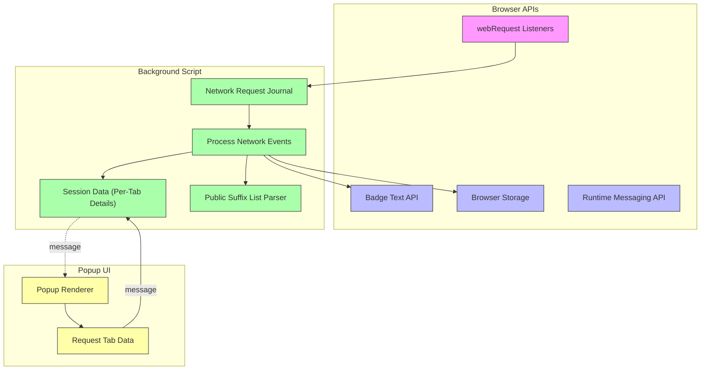

# How uBO Scope Works: Architecture Overview

## Instant Visibility into Network Connections

uBO Scope is designed to give you transparent, real-time insight into every network connection your browser attempts when loading webpages. This page presents a clear view of the core system components involved in capturing, processing, and displaying this information — helping you understand how uBO Scope works under the hood and why it delivers trustworthy data.

### What You'll Learn Here:
- How uBO Scope captures network events through browser APIs
- The role of background processes in organizing connection data
- How the popup UI surfaces results to you
- How data flows across these components using browser messaging

---

## Understanding uBO Scope's Architecture

At its heart, uBO Scope acts as a vigilant observer installed in your browser. It passively listens to every network request initiated by webpages, regardless of whether those requests are blocked or allowed by content blockers. This transparency enables you to see the true network exposure of any active tab.

### Core Purpose

The core purpose of this architecture is to **reliably intercept network request outcomes**, classify them, and present categorized data about these connections to you, the user, in an accessible interface.

### Key Components

1. **webRequest Monitoring**
    - Leveraging the browser's `webRequest` API, uBO Scope registers listeners to monitor network request lifecycle events including redirects, errors, and successful responses.
    - This is the entry point, where raw network activity is captured in real-time.

2. **Background Script Processing**
    - The background script acts as the extension’s central coordinator.
    - It collects network events, processes them to update connection outcome details (allowed, blocked, stealth-blocked), and maintains per-tab session data.
    - Data persistence is handled via browser storage APIs to ensure session continuity.

3. **Popup UI**
    - When you click the uBO Scope toolbar icon, the popup opens, requesting the current tab's network data from the background script.
    - It then renders a categorized breakdown of third-party connections, grouped by their outcome.

4. **Browser APIs & Messaging**
    - Communication between the popup and background scripts occurs via the browser's messaging API.
    - This ensures asynchronous, efficient data transfer while maintaining separation of concerns.

This flow empowers you to see who your browser connects to, what gets blocked or allowed, and even stealth-blocked, with counts aggregating distinct third-party domains.

---

## How The Data Flows: Step-by-Step User Journey

### 1. Network Request Occurs

As you browse, any webpage you visit triggers multiple network requests — main content, images, scripts, tracking beacons, etc.

- The browser's webRequest API catches each of these through listeners:
  - `onBeforeRedirect`
  - `onErrorOccurred`
  - `onResponseStarted`

Each event includes details like URL, type, response status, and tab context.

### 2. Event Queued for Processing

The background script queues these request events in an internal journal, ensuring batch processing for efficiency.

### 3. Processing Outcomes

Once queued, each network event is processed to update per-tab connection records:

- It identifies the hostname and derives the registered domain (using an up-to-date Public Suffix List).
- It classifies outcomes for hosts into:
  - **Allowed:** Successful connections.
  - **Blocked:** Errors typically caused by content blockers.
  - **Stealth-blocked:** Redirects or hidden blocking.

- The background connects data dots: main frame navigation resets tab info; subsequent requests augment allowed/blocked/stealth counts.

### 4. Badge Update & Persistence

- The toolbar badge updates with the count of distinct allowed third-party domains.
- Processed data is serialized and stored using the browser’s session storage to preserve state.

### 5. Popup Requests & Renders Data

- When you open the popup UI, it sends a message to the background script requesting the current tab’s connection details.
- The background responds with serialized data.
- The popup deserializes and displays the categorized list of third-party domains and their request counts.

---

## Architecture Diagram

---

## Practical Insights & Best Practices

- **Why Use a Public Suffix List?**
  uBO Scope maps individual hostnames to registered domains (e.g., `cdn.example.com` → `example.com`) using a public suffix list. This aggregation prevents skewed counts caused by subdomains and provides meaningful domain-level analytics.

- **Batch Processing for Resource Efficiency**
  Instead of directly processing every request event synchronously, uBO Scope queues them briefly to process in batches, reducing CPU and I/O overhead.

- **Session Persistence**
  By saving session data, uBO Scope maintains context across tab reloads or browser restarts, ensuring historical data remains accurate.

- **Clear Outcome Classification**
  Understanding allowed, blocked, and stealth-blocked helps you assess privacy exposure and content blocker effectiveness.

- **Asynchronous Messaging**
  The decoupled communication between popup and background ensures UI responsiveness without blocking core logic.

## Troubleshooting Common Issues

<AccordionGroup title="Common Architecture-Related Troubleshooting">
<Accordion title="Why don’t I see network data in the popup immediately after loading a page?">
Network request events are queued and processed asynchronously. There may be a slight delay (up to a second) before the popup displays updated data. Refreshing the popup or waiting briefly resolves this.
</Accordion>
<Accordion title="Why might the count on the badge be zero even though I know connections exist?">
The badge reflects the number of distinct allowed third-party domains. If all connections are blocked or stealth-blocked, the badge will show zero.
</Accordion>
<Accordion title="How is data preserved if the browser or extension restarts?">
Session details are serialized and persisted in browser storage. However, if storage is cleared or fails to save, session data might be lost.
</Accordion>
</AccordionGroup>

---

## Getting Started Preview

To experience this architecture in action:

1. **Install uBO Scope** by following the [installation guide](/getting-started/installation-setup/installing-ubo-scope).
2. **Browse a webpage** and watch how network connections are tracked.
3. **Click the toolbar icon** to open the popup UI and explore categorized connection details.

For in-depth usage and interpretation, visit:
- [Navigating the uBO Scope Interface](/overview/core-concepts-architecture/navigating-ubo-scope-ui)
- [Understanding and Interpreting the Badge Count](/guides/using-ubo-scope/interpreting-badge)

---

This architecture overview reveals how uBO Scope leverages browser capabilities to provide you unparalleled transparency into web network activity. With real-time data processing, categorized results, and streamlined UI interaction, you're empowered to understand and audit connections like never before.

---

## References

- [What is uBO Scope?](../../product-intro-value/what-is-ubo-scope) – Introduction to the product and mission.
- [Value Proposition & Use Cases](../../product-intro-value/value-proposition-and-use-cases) – Why users need uBO Scope.
- [Navigating the uBO Scope Interface](../navigating-ubo-scope-ui) – How to use the popup UI.
- [Troubleshooting Common Issues](../../advanced-guides/troubleshooting-common-issues) – Help if unexpected behavior occurs.

---

