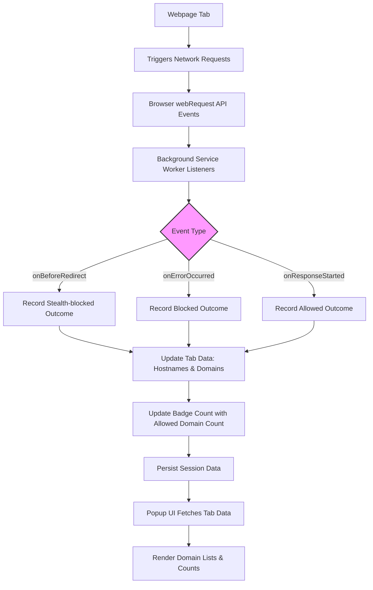

# How Does uBO Scope Work?

Discover the inner workings of uBO Scope, a powerful browser extension designed to monitor and categorize all network requests your browser makes. This guide walks you through the process from the moment a webpage initiates network requests, through uBO Scope's event monitoring, domain grouping, and ultimately how this information is presented in the extension's popup user interface. Understanding this flow will empower you to leverage uBO Scope effectively for transparency and analysis in your browsing experience.

---

## Understanding uBO Scope’s Operation

uBO Scope operates seamlessly within your browser, listening to network activity and providing insightful categorizations of these connections. Let's explore the step-by-step journey of data through the extension.

### 1. Monitoring Web Requests

At its core, uBO Scope hooks into the browser's `webRequest` API to monitor network events triggered by every webpage tab. It registers listeners for three main event types:

- **onBeforeRedirect**: Captures requests that are about to be redirected to new URLs.
- **onErrorOccurred**: Detects network requests that failed due to errors or were blocked.
- **onResponseStarted**: Notes requests that successfully received a response from a remote server.

Each of these events includes detailed information about the request, such as the URL, request type (main frame, subresource, etc.), and the tab in which it was made.

### 2. Recording Outcomes per Tab and Domain

uBO Scope organizes network requests by browser tab to provide context-specific insights. Each tab maintains a detailed record of:

- The **root domain** and **hostname** of the main webpage.
- Groups of connections categorized as **allowed**, **blocked**, or **stealth-blocked**.
- Counts of occurrences by **individual hostnames** and their corresponding **domains**.

The extension uses the [Public Suffix List](https://publicsuffix.org/) to accurately extract domains from hostnames, ensuring correct grouping — for example, differentiating between `ads.example.com` and `cdn.example.co.uk`.

### 3. Categorizing Network Request Outcomes

Each recorded request is assigned an outcome category based on the network event observed:

- **Allowed**: Successful requests that fetched content without interference.
- **Blocked**: Requests that failed due to content blocking or other errors.
- **Stealth-blocked**: Requests that resulted in a redirect or silent blocking that might bypass direct reporting but are inferred by uBO Scope.

By categorizing in this way, uBO Scope surfaces not only what your browser fetched but also what was silently suppressed or redirected, offering a comprehensive view.

### 4. Updating the Browser Toolbar Badge

For each active tab, uBO Scope updates the badge displayed on your browser toolbar icon. This badge reflects the **count of distinct allowed third-party domains** connected by the webpage—providing a simple yet powerful indicator of your tab’s network footprint.

> **Tip:** A lower badge count generally reflects fewer third-party connections, aligning with privacy and security best practices.

### 5. Surfacing Data in the Popup UI

When you open uBO Scope’s popup, it retrieves the current tab’s recorded data and displays it in a clear, user-friendly interface:

- The **main hostname and domain** of the active tab are prominently shown.
- Three categorized sections list all third-party domains connected under **not blocked (allowed)**, **stealth-blocked**, and **blocked** headings.
- Each domain listing includes a count of how many requests were made or blocked, helping you quickly assess network activity intensity.

This UI presents the network outcomes in a way that’s easy to digest, empowering you to investigate connection details without sifting through complicated logs.

---

## A Real User Flow

Imagine browsing a news website backed by various third-party services like analytics, ads, and content delivery networks. uBO Scope will:

1. Automatically monitor every network request triggered by the page.
2. Categorize each request into allowed, blocked, or stealth-blocked groups.
3. Show the number of distinct allowed third-party domains as a badge on the toolbar icon.
4. When you click the icon, show detailed breakdowns in the popup, revealing which domains were connected to and which requests were blocked.

This flow lets you immediately see the third-party connections initiated by the website, how effective your content blocking is, and where potential privacy leaks occur.

---

## Practical Tips & Best Practices

- **Keep the popup open on tabs you want to inspect**: The popup dynamically updates with the current tab’s data, giving you instant feedback.
- **Watch the badge count as an indicator**: Use it as a quick glance metric to spot unusual activity or unexpected connections.
- **Remember domain grouping matters**: A high number of requests to a single domain is grouped together, avoiding clutter in the UI.
- **Be aware of stealth-blocking**: Some blockers may redirect requests silently—uBO Scope helps expose these with its stealth category.

---

## Troubleshooting Common Issues

<AccordionGroup title="Troubleshooting Network Data" >
<Accordion title="Why does the badge sometimes show no count despite network activity?">
This can happen if the tab has no recorded allowed third-party domains yet, or if the requests happen rapidly before the data processes. Reload the tab or wait briefly for updates.
</Accordion>
<Accordion title="Popup shows 'NO DATA' instead of the tab hostname">
This may occur if the tab is still loading or uBO Scope hasn’t received network data from the tab. Ensure the page is fully loaded and try reopening the popup.
</Accordion>
<Accordion title="Some domains seem missing from the popup listing">
The popup only shows domains with recorded requests captured by the browser’s `webRequest` API. Requests made outside this API's scope won’t appear. Also, filtering by domain via the public suffix list can affect grouping.
</Accordion>
</AccordionGroup>

---

## How uBO Scope Fits Into Your Browser Ecosystem

By operating alongside your content blockers and browser security features, uBO Scope acts as an independent observer. It does not block or modify traffic itself but rather reveals what connections occur or are prevented. This positioning makes it an invaluable tool for privacy-aware users and filter list maintainers alike.

It complements existing privacy tools by providing raw, unfiltered insight into network requests, helping debunk myths about blocker performance and aiding informed decision-making.

---

## Summary Diagram of Flow

This visualizes how uBO Scope captures and processes network events to deliver actionable insights.

---

## Next Steps

Now that you understand how uBO Scope works under the hood, proceed to:

- [Understanding the Popup UI](/guides/getting-started/understanding-the-popup) to learn how to interpret the displayed data.
- [Analyzing Remote Servers Connected by Webpages](/guides/analyzing-network-connections/analyzing-remote-servers) for deeper network investigation techniques.
- Explore [Using uBO Scope to Debunk Content Blocking Myths](/guides/analyzing-network-connections/using-uBO-scope-to-debunk-myths) to apply uBO Scope insights in practical privacy discussions.

With this foundation, optimize your browsing privacy and transparency.

---

For complete source and updates, visit the official [uBO Scope GitHub repository](https://github.com/gorhill/uBO-Scope).