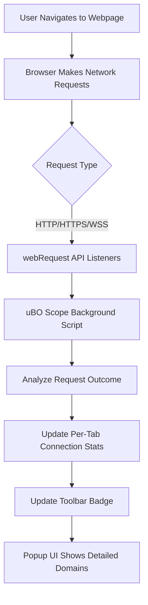

# Browser Integration & Compatibility

## Seamless Integration with Your Browser's Network Transparency

uBO Scope leverages your browser's native `webRequest` API to provide an unparalleled, real-time view of all third-party remote server connections initiated by webpages. This integration enables uBO Scope to transparently capture every network request the browser processes, regardless of which content blocker or privacy tools you use.

By embedding itself directly into your browser's web request lifecycle, uBO Scope delivers precise insights with minimal intrusion, empowering you to understand exactly what external domains your browser communicates with during each browsing session.

### Why This Matters

- **Complete Visibility:** uBO Scope monitors all outgoing HTTP, HTTPS, WebSocket, and Secure WebSocket requests that the browser handles.
- **Unbiased Data:** The extension reports connection outcomes independent of any content blocker in place, including those operating at the DNS level.
- **Accurate Badge Counts:** The toolbar icon badge reflects the number of distinct third-party domains contacted, giving you a clear metric to assess your exposure to external servers.

## How uBO Scope Uses the Browser's `webRequest` API

At its core, uBO Scope taps into three key event listeners provided by the `webRequest` API:

- **onBeforeRedirect:** Captures network request redirects.
- **onErrorOccurred:** Detects failed or blocked requests.
- **onResponseStarted:** Logs successful network responses.

Each captured event is queued and processed asynchronously to update per-tab statistics, enabling the extension to differentiate between:

- Requests that were **allowed** (successfully connected),
- Requests that were **stealth-blocked** (redirected or hidden from detection),
- Requests that were **blocked** (failed or explicitly denied).

This event-driven approach ensures real-time accuracy while minimizing performance overhead.

## Supported Browsers and Platforms

uBO Scope is designed to be compatible with all major modern browsers that support the `webRequest` API under Manifest V3:

| Browser        | Minimum Version | Installation Source                                 |
|----------------|-----------------|---------------------------------------------------|
| Chromium-based | 122.0+          | [Chrome Web Store](https://chromewebstore.google.com/detail/ubo-scope/bbdpgcaljkaaigfcomhidmneffjjjfgp) |
| Firefox        | 128.0+          | [Firefox Add-ons](https://addons.mozilla.org/firefox/addon/ubo-scope/) |
| Safari         | 18.5+           | Safari Extensions Gallery / Apple's Developer Portal |

### Permissions Required

To function correctly, uBO Scope requests the following permissions across all supported browsers:

- **`webRequest`** - to monitor all network events
- **`storage`** - to save session data and publicly suffix list data
- **`activeTab`** - to identify and update per-tab statistics

These permissions enable uBO Scope to operate securely and efficiently within the browser environment.

## Integration Boundaries: What uBO Scope Can and Cannot Detect

While uBO Scope's use of the `webRequest` API grants comprehensive coverage of network activity, there are inherent limitations:

- **Network Requests Outside WebRequest Reach:** Any network requests made by mechanisms that bypass the browser's `webRequest` API — such as some DNS-level blocking, proxying, or native OS-level traffic — are not visible to uBO Scope.
- **Opaque Extensions or Native Messaging:** Communications originating outside the browser's network stack are not monitored.
- **Encrypted or Obfuscated Traffic:** uBO Scope detects connections by their domain names extracted via the Public Suffix List but cannot inspect payload content or encrypted streams.

Understanding these boundaries helps set realistic expectations about the scope of network transparency uBO Scope provides.

## Compatibility with Other Content Blockers

A key strength of uBO Scope lies in its content blocker agnosticism. It accurately reports network request outcomes regardless of the presence or type of content blocking extension in your browser:

- Works flawlessly alongside uBlock Origin and other popular blockers.
- Accurately reflects requests blocked by DNS-based filters or network-layer blocks.
- Helps debunk misconceptions about block counts by showing actual allowed third-party domains, which is the true measure of content blocker effectiveness.

This independence ensures uBO Scope remains a trustworthy measure of your browser's network communication landscape.

## Practical Tips & Common Considerations

- **Browser Restrictions:** Make sure your browser version is supported and up to date to ensure full functionality.
- **Limitations in Private/Incognito Modes:** Some browsers restrict extensions’ access to the `webRequest` API in private windows. Check browser-specific policies if you plan to use uBO Scope in incognito mode.
- **Concurrent Extensions:** While uBO Scope coexists smoothly with other extensions, avoid running excessively many network-monitoring extensions simultaneously to prevent performance impacts.

## Summary

By utilizing the powerful yet standardized browser `webRequest` API, uBO Scope delivers real, unbiased insights into the distinct third-party connections initiated by your browser. Compatible with the latest major browsers, and designed to work seamlessly alongside your favorite content blockers, uBO Scope empowers you to see the true footprint of external network communications.

For a practical next step, explore the [Key Concepts and Terminology](https://your-docs-domain/overview/core-concepts-architecture/key-terms-concepts) page to deepen your understanding of how uBO Scope classifies and counts connections, or jump directly to [Installation & Setup](https://your-docs-domain/getting-started/setup-installation/prerequisites-system-requirements) to start monitoring your browsing activity immediately.

---

## Appendix: Manifest & Permission Highlights by Browser

### Chromium-based Browsers
```json
{
  "manifest_version": 3,
  "name": "uBlock Origin Scope",
  "version": "1.0.1",
  "permissions": ["activeTab", "storage", "webRequest"],
  "host_permissions": ["https://*/*", "http://*/*", "wss://*/*", "ws://*/*"],
  "background": {
    "service_worker": "/js/background.js",
    "type": "module"
  },
  "minimum_chrome_version": "122.0"
}
```

### Firefox
```json
{
  "manifest_version": 3,
  "name": "uBlock Origin Scope",
  "version": "1.0.1",
  "permissions": ["activeTab", "storage", "webRequest"],
  "host_permissions": ["https://*/*", "http://*/*", "wss://*/*", "ws://*/*"],
  "background": {
    "scripts": ["/js/background.js"],
    "type": "module"
  },
  "browser_specific_settings": {
    "gecko": {
      "id": "uBO-Scope@raymondhill.net",
      "strict_min_version": "128.0"
    },
    "gecko_android": {
      "strict_min_version": "128.0"
    }
  }
}
```

### Safari
```json
{
  "manifest_version": 3,
  "name": "uBlock Origin Scope",
  "version": "1.0.1",
  "permissions": ["activeTab", "storage", "webRequest"],
  "host_permissions": ["https://*/*", "http://*/*"],
  "background": {
    "scripts": ["/js/background.js"],
    "type": "module"
  },
  "browser_specific_settings": {
    "safari": {
      "strict_min_version": "18.5"
    }
  }
}
```

---

## Diagram: Browser Network Request Flow with uBO Scope Integration


This flow highlights how uBO Scope intercepts network request events via browser APIs, processes them, and surfaces insightful statistics to empower your network visibility.

---

For further learning, consult the [Extension Architecture Overview](https://your-docs-domain/overview/core-concepts-architecture/architecture-overview) and understand the underlying framework supporting these capabilities.


---

<Info>
Always ensure your browser installation is within supported versions to guarantee uBO Scope's full compatibility and security.
</Info>

<Warning>
Network requests from outside the browser or bypassing the webRequest API are inherently outside uBO Scope's detection capabilities.
</Warning>

<Tip>
Combine uBO Scope with content blockers to get holistic control and measured insight into third-party connections and content blocking effectiveness.
</Tip>
