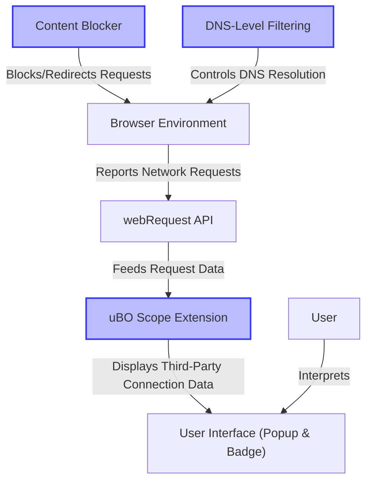

# Integration & Compatibility

Discover how uBO Scope integrates effortlessly within your browser, complementing existing content blockers and network filters for an unobtrusive, accurate insight into third-party connections. This page guides you through compatibility nuances, essential requirements, platform support, and practical limitations to ensure a smooth and reliable experience.

---

## Why Integration and Compatibility Matter

When tracking third-party connections, accuracy and consistency are paramount. uBO Scope is purpose-built to operate transparently alongside any content blockers or DNS-level filtering without interference, delivering trustable connection data that reflects your real browsing exposure.

This page explains what makes uBO Scope compatible with your environment and what conditions must be met to unlock its full value.

---

## How uBO Scope Works With Other Tools

Unlike traditional content blockers that report only blocked requests, uBO Scope reveals *all* attempted or successful network connections to remote third-party servers per browser tab. It leverages the browser's native `webRequest` API as its data source, which means:

- It **sees network requests regardless of which content blocker or filter is active**. This includes requests blocked via extension-based blockers or DNS-level filters, as long as these requests pass through the browser's networking stack.
- It **does not rely on any content blocking filter itself**. Instead, uBO Scope is a measurement tool offering **an impartial view** of network activity.

This approach allows you to:

- Cross-validate and assess how different content blockers behave by seeing the actual third-party domains they allow or block.
- Detect stealth blocking actions (e.g., redirects) which some blockers use, improving your understanding beyond simple block counts.

<u>**Example:**</u> If you use a popular ad blocker, uBO Scope will report the distinct third-party domains your browser connected to after the blocker has acted — even if some blockers hide their activities from the webpage context.

---

## Platform and Browser Support

uBO Scope requires your browser to expose the `webRequest` API to track network requests. Supported platforms include popular desktop browsers:

- **Chromium-based browsers:** Chrome (minimum version 122), Edge, Brave, and others supporting Manifest V3
- **Firefox:** Version 128 and later
- **Safari:** Version 18.5 and later

Each browser's extension manifest explicitly requests permissions to observe web requests over HTTP, HTTPS, WebSocket protocols (where supported):

```json
"host_permissions": [
  "https://*/*",
  "http://*/*",
  "wss://*/*",
  "ws://*/*"
]
```

Other necessary permissions include access to the active tab and storage.

**Note:**

- Mobile browser support is limited due to API restrictions.
- The extension runs as a service worker or background script depending on platform specifics.

---

## Essential Requirements for Proper Operation

To function correctly, uBO Scope depends on the following prerequisites:

- **Browser Support for `webRequest` API:**
  The `webRequest` API must report network requests faithfully, including those blocked by other content blockers or filtered by DNS-based services.

- **Permission Grants:**
  The extension requires permissions to observe and analyze network requests across all protocols stated in the `host_permissions`.

- **Active `webRequest` Reporting:**
  uBO Scope relies on browser events such as `onBeforeRedirect`, `onErrorOccurred`, and `onResponseStarted` to track connection outcomes.

Without these, uBO Scope cannot provide full visibility into your third-party connections.

---

## Known Limitations

While uBO Scope is robust, some technical and ecosystem limitations apply:

- **Requests Outside Browser Context:**
  Network requests initiated outside the scope of the browser's `webRequest` API (e.g., system OS-level DNS calls or proxy-filtered connections) are not visible to uBO Scope.

- **API Restrictions Vary by Browser:**
  Some browsers or future updates may limit the transparency of certain request types, which might reduce tracking completeness temporarily.

- **No Native Blocking:**
  uBO Scope itself does not block requests; it only reports outcomes.

---

## Best Practices for Integration

To ensure optimal compatibility:

- Install uBO Scope alongside your existing content blockers without conflicts by using the official extension from supported browser stores.

- Confirm your browser version meets the minimum required version supporting Manifest V3 and the `webRequest` API.

- Understand how your content blocker works to complement uBO Scope’s reports effectively.

- Recognize that a lower badge count in uBO Scope means fewer third-party connections, reflecting lesser exposure.

---

## Troubleshooting Compatibility Issues

If uBO Scope does not display expected data:

- Verify you granted the necessary permissions during installation.

- Ensure your browser supports the required APIs and that you are running a supported version.

- Disable conflicting extensions temporarily to isolate issues.

- Consult the [Troubleshooting Common Installation Issues](/getting-started/validation-troubleshooting/troubleshooting-common-issues) page.

---

## Summary Diagram: Integration Overview



This diagram highlights how uBO Scope receives data through the browser's webRequest API, independently observing network requests as affected by other content blockers or DNS filters, and presents it transparently to users.

---

## Next Steps

To continue your journey with uBO Scope, consider:

- Reading [Features at a Glance](/overview/getting-started-core-value/feature-glance) to understand what you will see in the popup and badge.

- Exploring [How uBO Scope Works (Architecture Overview)](/overview/core-concepts-architecture/how-ubo-scope-works) for in-depth data flow insights.

- Checking [Prerequisites & System Requirements](/getting-started/installation-basics/prerequisites-system-requirements) to preempt setup issues.

These resources will deepen your understanding of integration and operational contexts.

---

<Callout>
uBO Scope is not a content blocker itself. Its real power lies in working transparently alongside any existing blocking tool, exposing what actually happens at the network level — making your privacy and security assessment fundamentally more reliable.
</Callout>

---

_Last updated: 2024_

<Source url="https://github.com/gorhill/uBO-Scope" paths={[{"path": "platform/chromium/manifest.json", "range": "1-60"},{"path": "platform/firefox/manifest.json", "range": "1-60"},{"path": "platform/safari/manifest.json", "range": "1-42"},{"path": "js/background.js", "range": "1-150"},{"path": "js/popup.js", "range": "1-90"}]} />
