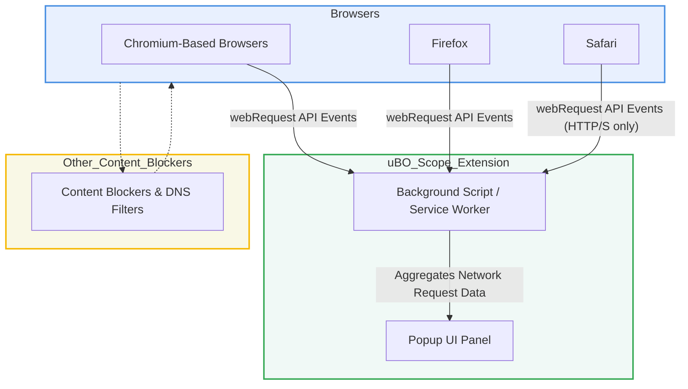

# Integrations and Compatibility

## Seamless Compatibility Across Major Browsers

uBO Scope is engineered for broad compatibility, supporting key browsers including Chromium-based browsers (such as Google Chrome and Microsoft Edge), Firefox, and Safari. This ensures that users across different platforms can benefit from uBO Scope's network connection visibility regardless of their browser choice.

- **Chromium**: Utilizes a service worker-based background script with comprehensive permissions to monitor `webRequest` events, covering HTTP, HTTPS, WebSocket, and Secure WebSocket requests.
- **Firefox**: Leverages Firefox-specific extension APIs, including the `webRequest` interface, with a manifest configured to meet Firefox extension requirements.
- **Safari**: Supports the latest Safari versions that provide the necessary `webRequest` API capabilities, albeit limited to HTTP and HTTPS protocols, reflecting Safari's API constraints.

## Monitoring Network Requests Regardless of Other Content Blockers

uBO Scope listens directly to the browser's `webRequest` API to observe all network connection attempts initiated by webpages, independently of any other content blockers the user may have installed or configured. This includes:

- Connections that are allowed through by other content blockers.
- Connections that are blocked or stealthily suppressed by content blockers or DNS-level blocking.

Because uBO Scope operates as a passive observer on the browser's network API, it accurately reports on the ultimate fate of network requests without interfering or being affected by third-party blocking tools.

## Complements, Does Not Replace Existing Privacy Tools

While uBO Scope provides invaluable transparency into network activity, it is designed to complement other privacy-enhancing tools rather than replace them:

- It provides detailed visibility into network connections but does not block or filter requests.
- Users should continue to rely on content blockers, firewalls, or VPNs to enforce privacy and security.
- uBO Scope acts as an audit tool, empowering users to understand the behavior and effectiveness of their existing privacy defenses.

## What Enables This Compatibility?

uBO Scope relies on the standardized `webRequest` API implemented across browsers, which allows extensions to monitor network requests:

- The extension registers listeners for key events including request start, redirect, error, and response start.
- These events provide granular information about network request outcomes, regardless of their blocking status.
- The extension’s manifest files declare comprehensive host permissions covering all HTTP, HTTPS, and WebSocket traffic to capture the full spectrum of connections.

## Practical Implications for Users

- **Broad Device Support**: Users switching browsers or using multiple browsers still gain consistent visibility.
- **Accurate Privacy Auditing**: uBO Scope shows all connections the browser knows about, providing a trustworthy source for uncovering hidden connections often missed by less transparent sources.
- **Interoperability**: Since it integrates at the API level without control over blocking, it transparently works alongside any existing blocker or network filter configuration.

## Tips and Best Practices

- For best results, keep your browsers updated to the latest versions that provide enhanced `webRequest` capabilities.
- Understand that uBO Scope reflects the browser's network stack visibility; some connections made outside the browser's scope (e.g., native OS network calls) will not be shown.
- Use uBO Scope in tandem with a content blocker like uBlock Origin for both visibility and control over network connections.

## Troubleshooting Compatibility Issues

<AccordionGroup title="Troubleshooting Compatibility Issues">
<Accordion title="uBO Scope Does Not Show Connections on Safari">
Safari's `webRequest` API has limitations compared to Chromium and Firefox. Make sure you are using Safari 18.5 or later. Note that Safari only supports monitoring HTTP/S and not WebSocket protocols.
</Accordion>
<Accordion title="Connections Not Appearing Due to Other Blockers">
uBO Scope reports connections as seen by the browser. If a blocking extension or DNS server prevents the browser from seeing a request, uBO Scope cannot report it.
</Accordion>
<Accordion title="Browser Version Support">
Check your browser's minimum required version for uBO Scope: Chromium 122+, Firefox 128+, Safari 18.5+ to ensure full functionality.
</Accordion>
</AccordionGroup>

## Summary

This page details how uBO Scope integrates seamlessly with major browsers and remains compatible with existing content blocking tools by directly observing the browser's network request events. It empowers users with unmatched transparency to audit network connections without disrupting their workflow or privacy defenses.

---

### Example Manifest Permissions (Chromium)
```json
{
  "permissions": ["activeTab", "storage", "webRequest"],
  "host_permissions": [
    "https://*/*",
    "http://*/*",
    "wss://*/*",
    "ws://*/*"
  ]
}
```

### Example Manifest Permissions (Safari)
```json
{
  "permissions": ["activeTab", "storage", "webRequest"],
  "host_permissions": [
    "https://*/*",
    "http://*/*"
  ]
}
```

---

### Integrations and Compatibility Diagram


---

## Additional Resources
- [What is uBO Scope?](/overview/getting-started/introduction-product-value): Understand the overall purpose and value of uBO Scope.
- [Core Concepts and Terminology](/overview/core-concepts-architecture/core-terminology): Learn key terms crucial for interpreting uBO Scope data.
- [Architecture Overview](/overview/core-concepts-architecture/architecture-overview): Technical flow of data capture and UI interaction.
- [Prerequisites & System Requirements](/getting-started/installation-basics/prerequisites-system-requirements): Check browser versions and setup guidelines.

---

By grasping uBO Scope's integration landscape, users gain confidence that their privacy auditing tool remains accurate, reliable, and robust—no matter the browser or existing privacy setup they use.
