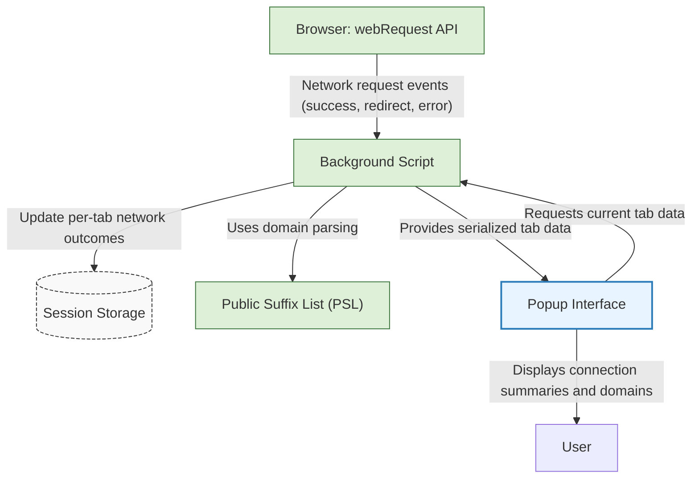

# System Architecture & Data Flow of uBO Scope

Visualize how uBO Scope transforms raw browser network request data into actionable insights via a seamless interaction between browser APIs, background monitoring, session management, and its popup interface. This high-level diagram clarifies the core system components and their data flow, helping you understand exactly how uBO Scope empowers you to see network connections at a glance.

---

## Overview

At its core, uBO Scope leverages your browser's native `webRequest` API to listen to network activity, categorizes requests by their outcome, and maintains per-tab session data. The extension’s architecture focuses on accurate, real-time monitoring and report generation, presented through a clean popup UI.

This page illustrates those relationships and how data moves and gets processed from raw network events to the information you actually interact with.

---

## High-Level Components

| Component                   | Role                                                          |
| --------------------------- | ------------------------------------------------------------- |
| Browser `webRequest` API    | Emits network event notifications to the extension’s background scripts for every network request. |
| Background Script           | Receives `webRequest` events, interprets outcomes (success, redirect, error), and updates session data accordingly. |
| Session Storage             | Persists tab-specific network outcome data between events and browser sessions for continuity. |
| Public Suffix List (PSL)    | Utilized to determine domain boundaries for accurate grouping and reporting. |
| Popup UI                   | Fetches session data from background scripts, renders categorized domain lists, and presents real-time network connection summaries to the user. |

---

## Data Flow Explained

The following Mermaid diagram details the components and the flow of data between these parts, mapping the lifecycle of a network request as it progresses through the system.

---

## Practical Explanation of the Flow

1. **Browser emits network request events:**
   Every network request your browser initiates, including those from webpages, triggers `webRequest` events that include details such as URL, request type, response status, and redirection.

2. **Background script listens and processes events:**
   The background script receives these events and determines the outcome of each request (allowed, stealth-blocked via redirect, or blocked due to error).

3. **Domain grouping using Public Suffix List:**
   To accurately group network requests by effective domain, the PSL is applied. This ensures subdomains and public suffixes are treated correctly when categorizing.

4. **Session persistence:**
   Network outcomes and domain groupings are stored per browser tab using session storage to maintain continuity across tab navigation and reloads.

5. **Popup interface requests and renders data:**
   When you open the uBO Scope popup, it queries the background script for the latest tab-specific network data, which it renders in categorized lists (allowed, stealth, blocked) along with summary counts.

6. **User insight:**
   The user sees immediate and clear information about all distinct third-party domains connected to by the current tab, assisting in analysis and decision making.

---

## Key Benefits of This Architecture

- **Real-time monitoring:** Immediate reflection of network request outcomes for the current browser tab.
- **Accurate domain classification:** Utilizes PSL to avoid misclassification of domains, crucial when analyzing complex web ecosystems.
- **Session continuity:** Saves state per tab so historical connection data remains accessible.
- **User-friendly interface:** Clear categorization and display minimize user effort to understand network footprint.

---

## Tips and Best Practices

- For accurate results, ensure uBO Scope has permissions enabled for all protocols (`http`, `https`, `ws`, and `wss`).
- Recognize that the badge count corresponds to distinct allowed third-party domains, reflecting the true effective network connections.
- Use the categorized domain lists to find stealth-blocked or blocked domains for troubleshooting or filter list maintenance.

---

## Troubleshooting Common Issues

- **No data shown in the popup:**
  Make sure uBO Scope is active in the current tab and the browser supports `webRequest` API as expected.

- **Incorrect domain grouping:**
  Verify the Public Suffix List is successfully loaded by the extension (this is managed automatically but can occasionally fail due to network issues).

- **Badge count not updating:**
  Reload the tab or toggle the extension to ensure session data refreshes properly.

---

## Next Steps

To deepen your understanding and practical use of uBO Scope, explore the following documentation pages:

- [How Does uBO Scope Work?](/overview/core-concepts-architecture/how-ubo-scope-works) — Detailed explanation of background event processing and UI data flow.
- [Quick Feature Overview](/overview/core-concepts-architecture/feature-overview) — Learn about key features and capabilities.
- [Installing uBO Scope](/getting-started/installation-essentials/installation-instructions) — Setup and get started quickly.

For more information about the development and source, visit the [GitHub repository](https://github.com/gorhill/uBO-Scope).

---

*Visualizing the system reveals its transparency and simplicity, empowering you to see exactly how your browser’s network connections are tracked and displayed by uBO Scope.*

---