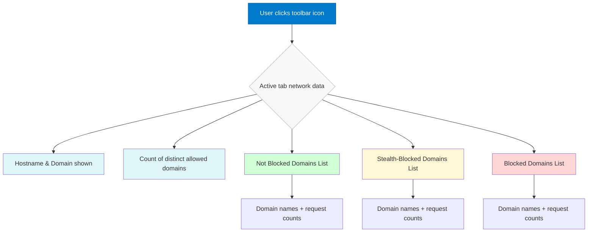

# Navigating the uBO Scope Interface

Discover the core components of uBO Scope's user interface with this guided tour of the toolbar badge and popup elements. This page explains what each UI part represents, how to interpret the network activity insights presented, and why these details empower you to understand your browser's network connections effectively.

---

## Understanding the Toolbar Badge

The toolbar badge is your first, glanceable insight into uBO Scope's observations. It displays a number indicating the **count of distinct third-party domains** your active tab has connected to without blocking.

- **Why it matters:** A lower number here signals fewer third-party connections, often equating to less exposure and better privacy. The badge instantly informs you if the webpage you’re visiting is communicating with many external servers.
- The badge count only reflects **allowed connections**, i.e., outgoing requests that were **not blocked** by any content blocker or network filter.

<Tip>
Reducing badge count often means reducing potential tracking and data leakage.
</Tip>

## The Popup Interface: A Detailed Snapshot

When you click the toolbar icon, the uBO Scope popup appears. This interface breaks down your current tab’s network connections into three key categories, giving you actionable insights:

### 1. Hostname Header

At the top, you’ll see the hostname and domain of the active tab:

- The **full hostname** shows the complete subdomain structure.
- The **base domain** (usually the registered domain) is displayed alongside or within the hostname for clarity.

This helps you know precisely which website’s activity you are inspecting.

### 2. Domains Connected Summary

Just below the hostname:

- The **domains connected** count shows how many unique domains the tab made connections to. This reinforces the badge count but in a more precise UI context.

### 3. Categorized Domains Sections

The main body of the popup organizes network connections into three clear sections — each listing domains and how many requests were made.

| Section Name    | Description                                      | What It Shows                    |
|-----------------|------------------------------------------------|---------------------------------|
| **Not Blocked** | Domains the tab connected to successfully.     | Requests allowed through blockers or network filters. |
| **Stealth-Blocked** | Domains whose requests were redirected or stealthily blocked by content blockers. | Connections attempted but hidden or silently blocked to prevent webpage breakage or detection. |
| **Blocked**     | Domains where requests failed or were explicitly blocked. | Requests that were stopped by blockers, showing domains you successfully prevented some communication with. |

Each domain listed includes a count indicator showing how many requests were sent or blocked, helping you identify the most active third parties.

<CardGroup cols={3}>
<Card title="Not Blocked">
These are domains successfully contacted. A high count here suggests lots of external connections.
</Card>
<Card title="Stealth-Blocked">
Domains blocked quietly by blockers to avoid interrupting page functionality.
</Card>
<Card title="Blocked">
Domains where requests failed or were explicitly blocked.
</Card>
</CardGroup>

## Why These Details Matter

Understanding this breakdown equips you with facts about your browser’s real network exposure:

- **Visibility past blockers:** uBO Scope captures all connection attempts, regardless of content blockers or DNS filters.
- **Network transparency:** See if stealth blocking hides connections you didn’t realize were attempted.
- **Informed decisions:** Decide if further tightening of filters is needed based on visible network activity.

<Tip>
Stealth-blocked connections may not appear in standard block lists but can indicate hidden tracking attempts.
</Tip>

## How to Use This Interface Effectively

1. **Monitor active tabs:** By clicking the badge, immediately review which domains are contacted.
2. **Spot unexpected domains:** Look for unknown or suspicious domains in the "Not Blocked" list.
3. **Compare categories:** Domains in the "Blocked" vs "Stealth-Blocked" lists indicate how completely your filters are working.
4. **Track counts:** High request counts to certain domains may warrant investigation.

## Common UI Tips and Best Practices

- The popup updates dynamically each time you open it for the selected tab.
- If no data is shown, the tab might be newly opened or has no network activity logged yet.
- Domains are sorted alphabetically and counts are aggregated.

<Warning>
Remember that connection data reflects only the currently active tab and resets or updates when tabs change or close.
</Warning>

## Summary

Navigating the uBO Scope interface efficiently gives you a transparent window into every third-party connection your browser makes per webpage. By combining the summarized toolbar badge with the detailed categorized lists in the popup, you gain clear, actionable insights about network requests, helping you protect your privacy and control third-party exposure.

### Next Steps

- Visit [Understanding and Interpreting the Badge Count](guides/using-ubo-scope/interpreting-badge) to learn how to make sense of badge numbers in daily use.
- Explore [Analyzing Remote Connections on Active Tabs](guides/using-ubo-scope/analyzing-tab-activity) for real-world workflow examples using this interface.
- If you encounter unexpected or missing data, consult the troubleshooting guide: [Quick Validation & Troubleshooting](getting-started/first-run-experience/quick-validation-and-troubleshooting).

---

For a complete understanding of uBO Scope’s network request monitoring, pair this interface tour with the [How uBO Scope Works: Architecture Overview](overview/core-concepts-architecture/how-it-works-architecture) documentation.

---

## Visual Flow: How Data is Presented in the Popup

This flow illustrates how the UI organizes and surfaces network connection information when engaging with uBO Scope, ensuring that all relevant details are clear and accessible.

---