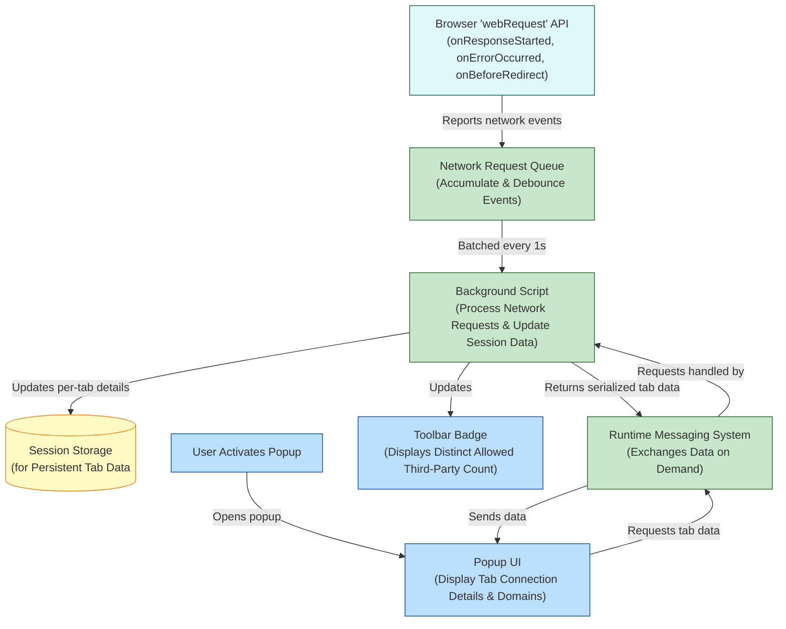

# How uBO Scope Works (Architecture Diagram)

## Overview
Discover how uBO Scope leverages browser APIs and extension components to continuously monitor network activity on a per-tab basis. This page presents a clear, high-level architecture diagram using Mermaid.js that traces the flow from raw browser `webRequest` events through background processing, to the real-time popup interface and toolbar badge updates.

Gain confidence in how uBO Scope delivers accurate, up-to-date insights into third-party connections without depending on any specific content blocker.

---

## Understanding the Architecture

uBO Scope operates by hooking into key browser network event APIs, collecting data about all network requests made by each browser tab. This information is processed, aggregated, and then surfaced live to the user via the popup interface and the badge on the browser toolbar icon.

This architecture ensures efficiency, real-time responsiveness, and persistent per-tab tracking of:

- Allowed third-party connections
- Blocked requests
- Stealth (redirected or stealthily blocked) requests

The following diagram illustrates the main components, their interactions, and data flow.

---

## Component Descriptions and Workflow

### Browser `webRequest` API Events
These events provide raw, real-time notifications for network requests:

- `onResponseStarted`
- `onErrorOccurred`
- `onBeforeRedirect`

They capture every network request attempt, regardless of content blocker state.

### Network Request Queue
To prevent performance bottlenecks, the extension queues network events and batches processing every second. This throttling balances timely updates with resource efficiency.

### Background Script
The heart of uBO Scope’s logic runs here, including:

- Processing queued requests
- Categorizing requests as allowed, blocked, or stealth
- Maintaining up-to-date per-tab domain and hostname maps
- Persisting this data to session storage
- Triggering badge updates

### Session Storage
Per-tab network activity is serialized and stored in session storage to ensure data longevity during the browsing session, enabling quick retrieval and consistent UI updates.

### Runtime Messaging System
Acts as a conduit between the popup UI and the background script, facilitating requests for tab-specific data and responses.

### Popup UI
When users open the extension popup, it:

- Queries the background script for live data about the active tab
- Renders categorized lists of third-party domains with connection counts
- Provides a detailed breakdown of allowed, stealth-blocked, and fully blocked connections

### Toolbar Badge
Displays a dynamic count of distinct allowed third-party domains connected on the current tab, conveying privacy exposure at a glance.

---

## Real-World Usage Scenario

When you browse to a website, uBO Scope listens to every network request made. Each request is queued and processed in the background where its outcome is recorded. This continuous monitoring updates the toolbar badge, showing you the number of distinct allowed third-party connections.

Opening the popup reveals a finely categorized report:

- Which third-party servers did the site contact successfully?
- Which requests were blocked by your content blocker?
- Which stealthy redirects or stealth-blocked connections were observed?

This detailed, real-time feedback empowers you to audit network activities without guesswork.

---

## Tips and Best Practices

- **Viewing Live Data:** Open the popup anytime to see fresh connection results for the active tab.
- **Performance:** The extension batches network events to maintain browser responsiveness.
- **Reliability:** Works alongside any content blocker, observing all browser-reported requests.

---

## Troubleshooting

If data doesn’t update promptly or appears stale:

- Ensure your browser supports the required `webRequest` events.
- Verify the extension has permission to access all HTTP and HTTPS URLs.
- Reload the active tab to reset per-tab tracking.

For persistent issues, consult the [Troubleshooting Common Issues](../getting-started/validation-troubleshooting/troubleshooting) guide.

---

## Next Steps

To deepen your understanding and start using uBO Scope:

- Visit the [Feature Overview](../core-concepts-architecture/feature-glance) to explore key capabilities.
- Learn about [Key Concepts & Terminology](../core-concepts-architecture/core-concepts-terminology) for foundational knowledge.
- Try the [Your First Connection Analysis: A Guided Tour](../../guides/getting-started/first-analysis-tour) to see the extension in action.

---

Explore uBO Scope with confidence, understanding exactly how data flows behind the scenes to offer transparent, actionable insights on third-party network connections.

---

[Back to Overview Main](../overview)

---

<Info>
This page visualizes uBO Scope’s core architecture to enhance user comprehension of extension operations. It complements other documentation focusing on features and concepts.
</Info>

