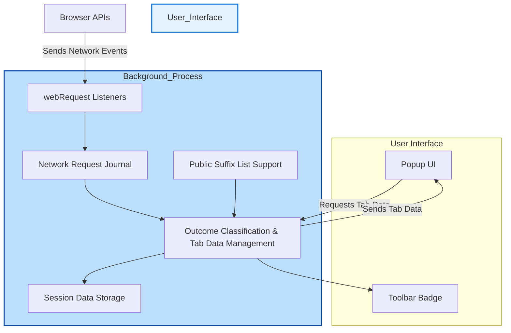

# System Architecture Overview

## Understanding uBO Scope's Core Components and Workflow

uBO Scope operates transparently to reveal your browser’s network connections with no user configuration needed. This page uncovers the inner workings of the system by walking you through the essential components and their interactions, helping you grasp how network data is collected, processed, and presented.

### Introduction

At its core, uBO Scope uses the browser’s built-in `webRequest` API to monitor all network activity initiated by webpages. It then organizes this data within the extension’s background process and relays meaningful summaries to the popup user interface you interact with. A badge count on the extension icon keeps you instantly informed about the current number of distinct allowed third-party domains connected, providing actionable insights at a glance.

### Key Components

- **Background Script**: The central engine of uBO Scope. It listens for network events using `webRequest` listeners, records outcomes (allowed, blocked, stealth-blocked), manages per-tab data, and maintains the session state.

- **Popup UI**: The interface presented when you click the extension icon. It queries the background script to fetch processed tab-specific network connection data and displays detailed breakdowns in a comprehensible and categorized format.

- **Badge Counter**: A lightweight visual indicator on the toolbar icon updated dynamically by the background script, reflecting the number of distinct allowed third-party domains for the active tab.

- **Public Suffix List**: Integrated to provide accurate domain parsing, ensuring third-party domains are correctly identified regardless of complex hostname structures.

### Workflow & Data Flow

1. **Network Event Capturing**
   - The background script actively listens for network requests’ lifecycle events: redirection, errors, and successful responses.
   - Each event is queued and batched for processing to minimize performance impact.

2. **Outcome Classification**
   - Requests are categorized into three states:
     - **Allowed:** Successful connection established.
     - **Blocked:** Errors indicating blocked requests.
     - **Stealth-blocked:** Redirected requests indicating stealthy blocking mechanisms.
   - This classification ties back to the requesting tab and its associated hostname and domain.

3. **Session State Management**
   - Tab-specific details are stored and updated during the session with counts of domains and hostnames per outcome.
   - The state is serialized and persisted in storage, allowing the extension to resume smoothly even if the browser restarts.

4. **Badge Count Updating**
   - When relevant changes occur (new allowed connections detected), the background script updates the badge count in real-time to keep the user informed.

5. **Popup UI Communication**
   - Upon user interaction (clicking the extension icon), the popup sends a message requesting the current tab's network connection data.
   - The background script responds with a serialized summary of allowed, blocked, and stealth-blocked domains, which the popup renders.

### Visual Diagram of System Architecture

### Practical Example: What Happens When You Load a Webpage

1. When you open a new tab and navigate to a webpage, the background script sees the main frame request.
2. It resets tab-specific details and records the main hostname and domain.
3. As the page loads, every network request (scripts, images, APIs) is tracked.
4. Requests that succeed update the 'allowed' list; blocked or stealth-blocked requests populate their respective lists.
5. The badge count on the extension icon updates to show the number of distinct allowed third-party domains.
6. Clicking the extension icon loads the popup, which queries and displays those aggregated statistics for your active tab.

### Best Practices and Tips

- **No User Configuration Needed**: uBO Scope works out of the box, requiring no filter lists or manual setup.
- **Data Freshness**: Badge counts update dynamically but may lag by about one second due to batched network event processing.
- **Domain Accuracy**: The Public Suffix List ensures domain extraction respects complex domain hierarchies.
- **Browser Compatibility**: Supports Chromium, Firefox, and Safari with necessary host permissions for monitoring.

### Troubleshooting Common Issues

<AccordionGroup title="Troubleshooting System Architecture">
<Accordion title="Badge Count Not Updating">
Ensure the tab is active and network requests are occurring. If the badge remains static, reload the tab or restart the browser. The background script batches events, so slight delays are expected.
</Accordion>
<Accordion title="Popup Shows No Data">
Verify network activity on the tab and confirm that the extension has permissions. If the tab URL is non-http(s) or local resource, network requests may not be captured.
</Accordion>
<Accordion title="Inconsistent Domain Counts">
Clear browser session storage or restart the browser to reset the internal session state.
</Accordion>
</AccordionGroup>

### Next Steps

To dive deeper into uBO Scope, explore these related documentation pages:

- [Core Concepts & Terminology](../core-concepts-architecture/core-concepts-glossary) — Understand the definitions and significance of allowed, blocked, and stealth domains.
- [Quick Feature Overview](../core-concepts-architecture/feature-overview) — Get a practical summary of the extension's key capabilities.
- [Getting Started Guides](../../getting-started/installation-setup/) — Installing and first-run configuration.

This understanding of system architecture equips you to better interpret uBO Scope’s UI and leverage its insights confidently.