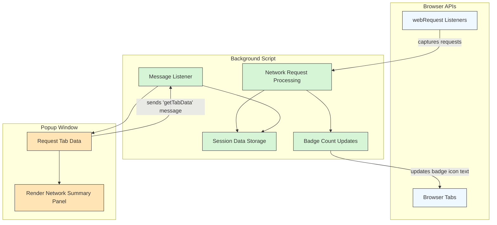

# How uBO Scope Works (System Overview)

Understanding how uBO Scope operates under the hood empowers users to interpret its data with confidence and leverage its full potential for network connection transparency. This page demystifies the extension’s core system architecture and workflow, detailing how uBO Scope monitors network activity, processes data, and presents it to you in an intuitive popup interface.

---

## Visualizing the Data Flow

At its core, uBO Scope acts as a vigilant observer within your browser. It listens to every network request your browser initiates and categorizes the connection outcomes—whether a request was allowed, blocked, or stealth-blocked—independently of any content blocker in place.

This flow involves three main components:

- **Browser webRequest API**: The entry point where uBO Scope hooks into network requests.
- **Background script**: The central processor that records, categorizes, and stores data about network requests.
- **Popup UI**: The front-facing interface presenting summarized and detailed connection data when you interact with the extension's icon.

Below is a flowchart illustrating this relationship and the data movements between these components:

## Step-by-Step Workflow

1. **Network Request Monitoring** 
   - uBO Scope attaches listeners to the browser's `webRequest` API to monitor all outgoing network requests matching HTTP, HTTPS, WS, and WSS protocols.
   - It captures events related to redirects, errors, and successful responses for these network requests.

2. **Background Processing and Categorization**
   - The background script queues incoming network request events and processes them in batches every second, reducing performance impact.
   - Each request is analyzed to determine:
     - The hostname and domain contacted.
     - The request outcome: allowed, blocked (error), or stealth-blocked (redirected stealthily).
     - The context of the request, such as the tab and frame it originated from.
   - The script maintains per-tab session data, grouping all observed domains and connection outcomes.

3. **Badge Count Management** 
   - The background script updates the browser action badge text with the count of distinct allowed third-party domains observed per tab.
   - This count reflects the number displayed on the extension icon, helping users quickly assess third-party connections.

4. **Data Retrieval by the Popup UI**
   - When you click the uBO Scope icon, the popup UI sends a message requesting the latest network data for the active browser tab.
   - The background script responds with serialized details of allowed, stealth-blocked, and blocked domains.

5. **Rendering the Popup Display**
   - The popup UI deserializes the data and dynamically renders it into categorized sections:
     - **Not Blocked:** Connections that succeeded.
     - **Stealth-Blocked:** Connections redirected stealthily by content blockers.
     - **Blocked:** Connections actively blocked.
   - The hostname and domain of the active tab are displayed prominently to contextualize the data.

## Data Storage and Persistence

- **Session Data Storage:**
  - The extension stores connection data in session storage scoped to tabs.
  - This allows persistent tracking as long as the tab is open and ensures data for closed tabs is cleared.

- **Public Suffix List Usage:**
  - uBO Scope uses the public suffix list to accurately derive the domain from any hostname, ensuring reliable grouping of network requests by trusted domains.

## Why This Matters to You

Knowing how uBO Scope gathers and organizes data enables you to trust the information it provides and precisely understand the number of distinct third-party servers your browser talks to, regardless of content blockers.

By revealing what is allowed, blocked, or stealth-blocked, you gain:

- **Accurate Insight**: Distinguish between actually blocked domains and those only redirected stealthily.
- **Contextual Awareness**: View network requests per tab, correlating connections directly to your browsing activity.
- **Reliable Metrics**: Understand that the badge count reflects distinct allowed third-party domains, not the total number of blocked requests.

## Practical Tips

- If you notice unexpected high numbers in the badge count, use the popup to investigate which third-party domains are contacted.
- Remember that stealth-blocked connections may not appear in content blocker block lists but still indicate control over network traffic.
- Use this system overview and popup insights together to debunk misleading claims about content blockers based solely on block counts.

## Troubleshooting

- If the popup shows ‘NO DATA’ or empty lists:
  - Ensure the active tab has finished loading and that network requests have occurred.
  - Refresh the tab to trigger new network activity.
  - Check that the browser supports the `webRequest` API and that permissions are intact.

- Badge count not updating:
  - This can happen if network requests are not captured (e.g., private browsing with restricted APIs).
  - Closing and reopening the tab resets the session data, so ensure you test on active tabs.

---

## Further Exploration

- For detailed user-centric explanations on the badge and popup interface, see [Understanding the Badge Count and Popup Panel](/guides/getting-started-essentials/understanding-badge-and-popup).
- For conceptual clarity on terminology used here, refer to [Key Concepts and Terms](/overview/core-concepts-architecture/key-concepts-terminology).

---

By comprehending this system overview, you unlock the full transparency power of uBO Scope and can navigate your browsing privacy landscape with confidence and clarity.

---