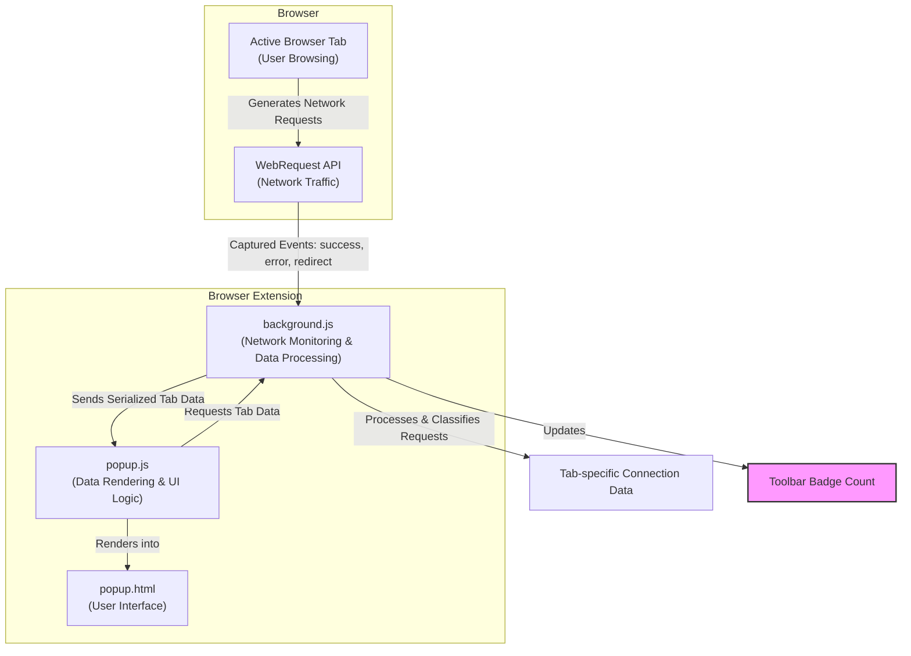

# System Architecture Overview

Understand how uBO Scope operates behind the scenes with a clear, visual guide to its core components and the flow of information—from network requests intercepted in the background to the data presented in the popup user interface.

---

## Unlocking uBO Scope's Inner Workings

uBO Scope is designed to provide complete transparency into all third-party connections initiated by web pages. This page breaks down the internal architecture that powers this insight, showing how each part of the system collaborates seamlessly to deliver accurate, real-time connection data.

### What You Will Learn Here
- The roles of the major components: **background.js**, **popup.js**, and **popup.html**.
- How network requests are captured, processed, and rendered.
- How data flows through the extension from low-level interception to user-facing display.

---

## Core Components and Their Responsibilities

### Background Script (`background.js`)
The backbone of uBO Scope’s data collection. It leverages the browser's `webRequest` API to listen for network activity within tabs:

- Captures all network requests made by web pages.
- Classifies each connection attempt as **allowed**, **blocked**, or **stealth-blocked** based on observed outcomes.
- Maintains detailed tracking of connections mapped to each tab, maintaining domain and hostname counts.
- Updates the toolbar badge count dynamically to reflect the number of distinct allowed third-party domains per tab.
- Responds to queries from the popup UI, providing the latest connection data for display.

This component operates invisibly in the background, continuously monitoring network activity and storing session data efficiently.

### Popup Interface (`popup.html` & `popup.js`)
When you click the uBO Scope icon, this user-facing component springs into action:

- The **HTML file** structures the interface, dividing connection data into three clear categories: _not blocked_, _stealth-blocked_, and _blocked_.
- The **JavaScript file** requests tab-specific connection data from the background script.
- It beautifully renders dynamic lists of domains and their connection counts under each category.
- The popup intelligently handles domain names encoded in punycode for internationalized domain names, converting them to readable Unicode.

This design ensures you can immediately grasp the privacy impact on the current page without digging.

---

## Information Flow: From Network Request to User View

Every time a page makes a network request, uBO Scope captures and processes this event, ultimately showing you up-to-date analytics on the popup.

**Explanation:**
- As you browse, your active tab generates network requests.
- These requests pass through the `webRequest` API, where `background.js` listens and logs them.
- The background script evaluates each event, tagging it and tracking domain counts.
- The toolbar badge visually summarizes the number of distinct allowed third-party domains.
- When you open the popup, its script requests current tab data and updates the display accordingly.

---

## Practical Insights and Tips

- **Why the Background Script Matters:** By centralizing network monitoring here, uBO Scope ensures reliable and comprehensive capture of all tracked connections, unaffected by UI activity or popup state.

- **Understanding the Badge:** The count reflects distinct allowed domains per tab, giving you a quick sense of third-party exposure without overwhelming details.

- **Popup Display:** Organizing domains by connection outcome empowers you to differentiate between what is allowed, blocked, or stealth-blocked accurately.

- **Unicode Domain Handling:** The popup's use of punycode decoding means internationalized domain names are user-friendly, helping you recognize sites clearly.

- **Session Persistence:** The architecture preserves session data so detailed statistics continue uninterrupted within your browsing session.

---

## Summary

This System Architecture Overview clarifies how uBO Scope's core components unite to provide a powerful privacy auditing experience. From deep network request capture in the background to vibrant, categorized popup displays, every element is tuned for accurate, real-time insight.

Explore other pages like [How uBO Scope Works](/overview/core-concepts-architecture/how-ubo-scope-works) and [What is uBO Scope?](/overview/introduction-core-value/what-is-ubo-scope) for further foundational knowledge and user-centric guidance.

---

## Troubleshooting

If the popup does not display connection data as expected:

- Verify that the background script is running without errors.
- Confirm your browser supports the necessary `webRequest` APIs.
- Check that the active tab has network activity to analyze.
- Close and reopen the popup to refresh data retrieval.

For deeper diagnostics, consult the [Troubleshooting Common Setup Issues](/getting-started/first-steps-usage-validation/troubleshooting-common-setup-issues) guide.

---

## Next Steps

Ready to dive deeper? Head to:

- [How uBO Scope Works](/overview/core-concepts-architecture/how-ubo-scope-works) — for detailed explanation of data capture methods and interpretation.
- [Value Proposition & Use Cases](/overview/introduction-core-value/value-proposition-use-cases) — to understand practical scenarios and benefits.

These will expand your mastery and help you gain the most from uBO Scope’s functionality.

---

**© uBO Scope Project**

_Source: [GitHub Repository](https://github.com/gorhill/uBO-Scope), Version 1.0.1_