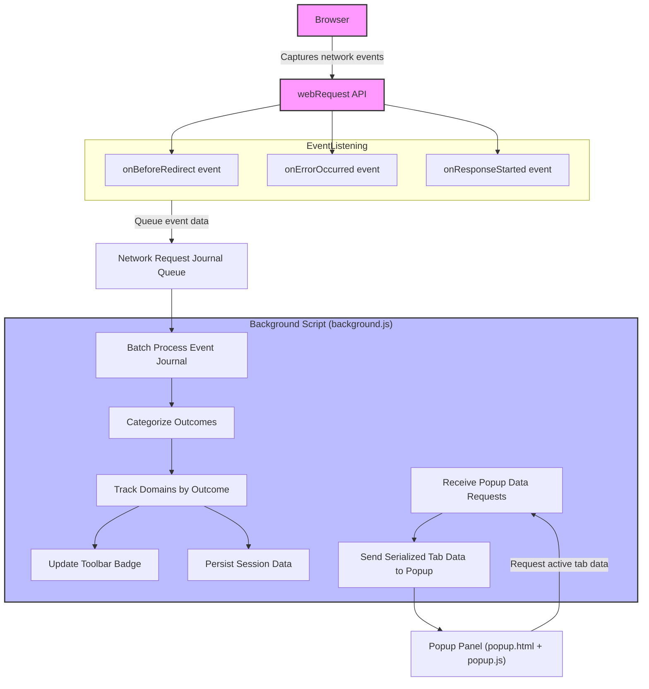

# How uBO Scope Works (with Diagram)

## Understanding the Flow of Network Event Processing

At its core, uBO Scope is designed to provide unparalleled transparency into your browser's network activity by monitoring and categorizing connections to third-party remote servers. This documentation details the end-to-end architectural workflow, offering clarity on how uBO Scope uses browser APIs, processes network events, and communicates results back to you through the extension's popup panel and toolbar badge.

---

## 1. The Journey of a Network Request

Every network request your browser makes—whether a page load, resource fetch, or websocket connection—is captured by uBO Scope's background script via the browser's `webRequest` API. This captures events for all URLs you visit, regardless of any content-blocking in place.

1. **Event Capturing:** The browser emits three key events for network requests:
   - `onBeforeRedirect` — triggered when a request is redirected
   - `onErrorOccurred` — triggered when a request fails or is blocked
   - `onResponseStarted` — triggered when the response starts successfully

2. **Event Queueing:** Each of these events is recorded into an internal journal queue.

3. **Batch Processing:** To efficiently handle bursts of network events, uBO Scope waits up to one second after the first event before processing the entire batch.

4. **Outcome Categorization:** Each request is evaluated to determine if it succeeded (allowed), was blocked (error), or was stealth-blocked (redirected in a way that conceals blocking).

5. **Domain & Hostname Tracking:** The extension breaks down URLs into hostnames and domain names (based on the public suffix list), incrementing counters for each outcome to maintain real-time statistics.

6. **Tab-Specific Aggregation:** This tracking is maintained separately for each browser tab, allowing you to see exactly which third-party servers each tab is connecting to.

7. **Badge Update:** The number of distinct allowed third-party domains is represented as a badge count on the extension icon to give you at-a-glance insight.

8. **Popup Panel Data:** Upon opening the popup, these aggregated statistics are presented in a clear, categorized manner: allowed (not blocked), stealth-blocked, and blocked domains.

---

## 2. Key Components in the Workflow

- **Browser `webRequest` API:** The critical interface through which all network events are intercepted. It is the source of truth for requests seen by uBO Scope.

- **Background Script (`background.js`):** Runs continuously or as a service worker, listening to webRequest events, managing data collection, processing, and badge updates.

- **Public Suffix List Processor:** Uses the public suffix list to correctly identify the registrable domain for any hostname. This distinction enables accurate grouping of requests.

- **Session Storage:** Persists tab-related network data within browser session storage, ensuring data is preserved within sessions and cleared when tabs close.

- **Popup Panel (`popup.html` + `popup.js`):** Provides a user interface to view aggregated counts broken down by allowed, stealth-blocked, and blocked domains for the active tab.

---

## 3. Visualizing the Architecture

---

## 4. Step-by-Step User Perspective

1. **Browsing starts:** You open a website. Your browser begins making network requests for page content and resources.

2. **uBO Scope listens:** The background script immediately records each network request event, capturing real-time details.

3. **Data is processed:** After buffering briefly, uBO Scope processes or updates data for each browser tab, determining which domains are successfully connected to and which were blocked or stealth-blocked.

4. **Visual feedback:** The extension badge updates dynamically to display the count of distinct allowed third-party domains, drawing your attention if many or suspicious connections occur.

5. **In-depth analysis:** When you click the extension icon, the popup panel shows a detailed breakdown of all connections for the active tab, grouped by these categories:
   - **Not Blocked:** Domains from which resources were successfully loaded.
   - **Stealth-Blocked:** Domains where requests were redirected, hiding the blocking.
   - **Blocked:** Domains whose requests were clearly blocked or failed.

6. **Informed decisions:** With this visibility, you gain actionable insights into your browsing privacy, enabling you to better evaluate content blockers and third-party exposure.

---

## 5. Best Practices and Tips

- **Always monitor badge counts:** A rising count of allowed third-party domains indicates a larger number of external connections, potentially affecting privacy.

- **Use the popup for context:** The badge number alone lacks granularity. The popup panel reveals the precise domains, helping you identify which third parties are involved.

- **Understand stealth-blocking:** Some blockers use stealth techniques that may not show as outright block but still prevent resource loading. uBO Scope surfaces these stealth-blocked domains distinctly.

- **Session isolation:** Data is scoped per tab session and is cleaned when tabs are closed to avoid stale or misleading information.

- **Compatibility:** uBO Scope works irrespective of your content blocker or DNS-level blocking since it relies on browser network event APIs.

---

## 6. Troubleshooting Common Issues

- **No badge count shown:** Ensure the extension has the required `webRequest` permission and your browser supports the `webRequest` API fully.

- **Popup shows no data for active tab:** The tab might not have fully loaded yet or no network requests have been captured. Reload the tab or visit a new domain.

- **Suspiciously low or high counts:** Confirm you are not using multiple conflicting privacy extensions that might interfere with event reporting.

- **Extension not processing events:** Check for browser compatibility and correct installation (refer to installation documentation).

---

## 7. Next Steps

To deepen your understanding or begin using uBO Scope effectively, explore the following:

- [What is uBO Scope?](overview/product-introduction/what-and-why) — Understand the product purpose and value.
- [Who Should Use uBO Scope?](overview/product-introduction/use-cases-audience) — Identify if uBO Scope fits your needs.
- [Understanding the Popup Panel](guides/getting-started-workflows/interpreting-popup) — Learn to interpret the detailed data display.
- [Supported Browsers & System Requirements](getting-started/requirements-installation/supported-platforms-browsers) — Confirm your environment is compatible.

---

For the complete source and updates, refer to the official repository:

[https://github.com/gorhill/uBO-Scope](https://github.com/gorhill/uBO-Scope)