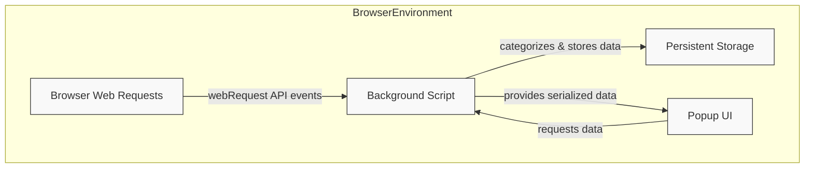

# System Architecture Overview

Understanding how uBO Scope captures, processes, and presents network connection data is crucial for appreciating the extension's power and simplicity. This overview provides a clear, visual, and narrative guide to the core architectural flow that powers uBO Scope's unique insights into browser network behavior.

---

## At a Glance: How uBO Scope Works

uBO Scope operates transparently within your web browser to reveal all connections — both attempted and successful — to remote servers that a webpage makes. This is achieved by monitoring network requests, processing them in the background, and then visualizing the results through its popup user interface.

### Core Components & Their Responsibilities

- **Browser Web Requests**: Every time a webpage loads or initiates network activity, the browser emits web request events covering URLs the page visits.

- **Background Script**: Listens to these web requests, categorizes the outcomes — whether allowed, stealth-blocked, or fully blocked — and stores detailed connection data.

- **Popup UI**: On user interaction (e.g., clicking the extension icon), the popup retrieves the stored data and visually summarizes network connections, empowering users with actionable insights.

---

## Architectural Flow Explained

1. **Network Requests Are Detected**
   - Using the browser's `webRequest` API, uBO Scope’s background script listens for all network events matching its host permissions.
   - Events include successful connections, redirects, and errors, providing a comprehensive view of request outcomes.

2. **Outcome Categorization & Data Recording**
   - The background script processes these events to classify the connection as `allowed`, `stealth-blocked` (hidden redirects), or `blocked`.
   - It maps each request by tab and tracks domains and hostnames, incrementally building a detailed model of network exposure per tab.

3. **Storage & Persistence**
   - Connection data is serialized and saved to browser storage to persist state across sessions, ensuring continuity of insights.

4. **Data Visualization on Demand**
   - When the user opens the popup UI, a message is sent to the background script to fetch the latest tab-specific connection details.
   - The popup parses and presents this data in a user-friendly interface, displaying domain counts and segmented lists by outcome.

---

## Visualizing the Architecture

This flowchart illustrates the cycle of capturing, analyzing, storing, and presenting network connection data. The browser environment hosts all components, with clear data movement paths ensuring responsiveness and accuracy.

---

## Why This Architecture Matters to You

Understanding this architecture helps you appreciate how uBO Scope delivers precise and trustworthy data about third-party connections with minimal overhead:

- **Real-Time, Reliable Monitoring**: By hooking directly into the browser's network event APIs, uBO Scope ensures it captures genuine connection attempts, unaffected by other content blockers or DNS-level filters.

- **Detailed Categorization**: The background script distinguishes subtle differences in request outcomes, offering clarity beyond simple allow/block metrics.

- **Persistent Session Tracking**: Data is preserved over your browsing session, allowing you to spot trends and changes without losing information when you switch tabs or close popups.

- **User-Centric Presentation**: The architecture supports on-demand visualization that focuses on your active tab, keeping insights relevant and actionable.

---

## Practical Tips

- **Efficiency**: uBO Scope batches network request processing on a timer (approximately every second) to balance responsiveness with performance.

- **Domain Awareness**: It uses a public suffix list to accurately resolve and group domains, so connections are summarized at meaningful domain levels.

- **Badge Count Updates**: The background script updates the toolbar badge to reflect the number of distinct allowed third-party domains per tab, providing an immediate privacy indicator.

---

## Troubleshooting Common Questions

<AccordionGroup title="Troubleshooting System Architecture">
<Accordion title="Why doesn't uBO Scope see all network requests?">
Not all network traffic is accessible through the browser's `webRequest` API. Requests made outside its scope, such as some browser-internal connections or DNS-level blocking that the browser doesn't report, will not appear in uBO Scope.
</Accordion>
<Accordion title="What causes data to sometimes delay in updating?">
uBO Scope batches incoming network events and processes them at timed intervals to optimize performance. This may cause a slight delay (around one second) before the popup UI reflects the most recent activity.
</Accordion>
<Accordion title="How is data cleaned up when tabs are closed?">
When you close a tab, the background script detects this event and deletes all associated connection data to keep storage clean and accurate.
</Accordion>
</AccordionGroup>

---

## Next Steps

With a grasp of this architecture, you're ready to dive deeper into how to interpret the popup visualization and effectively use uBO Scope to enhance your privacy awareness.

- Visit [Key Terminology](./core-terminology) to understand background outcomes and domain concepts.
- Explore [Feature Overview](./feature-overview) to see how this architecture enables powerful insights.
- Start using uBO Scope to observe real-time connections while browsing, appreciating the seamless collaboration between browser, background script, and popup UI.

---

For additional context and to see uBO Scope in action, explore the related pages in the Overview section of the documentation:

- [What is uBO Scope?](./what-is-ubo-scope)
- [Why Use uBO Scope?](./value-proposition)
- [Who is uBO Scope For?](./target-audience-usecases)

---

© 2024 Raymond Hill — [GitHub Repository](https://github.com/gorhill/uBO-Scope)

---