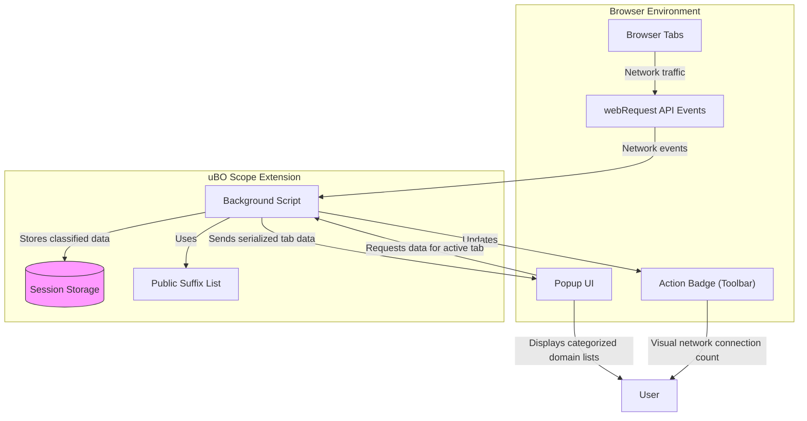

# System Architecture & Data Flow

uBO Scope offers users a clear lens into the underlying mechanics of how network requests are monitored, classified, and displayed in real time. This page walks you through the entire lifecycle of a network request as handled within the extension — from the moment it is intercepted by the browser's background process, through the decision-making and data storage steps, to the display of that information in the popup user interface.

Understanding this process enables you to grasp how uBO Scope provides accurate and timely insight into third-party connections regardless of content blocking layers.

---

## How uBO Scope Tracks Network Requests

At its core, uBO Scope leverages the browser's `webRequest` API within a background script to listen for network activity. Specifically:

- **Interception:** The extension listens to three main types of network events:
  - **Redirects** via `onBeforeRedirect`
  - **Errors** via `onErrorOccurred`
  - **Response Starts** (successful requests) via `onResponseStarted`

- **Event Queuing:** Each network event is queued temporarily to batch-process requests efficiently without causing performance issues.

- **Processing & Classification:** When the queue is processed, each request is classified into one of three outcome categories:
  - **Allowed (Successful):** Requests which succeeded and connected to a remote server.
  - **Blocked:** Requests that failed due to blocking or error conditions.
  - **Stealth:** Redirect events that effectively act as hidden blocks.

This classification is tied to the tab from which the network request originated and is stored for lookup and display.

## Lifecycle of a Network Request in uBO Scope

### 1. Intercepting Requests in the Background Script

uBO Scope runs a background script responsible for intercepting network requests across all browser tabs. It hooks into the webRequest API and feeds requests into an internal queue.

### 2. Storing and Updating Tab-Specific Data

For each tab, uBO Scope maintains a detailed record of domains and hostnames categorized by their outcome (allowed, blocked, stealth). Upon processing requests:

- If a main frame request loads successfully, tab-specific data is reset to reflect the current page’s domain.
- Requests to third-party domains update counts under their respective categories.

This data is stored in session storage for persistence and quick access.

### 3. Updating the User Interface in Real Time

When network request processing completes, the extension updates the browser action badge to indicate the number of distinct third-party domains successfully connected to by the current tab.

The popup UI fetches this tab-specific data on activation, rendering a categorized list of domains and their counts, providing a snapshot of network activity per tab.

---

## Key Components and Their Roles

| Component                 | Role & Responsibility                                               |
|--------------------------|-------------------------------------------------------------------|
| **Background Script**    | Captures all network events, classifies outcomes, manages session data, and updates the badge count for each tab. |
| **Session Storage**      | Persists tab-specific domain outcome data during browsing sessions with serialization for efficient storage. |
| **Popup Script & UI**    | Retrieves stored data for the active tab and presents an organized summary of network connections by outcome category. |
| **Public Suffix List**   | Helps accurately identify domains from hostnames, supporting consistent grouping and counts of network requests. |

---

## Data Flow Diagram

---

## Practical Example: From Request to Badge Update

Imagine you open a new browser tab to a website:

1. The background script intercepts the main frame request first. It resets any prior data for this tab and sets the hostname and domain for this session.
2. As subsequent network requests occur — e.g., loading images, scripts from third-party servers — events are queued and classified as allowed, blocked, or stealth.
3. After processing, the extension updates the tab's badge count to show the number of distinct third-party domains successfully connected to.
4. When you open the popup, it renders separate lists of allowed, stealth-blocked, and blocked domains, giving you full insight into what actually connected or was prevented.

---

## Tips & Best Practices

- **Tab Data Reset:** The extension resets network tracking data for a tab when the main frame loads, ensuring fresh and relevant data on page navigations.
- **Batch Network Event Processing:** Network events are batched and processed once per second to optimize performance and avoid UI lag.
- **Accurate Domain Identification:** Usage of the public suffix list ensures domains are calculated correctly despite complex subdomains or internationalized domain names.
- **Badge Count Meaning:** The badge reflects successful third-party connections, helping you quickly evaluate connection exposure for any tab.

---

## Troubleshooting Common Issues

<AccordionGroup title="Common Troubleshooting Scenarios">
<Accordion title="Why does the badge sometimes not update immediately?">
The extension batches network events and updates the badge asynchronously, typically every second. If you navigate rapidly or the network is busy, there may be a slight delay.
</Accordion>
<Accordion title="Why are some network requests not listed in the popup?">
uBO Scope relies on the browser's webRequest API. Some types of requests or isolated network contexts may not be visible to this API, resulting in missing data.
</Accordion>
<Accordion title="What if the domain counts seem incorrect or inconsistent?">
Ensure the public suffix list is loaded correctly — this list is essential for correctly mapping hostnames to domains. The extension loads and caches this list, but failure in fetching it could impact counts.
</Accordion>
</AccordionGroup>

---

Now that you understand the system architecture and data flow, you can appreciate how uBO Scope provides reliable, real-time visibility into network connections, helping you monitor and analyze web traffic with confidence.

For practical guidance on interpreting this data, proceed to the [Understanding the Popup: Allowed, Blocked, and Stealth Domains](/guides/interpreting-results/understanding-popup) page.

---

## References

- [Background Script Source Code](https://github.com/gorhill/uBO-Scope/blob/main/js/background.js)
- [Popup UI Source Code](https://github.com/gorhill/uBO-Scope/blob/main/js/popup.js)
- [Public Suffix List Library](https://github.com/gorhill/uBO-Scope/blob/main/js/lib/publicsuffixlist.js)

---

## Next Steps

- Explore the popup UI in action by installing uBO Scope and visiting various websites.
- Visit [Key Features and User Workflow](/overview/feature-highlights/feature-list-and-workflow) to see how the architecture supports user-driven workflows.
- Use the troubleshooting guide if you encounter unexpected data in your popup or badge.

---