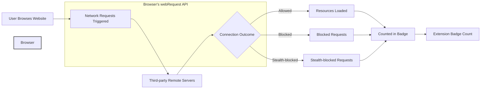

# Core Concepts and Terminology

Welcome to the foundational page that sets the stage for understanding how uBO Scope works and why it matters. Here, you will grasp the essential vocabulary and concepts that guide your experience with the extension — from how network connections are categorized, to the meaning behind the badge count, and the critical role browser APIs play.

---

## Understanding Third-Party Remote Servers

When you browse the web, your browser often connects not only to the website you requested but also to many other remote servers. These "third-party remote servers" provide resources like images, ads, fonts, analytics, and more.

**Why it matters:**
- These connections can impact your privacy and security.
- Some third-party servers are necessary (e.g., content delivery networks), while others may be intrusive or unwanted.

uBO Scope focuses on revealing these third-party connections to give you transparent insight into all remote servers your browser communicates with during browsing.

## Outcomes of Network Connections

uBO Scope categorizes every observed network request based on its connection outcome. Understanding these outcomes is crucial to make sense of the extension’s reporting.

| Outcome          | Description                                           | User Impact                                      |
|------------------|-------------------------------------------------------|-------------------------------------------------|
| **Allowed**      | Connection request succeeded and was not blocked.    | Indicates the domains your browser successfully connected to.
| **Blocked**      | Connection was explicitly blocked by the browser or content blocker. | Domains where connections were prevented.
| **Stealth-Blocked** | The connection was blocked in a way that hides its occurrence from the webpage (e.g., redirected or suppressed without page awareness). | These requests are "invisible" to the page, enhancing stealth blocking.

### Practical Example
Imagine visiting a news website. 
- When ads or trackers attempt connections, these may be blocked.
- However, legitimate assets like images or fonts load and are "allowed".
- Some stealth-blocked requests may quietly fail without alerting the webpage.

Seeing these three categories separately helps you understand what is really happening behind the scenes.

## Badge Count: What Does It Represent?

In the browser toolbar, uBO Scope displays a badge count — a powerful signal reflecting network activity.

> **The badge count shows the number of distinct third-party remote servers your browser connected to during your active tab’s session.**

**Key points:**
- Each domain is counted once, even if multiple requests occur.
- A lower count generally indicates fewer third-party connections, often desirable for privacy and performance.

### Why Focus on Distinct Servers?
Counting blocked requests or total connections can be misleading. The number of distinct domains connected to is a clearer indicator of third-party exposure.

> _"A high block count might still mean many distinct connections were allowed, reducing overall effectiveness of content blocking."_

## The Role of the Browser's `webRequest` API

uBO Scope leverages the browser's `webRequest` API to monitor network requests in real-time.

### How does it work?
- This API allows uBO Scope to listen to network requests initiated by webpages.
- It records detailed information about each request’s URL, status (allowed, blocked, redirected), and outcomes.
- Because the API operates at the browser level, uBO Scope observes connections even if another content blocker is active.

### Limitations to be aware of:
- Network requests made outside the browser's `webRequest` scope (e.g., certain WebSocket connections on some browsers) may not be observed.
- The extension cannot report connections blocked outside the browser, such as system-level DNS filtering or external firewall rules.

## Summary of Core Vocabulary

| Term                  | Meaning                                                        |
|-----------------------|----------------------------------------------------------------|
| **Third-party server**| Any remote server not belonging to the site you directly visit. |
| **Allowed**           | Network request successfully connected; not blocked.           |
| **Blocked**           | Network request prevented by content blocking or errors.       |
| **Stealth-blocked**   | Requests blocked in a way that is hidden from the webpage.     |
| **Badge count**       | Number of distinct third-party domains connected to in a tab.  |
| **webRequest API**    | Browser API that provides access to web network requests.      |

---

## Why These Concepts Matter to You

By understanding these core principles, you:

- **Gain clarity** on what uBO Scope displays and why the badge count reflects your browsing exposure.
- **Learn to interpret network outcomes** clearly, distinguishing between allowed, blocked, and stealth-blocked requests.
- **Are empowered to validate content blockers** and make informed privacy decisions.

## Common Pitfalls and How to Avoid Them

<AccordionGroup title="Common Misunderstandings and Tips">
<Accordion title="Confusing Block Count with Badge Count">
The badge count reflects connected domains, not the number of blocked requests. A higher block count may not mean better blocking if many different domains still connect.
</Accordion>
<Accordion title="Assuming All 3rd Parties Are Bad">
Not all third-party connections are harmful. CDNs and essential services may connect to third-party domains legitimately.
</Accordion>
<Accordion title="Expecting Complete Network Visibility in All Browsers">
Some browsers restrict `webRequest` API monitoring for newer protocols or sandboxing features, which may cause missing data.
</Accordion>
</AccordionGroup>

<Tip>
If you are new, start by observing the badge count and popup data together to correlate network connections with their outcomes.
</Tip>

## Next Steps

Once comfortable with these core concepts and terminology, proceed to:

- [System Architecture & Data Flow](/overview/core-concepts-overview/architecture-data-flow) to understand how uBO Scope gathers and processes this data.
- [Key Features and User Workflow](/overview/feature-highlights/feature-list-and-workflow) to see how these concepts translate into user-facing capabilities.
- [Interpreting the Popup: Allowed, Blocked, and Stealth Domains](/guides/interpreting-results/understanding-popup) for practical insights on reading your data.

---

For detailed installation instructions and using the extension, visit the [Installing uBO Scope](/getting-started/prerequisites-installation/installing-ubo-scope) and [Interpreting Badge and Popup Data](/getting-started/first-run-setup/interpreting-badge-popup) pages.

---

## Glossary of Key Terms

| Term                | Definition                                                                 |
|---------------------|-----------------------------------------------------------------------------|
| **Third-party domain** | A domain different from the website you are visiting, often linked to ads, trackers, or resources.
| **Allowed connection** | A network request that successfully reached its destination without being blocked.
| **Blocked connection** | A request prevented from completing, usually by a content blocker.
| **Stealth-blocked connection** | A blocked request intentionally hidden from the page so it cannot detect the block.
| **Badge count**       | The count of distinct third-party domains connected to, shown on the extension icon.
| **webRequest API**    | The browser's programming interface providing details about network requests.

---

# Visualizing Core Concepts

This diagram illustrates how uBO Scope sits within the browsing experience: monitoring network requests, classifying their outcomes, and reflecting that information through the badge count.

---

## Troubleshooting Tips

<AccordionGroup title="Common Issues Understanding Core Concepts">
<Accordion title="Why does the badge count not match the number of allowed requests?">
The badge counts distinct third-party domains, not individual requests. Multiple requests to the same domain count once.
</Accordion>
<Accordion title="What does stealth-blocked mean, and why is it important?">
Stealth blocking stops certain requests without alerting the webpage, preventing the page from detecting blocking behavior, ensuring better privacy and stealth.
</Accordion>
<Accordion title="Can uBO Scope see all network connections?">
No. It relies on browser APIs and their limitations. Some network activity outside `webRequest` or system-level filtering is not visible.
</Accordion>
</AccordionGroup>

---

Embracing these core concepts ensures you use uBO Scope effectively to gain actionable insight into your browser's network activity.

