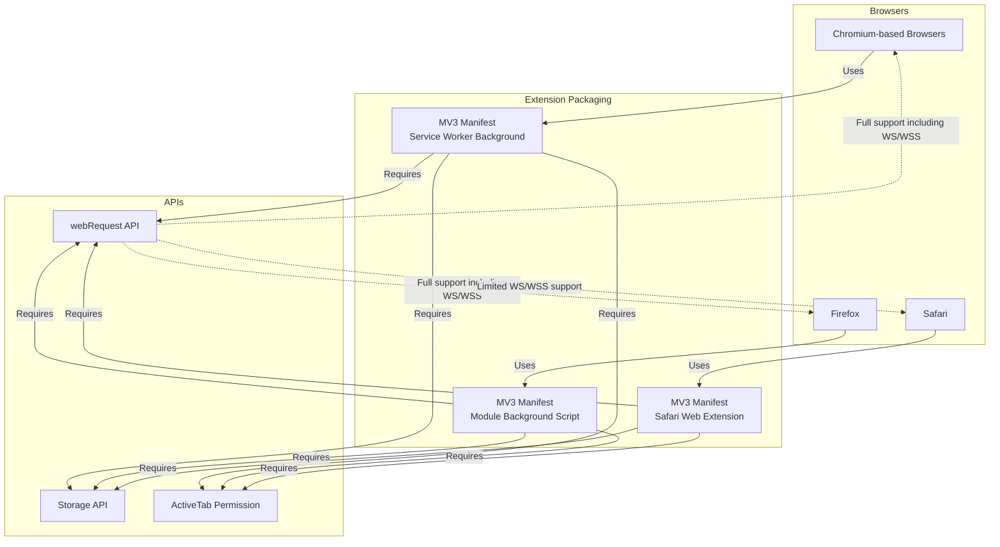

# Supported Browsers & Environment Integration

## Introduction

uBO Scope is engineered to operate seamlessly across the major browser environments including Chromium-based browsers, Firefox, and Safari. This wide compatibility ensures that users benefit from transparent, factual reporting of network connections regardless of their platform choice. However, integration capabilities depend on browser-specific APIs and permissions available, notably the `webRequest` API.

This page details how uBO Scope is packaged for different browsers, the limitations inherent to each environment, and practical scenarios illustrating how these integrations allow you to harness uBO Scope effectively.

---

## Cross-Browser Support

### Chromium

Chromium-based browsers, such as Google Chrome and Microsoft Edge, support uBO Scope through a Manifest V3-compliant extension structure using a **service worker** in the background.

- **Manifest Highlights**:
  - Background runs as a service worker (`service_worker` in `background`)
  - Requires `webRequest` permission to monitor network activity
  - Supports `host_permissions` covering HTTP, HTTPS, and WebSocket traffic
  - Minimum Chrome version 122.0 ensures API availability

This setup enables uBO Scope to listen to network requests and log connection outcomes effectively while respecting user privacy and browser policies.

### Firefox

Firefox supports uBO Scope with its own Manifest V3 style package, deploying the background script as a **module-style background script**.

- **Manifest Highlights**:
  - Uses `type: "module"` for background scripts
  - Requires `webRequest` and `storage` permissions
  - `host_permissions` include HTTP, HTTPS, and WebSocket URLs
  - Browser-specific options include versioning constraints and a unique extension ID

Firefox’s implementation provides robust network request monitoring, similar in capability to Chromium, enabling deep connection insights.

### Safari

Safari integrates uBO Scope as a **Safari Web Extension**, with key differences driven by its strict API surface and version constraints.

- **Manifest Highlights**:
  - Background scripts run as modules but specified differently from other browsers
  - Minimal required Safari version 18.5 to support features
  - Host permissions cover HTTP and HTTPS only; WebSocket support is limited or unavailable
  - Permissions include `webRequest`, `storage`, and `activeTab`

Safari's environment imposes unique restrictions due to its platform architecture. Notably, WebSocket monitoring via `webRequest` API may be limited or unsupported, impacting the full network reporting capabilities.

---

## Packaging Differences Across Environments

| Feature             | Chromium                            | Firefox                              | Safari                             |
|---------------------|-----------------------------------|------------------------------------|-----------------------------------|
| Background          | Service Worker (`service_worker`) | Module background script            | Module background script          |
| Manifest Version    | 3                                 | 3                                  | 3                                 |
| Minimum Version     | 122.0+                            | 128.0+ (Gecko)                     | 18.5+ Safari                     |
| Permissions         | `webRequest`, `storage`, `activeTab` | `webRequest`, `storage`, `activeTab`| `webRequest`, `storage`, `activeTab` |
| Host Permissions    | HTTP, HTTPS, WS, WSS URLs         | HTTP, HTTPS, WS, WSS URLs           | HTTP, HTTPS URLs only              |
| WebSocket Support   | Full                             | Full                               | Limited / No Support               |

This table summarizes key packaging distinctions that influence uBO Scope’s functionality and integration breadth.

---

## Integration Limitations

While uBO Scope provides consistent core functionality, some inherent limitations relate to both browser constraints and API availability.

### Reliance on the webRequest API

- uBO Scope depends on the browser’s `webRequest` API to monitor network traffic.
- Browsers must expose this API for all relevant traffic types (HTTP, HTTPS, WebSocket).
- Network requests made outside the `webRequest` API’s scope (for example, certain browser internal requests, or in browsers that do not fully support these APIs) cannot be detected or reported.

### WebSocket Monitoring

- WebSocket connections can be critical indicators of real-time data exchanges.
- Chromium and Firefox support WebSocket monitoring via the `webRequest` API, allowing uBO Scope to track these efficiently.
- Safari currently limits or does not support WebSocket tracking using this API, reducing reporting completeness.

### Browser Permissions and API Changes

- Browser updates can modify API behavior and permission requirements.
- Users must ensure correct permission grants during installation; missing permissions will inhibit uBO Scope’s ability to monitor network requests.
- Minimum browser versions are enforced to provide consistent API support.

---

## Practical Integration Scenarios

The following examples illustrate how uBO Scope integrates and operates in different environments to deliver actionable insights into network connections.

### Scenario 1: Privacy-Conscious User on Chromium

A user installs uBO Scope from the Chrome Web Store on Chrome v124. Upon visiting various websites, uBO Scope actively monitors all HTTP, HTTPS, and WebSocket requests through service worker listeners, providing real-time badge counts showing the number of distinct remote third-party connections.

### Scenario 2: Filter List Maintainer on Firefox

Maintaining filter lists requires accurate data on which third-party servers are contacted. Using uBO Scope on Firefox 130.0 enables detailed reporting on allowed, stealth-blocked, and blocked connections, including WebSocket traffic, allowing comprehensive analysis during testing sessions.

### Scenario 3: Safari User on macOS

A Safari 18.5 user installs uBO Scope as a Safari Web Extension. While all HTTP and HTTPS connections are monitored and displayed, WebSocket connections are not tracked due to API limitations. The user still receives valuable insights for standard web traffic, aiding general privacy awareness.

---

## Summary

uBO Scope’s support across Chromium, Firefox, and Safari ensures a broad user base can leverage transparent network connection monitoring. Despite some integration limitations inherent to browser-specific API capabilities—especially concerning WebSocket monitoring in Safari—the extension maximizes available APIs to provide reliable and actionable network visibility.

By understanding these environment-specific details, users and technical evaluators can make informed decisions on deploying uBO Scope effectively within their preferred browsing contexts.

---

## Next Steps

- To install uBO Scope, see [Installation on Chrome, Firefox, and Safari](/getting-started/essentials/installation).
- For understanding permission setup and troubleshooting, visit [Basic Configuration and Permissions](/getting-started/setup-and-troubleshooting/basic-configuration).
- Explore in-depth usage and interpretation in [Interpreting Badge Counts Effectively](/guides/practical-use-cases/interpreting-badge-counts).


---

## References

- [uBO Scope GitHub Repository](https://github.com/gorhill/uBO-Scope)
- [Manifest for Chromium](platform/chromium/manifest.json)
- [Manifest for Firefox](platform/firefox/manifest.json)
- [Manifest for Safari](platform/safari/manifest.json)


---

## Appendix: Example Manifest Snippet (Chromium)

```json
{
  "manifest_version": 3,
  "background": {
    "service_worker": "/js/background.js",
    "type": "module"
  },
  "permissions": [
    "activeTab",
    "storage",
    "webRequest"
  ],
  "host_permissions": [
    "https://*/*",
    "http://*/*",
    "wss://*/*",
    "ws://*/*"
  ]
}
```

This snippet outlines the permissions and service worker usage that empower uBO Scope on Chromium.

---

## Visualization of Environment Integration



This diagram summarizes the relationships between browsers, packaging, and APIs critical to uBO Scope integration.
