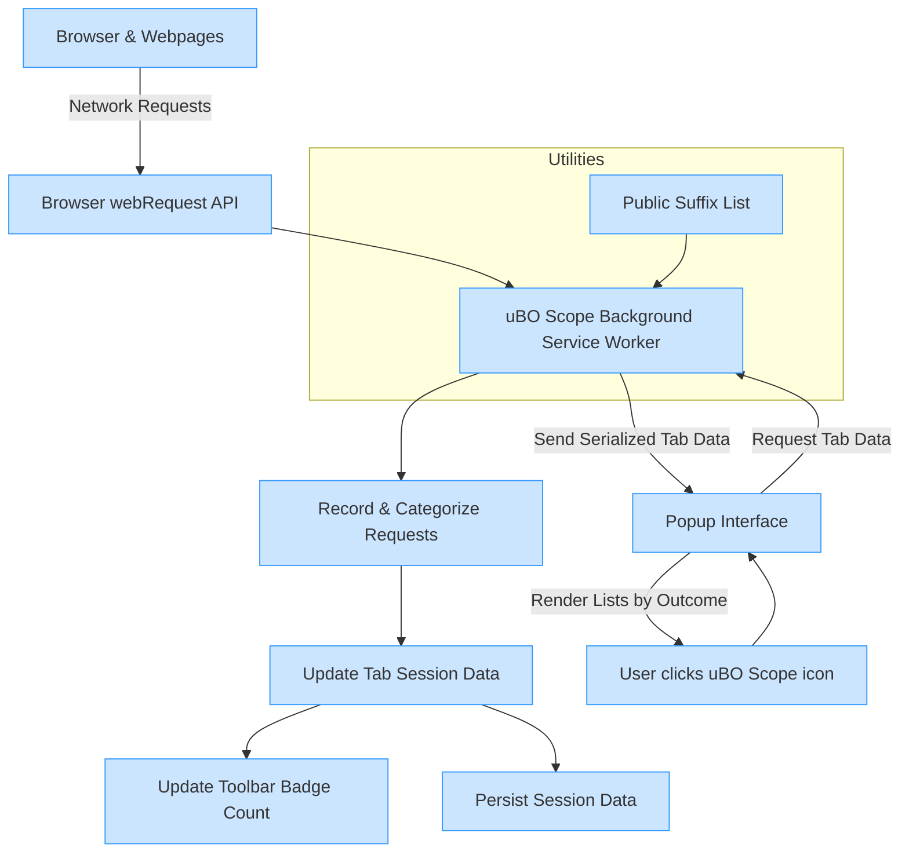

# How uBO Scope Works: Architecture & Data Flow

Discover how uBO Scope diligently observes your browser's network activity, organizes these observations into meaningful data, and presents insights through its intuitive UI. This guide walks you through the flow of information—from network requests generated by web pages, through event monitoring in the extension’s background service, to real-time badge updates and detailed popup reports. Understanding this process empowers you to grasp the full value of uBO Scope and leverage it effectively for privacy, security, and content blocker validation.

---

## Overview

uBO Scope intercepts and analyzes all network requests initiated by your browser. It categorizes these requests based on their outcomes and associated domains, maintaining a live record of distinct remote servers contacted during your browsing session. This architecture ensures you see a clear, unbiased view of network activity independent of any content blocker or DNS filter settings.

By observing requests at the browser extension level, uBO Scope acts as an independent auditor of network traffic targeting third-party servers, helping you identify potentially unwanted or stealthy connections, and validate your content blocking rules.

## Architecture & Data Flow Components

### 1. Web Requests from Browsing Contexts

Your browser sends various network requests as you navigate and interact with websites, including HTTP/HTTPS and WebSocket protocols. Each request has metadata such as its type (main frame, sub-resource), URL, and initiator.

### 2. Background Monitoring Service Worker

At the core, uBO Scope uses a persistent background service (background.js) that:

- Listens to the browser’s `webRequest` API events (`onBeforeRedirect`, `onErrorOccurred`, and `onResponseStarted`).
- Records each network request event alongside its outcome: success, error, or redirect.
- Processes these events asynchronously to maintain smooth performance.
- Maps each request to the tab it originated from, associating hostnames and domains to that tab’s session data.
- Categorizes connections as **allowed**, **stealth-blocked**, or **blocked** based on request events.
- Uses the Public Suffix List and domain parsing to accurately resolve registered domains from hostnames.
- Updates the browser action badge for each tab with the count of distinct allowed third-party domains.
- Persists session data efficiently to maintain state across browsing sessions.

### 3. Tab Session Data Store

The extension maintains an internal session structure holding details for each active browser tab:

- The main tab’s **hostname** and **domain**
- Maps of connected domains and hostnames categorized by outcome: allowed, stealth-blocked, and blocked

This structure is dynamically updated with every monitored network request.

### 4. Popup User Interface

When you click the uBO Scope icon, the popup (popup.html and popup.js):

- Sends a message to the background script requesting the current tab’s network data.
- Receives serialized tab session data.
- Decodes and renders the data, showing detailed lists of connected domains by outcome category.
- Updates the UI dynamically to reflect the latest connection state.

## Data Flow Simplified

## Detailed User Story Flow

1. **Browsing & Network Traffic Initiation**
   - You visit a website or interact with content.
   - Your browser initiates network requests required by the page.

2. **Background Service Captures Events**
   - uBO Scope’s service worker intercepts network events via the `webRequest` API, listening for redirects, errors, and successful responses.
   - Each event includes metadata such as URL, tab ID, frame ID, and outcome type.

3. **Tab-Level Data Management**
   - The background service associates each request with the relevant browser tab.
   - It normalizes the hostname and derives the registered domain using the Public Suffix List algorithm.
   - Depending on the outcome, the request is recorded as **allowed**, **stealth-blocked**, or **blocked**.

4. **Dynamic Badge Update**
   - After processing recent requests, the badge count on the tab’s toolbar icon updates to show the number of distinct allowed third-party domains.
   - This real-time indicator helps you quickly assess how many third-party connections occurred.

5. **Popup Display upon User Request**
   - When you open the uBO Scope popup, it requests the latest data for the active tab from the background service.
   - The service returns a serialized snapshot of the current tab’s connection data.
   - The popup UI renders categorized domain lists with counts, clearly separating allowed, stealth, and blocked connections.

6. **Session Persistence for Continuity**
   - uBO Scope saves session data using browser storage APIs, ensuring data continuity across browser restarts.
   - Tab closure triggers data cleanup to free resources and maintain accuracy.

## Practical Tips

- The badge count reflects distinct allowed third-party domains, not individual requests or hosts. A lower stable count often indicates tighter privacy.
- Domains marked as stealth-blocked indicate network requests that were redirected or blocked invisibly by content blockers but detected by uBO Scope.
- The extension leverages the latest Public Suffix List to precisely identify registrable domains, improving classification accuracy.
- Network requests outside the reach of the browser’s `webRequest` API (e.g., non-web extensions or certain browser internals) are not reported.

## Common Pitfalls to Avoid

- Expect the badge count to fluctuate dynamically as pages load resources asynchronously.
- Remember, a higher block count reported by a blocker does not necessarily mean fewer third-party connections; uBO Scope focuses on distinct server counts.
- The extension does not block or alter network requests; it strictly monitors and reports activity.

## Summary

Understanding uBO Scope’s architecture and data flow demystifies how it provides transparent insights into your browser’s third-party network connections. By carefully observing network events, categorizing outcome data, and presenting actionable information in real time, uBO Scope equips you with the knowledge to enhance your privacy and verify your content blocking effectiveness.

---

For additional guidance on usage, refer to [Overview: What is uBO Scope?](../../overview/introduction-value/product-purpose) and [Core Concepts & Terminology](../../overview/core-concepts-workflow/core-terminology).

---

### Related Files & Source

- [Background Monitoring Service - js/background.js](https://github.com/gorhill/uBO-Scope/blob/main/js/background.js)
- [Popup UI Rendering - js/popup.js](https://github.com/gorhill/uBO-Scope/blob/main/js/popup.js)
- [Extension Manifest (Firefox) - platform/firefox/manifest.json](https://github.com/gorhill/uBO-Scope/blob/main/platform/firefox/manifest.json)

---

### Troubleshooting

<AccordionGroup title="Common Issues and Troubleshooting Tips">
<Accordion title="Badge Does Not Update or Remains Blank">
- Ensure the browser supports the webRequest API for your platform.
- Confirm uBO Scope has the required permissions (`webRequest`, `activeTab`, `storage`).
- Check for conflicting extensions that might interfere with webRequest events.
</Accordion>
<Accordion title="Popup Displays 'NO DATA' or Empty Lists">
- The tab might not have generated any network requests yet.
- Try refreshing the page to initiate network activity.
- Verify the extension is enabled and properly installed.
</Accordion>
<Accordion title="Unexpected High Number of Allowed Domains">
- Remember that legitimate third-party connections (CDNs, APIs) will count toward this number.
- Evaluate domains in the allowed list carefully before assuming privacy risk.
- Use this data to fine tune your content blocker or filter lists.
</Accordion>
</AccordionGroup>

