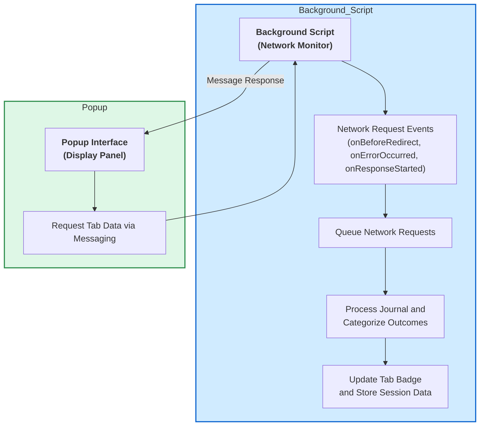

# System Architecture at a Glance

Understand how uBO Scope captures, processes, and presents network connections through its core architectural components. This page presents a clear visual and explanatory overview of the extension's main parts and how data flows from capturing network events to displaying real-time results in the user interface.

---

## Visualize uBO Scope’s Architecture

Imagine browsing a website and being curious about every external server your browser contacts behind the scenes. uBO Scope empowers you by reporting these connections in real time through its layered, event-driven system.

At its heart, uBO Scope consists of three main components:

- **Background Script**: The event-driven engine that listens to all network requests your browser makes, categorizing them as allowed, blocked, or stealth-blocked.
- **Popup Interface**: The user-facing panel summoned from the browser toolbar, revealing live, detailed summaries of network activity for the active tab.
- **Communication Pipeline**: The messaging channels that connect the background script and popup, ensuring data flows smoothly and updates are timely.

Together, these components operate seamlessly to turn raw network data into actionable insights with minimal delay.

## How Data Moves Inside uBO Scope

### Step-by-Step Flow

1. **Monitoring Requests in Background**
   - The background script registers listeners (`webRequest.onBeforeRedirect`, `onErrorOccurred`, and `onResponseStarted`) for all network requests matching its host permissions.
   - Each request is queued temporarily. A timer batches these requests for periodic processing, improving efficiency.

2. **Processing Request Outcomes**
   - The processor examines each request and classifies it as:
     - *Allowed*: Successfully connected.
     - *Blocked*: Request failed or was blocked.
     - *Stealth-blocked*: Redirects that bypass normal reporting.
   - It updates detailed tab-specific data sets, tracking domains and hostnames observed in each outcome.
   - After processing, it writes updated session data to browser storage and refreshes toolbar badge counts.

3. **Data Relay to Popup UI**
   - When you open the extension's popup, it sends a message to the background script requesting the current tab’s network data.
   - The background script responds with serialized tab-specific connection details.
   - The popup deserializes this data and renders a categorized list showing allowed, stealth-blocked, and blocked domains, alongside count badges.

4. **Live User Insight**
   - This flow gives immediate visibility into the distinct third-party servers contacted by the page you're viewing, helping you gauge privacy exposure at a glance.

## Why This Architecture Matters

- **Efficiency:** Using asynchronous batching prevents flooding resources while ensuring timely updates.
- **Accuracy:** Directly capturing browser network events guarantees precise information regardless of other content blockers.
- **Clarity:** The separation of concerns allows each component to focus on its responsibility, enhancing maintainability and user experience.

## Practical Usage Scenario

Imagine you visit a news site. The background script silently logs every outgoing connection. You click your browser toolbar icon to open uBO Scope's popup. Instantly, it displays how many distinct third-party domains the site connects to — whether your content blockers are allowing or blocking those connections — giving you a transparent overview of your exposure to external servers.

## Best Practices & Tips

- **Keep the Popup Closed for Performance:** The background script works continuously, but the popup fetches data only when opened, conserving resources.
- **Understand Badge Counts:** The toolbar badge reflects the count of allowed third-party domains, emphasizing real connections rather than simply blocked counts.
- **Refresh Regularly:** Closing and reopening the popup ensures data is current, as it fetches fresh state from the background.

## Troubleshooting Common Issues

<Accordion title="Popup Not Updating or Showing Data">
If the popup appears empty or stale:
- Ensure the background script is running (check browser extension status).
- Reload the tab or the extension to reset state.
- Confirm you are viewing the popup in the active tab (data is tab-specific).
- Verify browser compatibility; uBO Scope requires modern browsers supporting Manifest V3 and the WebRequest API.
</Accordion>

<Accordion title="Badge Count Not Reflecting Connections">
- Badge counts show distinct allowed third-party domains only, not total requests.
- Connections blocked outside browser extension (e.g., by network-level filters) may not appear.
</Accordion>

## Related Resources

- [Feature Overview](../feature-summary) — Explore all the capabilities of uBO Scope.
- [Understanding Terms](../core-terms) — Clarify definitions like allowed, blocked, stealth-blocked.
- [Usage Guide: Reading the Popup](../../guides/getting-started-essentials/reading-popup) — Learn to interpret what the popup shows.

---

By presenting this architecture clearly, we equip users and contributors alike to visualize how uBO Scope captures and presents invaluable network insights, empowering informed browsing decisions and filter list improvements.

---