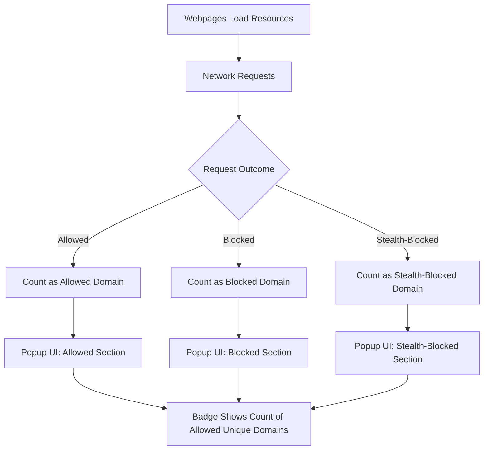

# Feature Overview

Explore the core capabilities that make uBO Scope a powerful, lightweight tool for uncovering the real network connections your browser makes during web browsing. This page highlights uBO Scope's primary features including seamless counting of remote server connections, clear categorization by connection outcome, and wide support across major browsers—Chromium, Firefox, and Safari.

---

## What uBO Scope Does Best

uBO Scope provides you with a straightforward, unobtrusive insight into the network connections triggered by the webpages you visit. It tracks the unique remote servers contacted and classifies these network requests according to whether they were allowed, blocked, or stealth-blocked.

Key benefits include:

- **Accurate Distinct Server Counting:** Instead of misleading high block counts, uBO Scope reports the number of unique third-party remote servers interacting with your browser, enabling a clearer picture of actual network exposure.
- **Clear Outcome Categorization:** Requests are neatly grouped into 'allowed', 'blocked', and 'stealth-blocked' categories, providing actionable understanding of what network activity actually occurred.
- **Cross-Browser Compatibility:** Whether you use Chromium-based browsers (like Chrome), Firefox, or Safari (version 18.5+), uBO Scope runs smoothly with full feature support.

---

## Primary Features Explained

### 1. Unobtrusive Counting of Remote Server Connections

uBO Scope continuously monitors network requests made by webpages and accumulates the number of distinct third-party remote servers contacted. This approach goes beyond conventional block counts and emphasizes the breadth of external connections, which often better reflects privacy exposure and tracking potential.

Example: If a webpage loads resources from several distinct CDN domains and trackers, uBO Scope reports how many unique domains were contacted, not just how many requests were blocked.

### 2. Categorization of Network Request Outcomes

uBO Scope classifies every network request under three outcome buckets:

- **Allowed:** Connections that succeeded and were not blocked by any content blocker or network control.
- **Blocked:** Requests that failed or were explicitly blocked by the content blocking mechanisms.
- **Stealth-Blocked:** Requests blocked in a manner that is intentionally hidden from the webpage, typically to prevent detection or avoid breaking the page.

This triage empowers users and filter list maintainers to distinguish real network activity from blocked attempts, shedding light on stealth blocking that traditional tools often miss.

### 3. Support Across Major Browsers

uBO Scope maintains full support and functional parity in the three most popular browsing environments:

- **Chromium:** Supports modern Chromium browsers, requiring Chrome version 122 or greater.
- **Firefox:** Compatible with Firefox version 128 and above, including Firefox for Android.
- **Safari:** Runs on Safari version 18.5 and later, leveraging Safari’s web extension support.

This extensive coverage guarantees that users of different platforms and preferences can benefit from uBO Scope’s insights.

---

## How These Features Work Together in uBO Scope’s User Interface

When you open the uBO Scope popup, you receive an instant summary of the current tab’s network activity:

- The **domain count badge** on the toolbar icon tells you the number of unique third-party domains contacted.
- Inside the popup, connection details are divided into three sections labeled “not blocked,” “stealth-blocked,” and “blocked,” each listing domains and their respective request counts.

This interface delivers transparency at a glance, with no overwhelming details but enough granularity to understand which third-party servers interact with your browsing session.

---

## Practical Tips & Best Practices

- **Interpret the badge count with context:** A lower number means fewer third-party remote servers contacted, which is generally preferable from a privacy standpoint.
- **Use categorization to diagnose issues:** If you see many stealth-blocked domains, this can indicate hidden network controls that may affect site functioning.
- **Cross-check with your content blocker:** Since uBO Scope reports independently of which content blocker is in use, compare its output to your blocker to verify blocking effectiveness.
- **Browser support considerations:** For best experience, ensure your browser version meets the minimum indicated requirements to leverage all features smoothly.

---

## Troubleshooting Common Scenarios

- **No data displayed in popup:** Make sure the current tab is an active webpage and not a browser internal page or local file, as network requests there may not be monitored.
- **Discrepancies in counts:** Remember that uBO Scope reports unique third-party domains, not the total number of blocked requests; differences are expected.
- **Compatibility issues:** Verify your browser version supports webRequest API as used by uBO Scope, especially on mobile or newer browser versions.

---

## Summary

The "Feature Overview" page is your quick reference to understand what makes uBO Scope effective:

- Counts unique third-party remote connections
- Categorizes requests by outcome
- Supports Chromium, Firefox, and Safari

Dive into this page whenever you want a clear, immediate grasp of what uBO Scope reveals about your browsing network activity.

---

For detailed installation steps, see [Installation: Browser Guides](/getting-started/installation-and-setup/installing-on-your-browser). To understand terms used in this overview, refer to [Key Terms and Concepts](/overview/core-concepts/core-terms). For deeper appreciation of why these features matter, explore [Why Use uBO Scope?](/overview/getting-started/value-proposition).

---

### Code Snippet Example

Here is a conceptual glimpse of how uBO Scope classifies domains internally (simplified representation):

```javascript
const outcomes = {
  allowed: new Map(),      // Domains with allowed requests
  blocked: new Map(),      // Domains with blocked requests
  stealth: new Map(),      // Domains with stealth-blocked requests
};

function addRequestOutcome(domain, outcomeType) {
  const map = outcomes[outcomeType];
  map.set(domain, (map.get(domain) || 0) + 1);
}
```

This counting logic drives the UI categorization and badge display.

---

### Supported Browsers Compatibility Snippet

| Browser   | Minimum Version | Permissions Used             |
|-----------|-----------------|-----------------------------|
| Chromium  | 122.0           | activeTab, storage, webRequest |
| Firefox   | 128.0           | activeTab, storage, webRequest |
| Safari    | 18.5            | activeTab, storage, webRequest |

With all browsers, the extension listens to webRequest events to capture network activity precisely.

---

### Visual: Simplified Feature Breakdown



This flow clarifies how network request events feed into uBO Scope’s categorized reporting.

---

## Next Steps

After familiarizing yourself with uBO Scope’s key features here, proceed to the [Installation: Browser Guides](/getting-started/installation-and-setup/installing-on-your-browser) to install and set up the extension.

Once installed, visit [Understanding the Popup: Interpreting Connection Summaries](/guides/getting-started-essentials/reading-popup) to learn how to make the most of the real-time insights presented.


---

_For additional developer insights or contribution details, visit the GitHub repository: [uBO Scope on GitHub](https://github.com/gorhill/uBO-Scope)_
