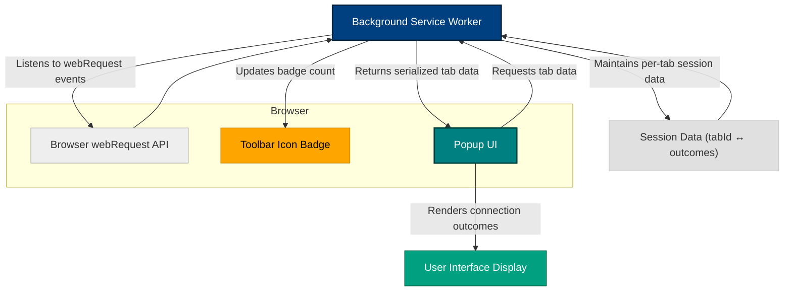

# How uBO Scope Works: System Overview

## Understanding uBO Scope's Operational Model

Unlock the inner workings of uBO Scope — a powerful browser extension that monitors and reports network connections made by your browser tabs. This overview explains how uBO Scope leverages browser webRequest APIs to continuously track the outcome of network requests per tab and visually reports unique third-party domains detected with a real-time badge count.

### What You'll Learn
- How uBO Scope captures network request events behind the scenes
- The role of persistent session tracking by browser tabs
- How connection data flows between the background service worker and the popup user interface
- An illustrative data flow diagram to visualize these interactions

---

## The Core Mechanism: Leveraging Browser webRequest APIs

At its heart, uBO Scope taps directly into browser-provided `webRequest` APIs — specialized browser hooks designed to notify extensions about network requests initiated by webpages.

**Why this matters for you:**
- You receive a real-time, nearly universal view of all web resource requests.
- Traffic blocking or filtering implemented elsewhere doesn’t mask connection attempts; uBO Scope sees the actual outcomes (allowed, blocked, redirected).

uBO Scope listens for three key webRequest events for every outbound network request within the browser's scope:

- `onBeforeRedirect` — captures redirects happening during requests
- `onErrorOccurred` — detects connection failures or blocks
- `onResponseStarted` — indicates successful request initiation

Each intercepted event carries detailed metadata such as the tab ID, request URL, and request type.

Upon receiving these events, uBO Scope queues and periodically processes them to build a precise map of network outcomes. This asynchronous batching balances performance with accuracy.

---

## Persistent Session Tracking by Browser Tab

uBO Scope uniquely organizes all connection activity **per browser tab**, maintaining persistent session data while the tab remains open. This approach lets you:  

- Track distinct third-party domains contacted during your browsing session in each tab.
- Differentiate between outcomes like allowed, stealth-blocked, and blocked connections.

Each tab is associated with a comprehensive record containing:

- The main hostname and domain of the webpage loaded.
- Separate collections of domains and hostnames categorized by outcome:
  - **Allowed:** Connections successfully made.
  - **Stealth:** Redirected or obfuscated connections.
  - **Blocked:** Requests that failed or were explicitly blocked.

This state is stored within the extension's session data, updated dynamically as new network events come in. When a tab closes, uBO Scope discards its session data to keep memory usage efficient.

---

## Badge Reporting: Real-Time Domain Summary at a Glance

To provide meaningful and actionable feedback, uBO Scope communicates the count of **unique third-party domains with allowed connections** found in each tab through a badge on the browser toolbar icon.

**Benefits:**
- Quickly gauge the number of different external domains your current tab interacts with.
- Lower badge counts indicate fewer external connections, reflecting potentially stronger privacy.

The background service worker updates this badge promptly after processing batches of network request outcomes.

---

## Data Flow: Background Monitoring to Popup UI

Understanding how uBO Scope components interact can clarify how data becomes the familiar badge counts and detailed popup reports you see.

### Key components:

- **Background Service Worker**  
  Runs continuously (as permitted) in the background. It listens to network request events and maintains the session data tracking per-tab outcomes.

- **Popup UI**  
  Activated when you click the toolbar icon. It requests the current tab's session data from the background script and renders detailed domain connection summaries.

### How they interact

1. Background service worker intercepts webRequest events and updates session data.
2. Background updates the badge count on the toolbar icon per relevant tab.
3. When the popup UI opens, it sends a message requesting the session data for the active tab.
4. Background script serializes and returns the stored statistics.
5. Popup renders a categorized list of allowed, stealth, and blocked domains, enriching your understanding of active connections.

 

---

## Practical Scenario: Visualizing the Flow

Imagine opening a news website in a tab. Here’s what happens with uBO Scope:

- The background worker listens as the page silently fires dozens of network requests to content servers, ads, and trackers.
- Each request's outcome is categorized: allowed, stealth-redirected, or blocked.
- This data builds a real-time map of which distinct third-party domains the tab contacted.
- The toolbar badge updates to show the count of unique allowed domains.
- Upon clicking the badge icon, the popup UI fetches and displays detailed lists of these domains sorted by outcome category.

Through this continuous monitoring, you gain a clear, unbiased view into the third-party connections initiated from the tab’s webpage.

---

## Tips & Best Practices

- **Keep the tab active:** uBO Scope tracks data **per-tab** until the tab closes. Avoid closing tabs where you need historical network connection insights.
- **Refresh for latest data:** Reloading the webpage resets session tracking and starts fresh.
- **Badge count insights:** A lower badge count is a sign of fewer remote connections and less tracking surface.
- **Use in conjunction:** Combine uBO Scope with content blockers for deeper privacy insights.

---

## Troubleshooting Common Issues

<Accordion title="Badge Isn't Updating">
If the badge count remains zero despite network activity:

- Refresh the tab to reset session data.
- Check your browser’s permissions to ensure `webRequest` API access.
- Confirm that no other extensions interfere with network monitoring.
- Restart the browser if issues persist.
</Accordion>

<Accordion title="Popup Shows ‘No Data’">
This means no session data for the current tab has been recorded:

- Confirm the tab is actively loading a webpage, not a browser internal page.
- Ensure the background service worker is running and hasn’t crashed.
- Try closing and reopening the popup.
</Accordion>

---

## Next Steps

Now that you understand uBO Scope’s core system architecture and data flow, explore:

- **[Key Terminology & Core Ideas](./key-terminology)** — to grasp important terms and concepts.
- **[Features at a Glance](./feature-glance)** — to get a high-level view of what the extension can do.
- **[Getting Started Guides](../../getting-started)** — for installation, setup, and practical usage.

---

_Source code insights are based on the background script (`js/background.js`) and extension manifest files that define the permissions, event listeners, and messaging system._

---