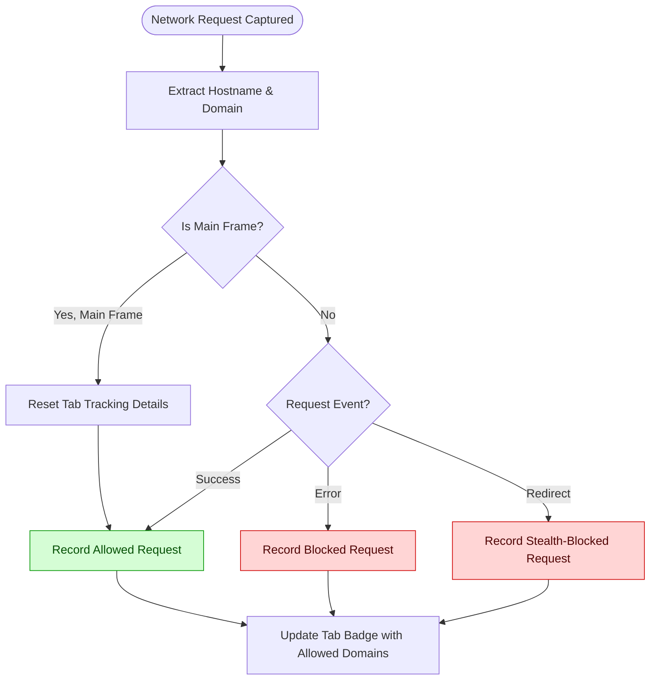

# Key Terminology & Core Ideas

Understanding the essential terms behind uBO Scope is crucial for leveraging its full potential. This page defines the core concepts that every user must grasp, including crucial distinctions like 'third-party remote server', the difference between 'allowed' and 'blocked' requests, the concept of 'stealth blocking', and what the 'badge count' represents. These terms illuminate how uBO Scope independently and accurately measures network request outcomes, while also debunking misconceptions common in other tools and websites.

---

## Defining Third-Party Remote Server

A **third-party remote server** is any external domain distinct from the main site you visit that your browser contacts to fetch resources. For example, when you visit `example.com` and your browser also loads images or scripts from `cdn.someservice.net`, that latter domain is considered third-party.

- **Why this matters:** Counting distinct third-party servers reveals the breadth of external connections a webpage initiates.
- **Legitimate vs. suspicious:** Not all third parties are harmful—e.g., many sites use content delivery networks (CDNs) which are low in count and essential.

<u>Example scenario:</u> You browse a news site that loads ads from `ads.adnetwork.com` and analytics from `tracking.analyticsco.com`. Both domains are third-party servers connected to your session.

---

## Allowed vs. Blocked Requests

uBO Scope tracks the fate of every network request and categorizes them as:

- **Allowed (Not Blocked):** Requests that successfully reach their destination and fetch content.
- **Blocked:** Requests that are denied by the browser or any content blocker, resulting in a failure to retrieve content.

<u>User impact:</u> The count of allowed third-party servers indicates actual external exposure; blocked requests, while prevented, still reflect attempted connections.


**Important:** uBO Scope distinguishes between these outcomes regardless of which content blocker or filtering method is active.

---

## Understanding Stealth Blocking

**Stealth blocking** is the technique where content blockers silently prevent requests without making the block obvious to the webpage itself.

- Allows blockers to avoid breaking page functionality or alerting malicious scripts to their presence.
- uBO Scope reports stealth-blocked requests distinctly, helping users see blocking events that other tools might miss.

<u>Why it matters:</u> Many traditional ad-block detection tests fail to account for stealth blocking, misleading users about blocker effectiveness.

---

## Badge Count Explained

The **badge count** you see on the uBO Scope toolbar icon represents:

- The number of **distinct third-party remote servers** from which your browser has made connections during the current tab session.
- Importantly, it reflects **allowed connections only** — connections that successfully fetched resources.

**Key insight:**

- A **lower count is better**, indicating fewer unique third-party servers are contacted.
- This count is a more reliable privacy indicator than traditional block counts shown by other blockers.

<u>Real-world example:</u>

- If blocker A shows a higher block count but a higher badge count, it may actually allow more third parties.
- uBO Scope helps users avoid this common pitfall by focusing on unique allowed connections.

---

## How uBO Scope Uses These Concepts for Accurate Measurement

uBO Scope leverages the browser's `webRequest` API to:

- Monitor every network request and its outcome (success, redirect, error).
- Map each request to its hostname and determine the *domain* using a precise Public Suffix List algorithm.
- Track and categorize requests per-tab into allowed, blocked, and stealth-blocked buckets.

This structure enables independent and unbiased reporting:

- Works regardless of which content blocker or DNS filter is active.
- Does not rely on block counts from third-party tools or websites.
- Uses real data from browser APIs to provide transparency about network activity.

<u>Technical note:</u> uBO Scope's use of the Public Suffix List ensures that domain grouping is accurate — for example, distinguishing between `sub.example.co.uk` and `example.co.uk` domains.

---

## Debunking Popular Misconceptions

### Myth 1: "More Block Count Means Better Blocking"

- A blocker showing more blocked requests isn't necessarily better.
- Higher block counts can correspond to more allowed third-party connections overall, meaning worse privacy.
- uBO Scope focuses on distinct **allowed third-party servers**, the true indicator of privacy exposure.

### Myth 2: "Ad Blocker Test Websites Are Reliable"

- Many online adblock tests do not reflect real-world network activity.
- They often use fabricated domains and do not detect stealth blocking.
- uBO Scope’s approach using the browser's request data provides a more genuine assessment.

---

## Practical Tips & Best Practices

- Use the badge count as your primary indicator of third-party exposure per tab.
- Remember that some third-party connections, like CDNs, are normal and essential.
- If you see unexpectedly high counts, inspect the detailed popup to identify the domains involved.
- Combine uBO Scope with a trusted content blocker for layered privacy protection.

---

## Summary

Understanding these foundational terms empowers you to interpret uBO Scope’s data accurately and make informed decisions about your browser's privacy posture.

For a deeper insight into how these concepts come together under the hood, visit the [How uBO Scope Works: System Overview](../core-concepts/how-ubo-scope-works).

For a complete picture of features, see [Features at a Glance](../core-concepts/feature-glance).

For installation and practical walkthroughs, explore the [Getting Started](../../getting-started) tab.

---

### Additional Resources

- [About uBO Scope](../about-ubo-scope/what-is-ubo-scope): Understand the core purpose and audience.
- [Key Benefits & Value Proposition](../about-ubo-scope/key-benefits): Learn why these metrics matter.
- [Who Should Use uBO Scope?](../about-ubo-scope/target-users-use-cases): Determine if this is right for your needs.

---

# Code Example: Determining Domain from Hostname

```javascript
// Given a full hostname, fetch the registrable domain using the Public Suffix List
function domainFromHostname(hostname) {
  return psl.getDomain(hostname) || psl.getPublicSuffix(hostname);
}

// Example:
const hostname = 'sub.example.co.uk';
const domain = domainFromHostname(hostname); // returns 'example.co.uk'
```

This logic ensures accurate grouping of network requests by domain, fundamental for meaningful counts.

---

# Visual Flow: How uBO Scope Classifies Request Outcomes



This workflow clarifies how each request is categorized and impacts the badge count.

---

# Troubleshooting Common Questions

<AccordionGroup title="Frequently Asked Questions">
<Accordion title="Why does the badge count differ from my content blocker's block count?">
uBO Scope counts **distinct allowed third-party servers** your browser connects to, while many blockers only count **blocked requests**, which can be inflated by retries or multiple requests per domain.
</Accordion>
<Accordion title="What if stealth blocking isn't visible on other tools?">
Stealth blocking is designed to hide blocking activity from webpages and many tools. uBO Scope detects these silently blocked attempts by monitoring the browser's request lifecycle itself.
</Accordion>
<Accordion title="Does uBO Scope block anything?">
uBO Scope is a purely reporting tool and does not block any requests by itself. It measures outcomes arising from any existing blockers or filters you have.
</Accordion>
<Accordion title="Can I trust domains listed as allowed?">
Allowed domains are those your browser successfully connected to within the current tab. While many are legitimate, examining domains for unexpected or known trackers can reveal privacy risks.
</Accordion>
</AccordionGroup>

---

For the latest updates, source code, and issue reporting, visit the official GitHub repository: [uBO-Scope](https://github.com/gorhill/uBO-Scope).

