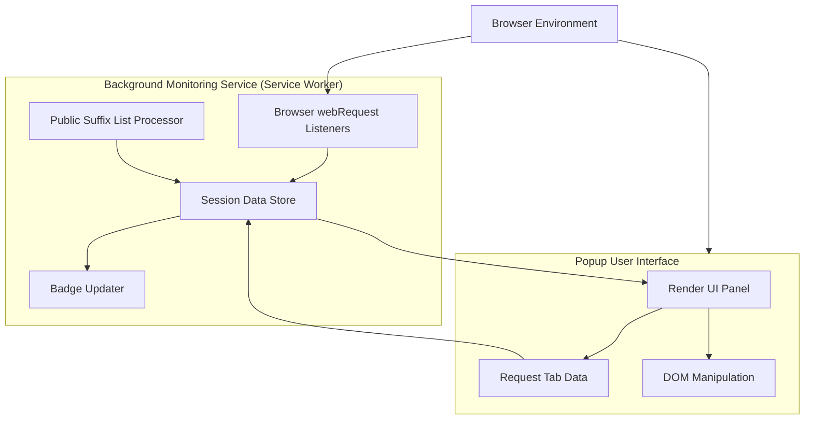

# System Architecture (with Diagram)

## Unlocking the Inner Workings of uBO Scope

Understanding how uBO Scope orchestrates its components to monitor network connections helps you appreciate its reliability and modular design. This page presents a high-level Mermaid diagram illustrating the main parts of the extension— the background monitoring service, the popup user interface, and their interactions with the browser — alongside descriptions of key data flows and modularity benefits.

---

## High-Level Overview: What Happens Behind the Scenes

At its core, uBO Scope is a browser extension designed to independently track remote server connections made by webpages. It divides its responsibilities into two primary components:

- **Background Monitoring Service** — Operates persistently in the background, listening to all network requests across tabs.
- **Popup UI** — A lightweight, user-facing interface accessible via the browser toolbar that presents aggregated connection data for the active tab.

These components communicate asynchronously, maintaining a clear separation of concerns that enhances performance and user experience.

---

## Key Components and Their Roles

### Background Monitoring Service (Service Worker)
- Runs as the core engine capturing network activity through the browser’s `webRequest` API.
- Listens to events like redirects, successful connections, and errors to classify network requests.
- Maintains session data mapping each browser tab to its recorded domains categorized by outcome (`allowed`, `blocked`, `stealth-blocked`).
- Updates the toolbar badge to reflect the count of distinct allowed third-party domains per tab, providing at-a-glance insight.
- Persists session details and the Public Suffix List, enabling accurate domain grouping.

### Popup User Interface
- Triggered by the user clicking the toolbar icon.
- Requests detailed tab-specific connection data from the background service.
- Renders the categorized domains (`allowed`, `blocked`, `stealth-blocked`) along with counts in an accessible layout.
- Leverages templates and DOM utilities to dynamically populate the list without overwhelming the user.

### Browser Interaction Layer
- The extension relies on host permissions and browser APIs (`webRequest`, `tabs`, `storage`) to monitor and manage data flow.
- Interaction secured within browser extension boundaries to ensure user privacy and performance.

---

## Data Flow & Modular Interaction

- The **Background Monitoring Service** listens to all network request events via the browser’s `webRequest` API, logging outcomes per tab.
- It aggregates this data into an in-memory session store that keeps domain and hostname counts for allowed, stealth-blocked, and blocked categories.
- The **badge updater** updates the icon’s badge count dynamically, focusing on allowed third-party domains, so you can quickly assess the network footprint.
- When the user opens the popup, the **Popup UI** sends a message requesting data for the active tab.
- Upon receiving this, the popup renders domain lists and counts across the three outcome types using efficient DOM templates.
- The **Public Suffix List processor** ensures accurate domain extraction and grouping by recognizing registrable domains, improving clarity by merging subdomains under their registered base domain.

---

## Modular Design Benefits

- **Separation of Concerns:** Background service continuously watches network events without UI overhead.
- **Resource Efficiency:** Popup UI activates only on user interaction, reducing runtime resource usage.
- **Data Integrity:** Session state persists across restarts and tab lifecycle events, maintaining consistent user experience.
- **Scalability:** Modular components can be enhanced independently, such as adding more detailed analytics or UI features without risking core monitoring stability.

---

## Practical Impact for Users

- Transparency: You get accurate, real-time insights into the external connections a webpage makes, regardless of content blocker activity.
- Control: The clear distinction between allowed, blocked, and stealth-blocked connections helps you understand filtering behavior.
- Simplicity: The architecture ensures smooth, responsive interaction and reliable data presentation.

---

## Troubleshooting Tips

- If the badge count does not update, ensure your browser supports the required permissions and APIs like `webRequest`.
- Delays in updating the popup data typically relate to asynchronous message passing; reopening the popup refreshes the display.
- Tab-specific data resets happen when tabs close to prevent stale information.

---

## Next Steps

Continue your exploration by visiting the [Core Concepts & Terminology](https://documentation-url/overview/core-concepts/core-terminology) to familiarize yourself with fundamental terms, then advance to [Using uBO Scope Effectively](https://documentation-url/guides/getting-started-workflows/reveal-remote-connections) to learn how to interpret results and maximize value.

---

## Additional Resources

- **Background Monitoring Source:** [`js/background.js`](https://github.com/gorhill/uBO-Scope/blob/main/js/background.js)
- **Popup User Interface Logic:** [`js/popup.js`](https://github.com/gorhill/uBO-Scope/blob/main/js/popup.js)
- **Manifest Definitions:**
  - Chromium: [`platform/chromium/manifest.json`](https://github.com/gorhill/uBO-Scope/blob/main/platform/chromium/manifest.json)
  - Firefox: [`platform/firefox/manifest.json`](https://github.com/gorhill/uBO-Scope/blob/main/platform/firefox/manifest.json)
  - Safari: [`platform/safari/manifest.json`](https://github.com/gorhill/uBO-Scope/blob/main/platform/safari/manifest.json)

---